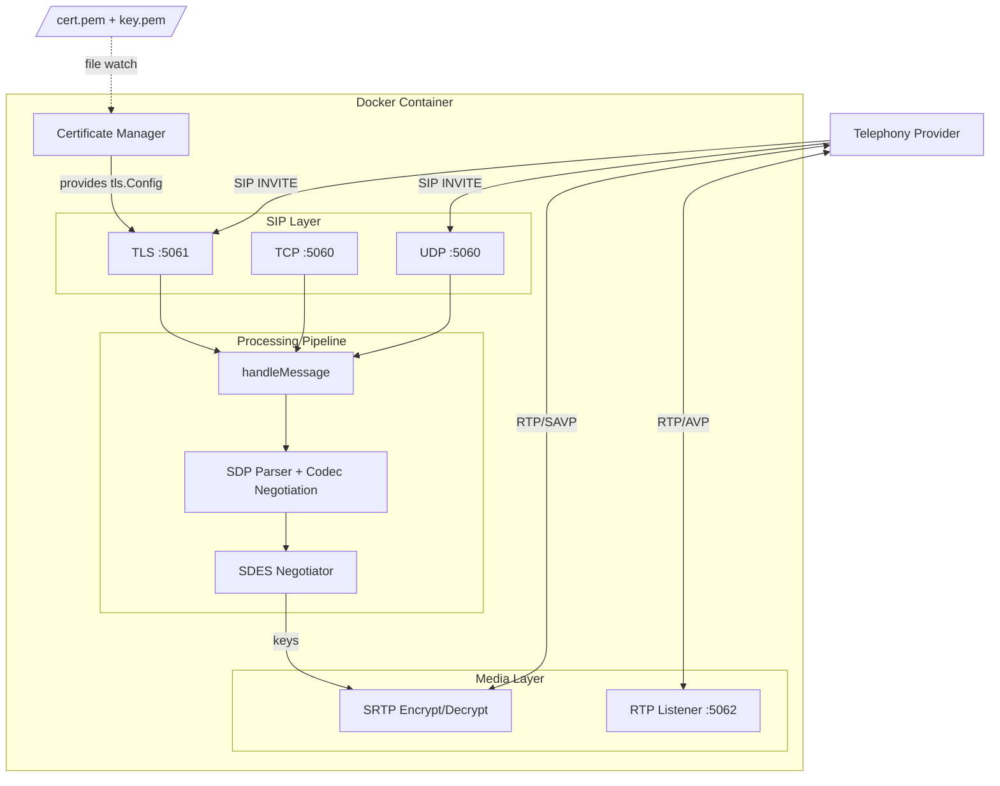
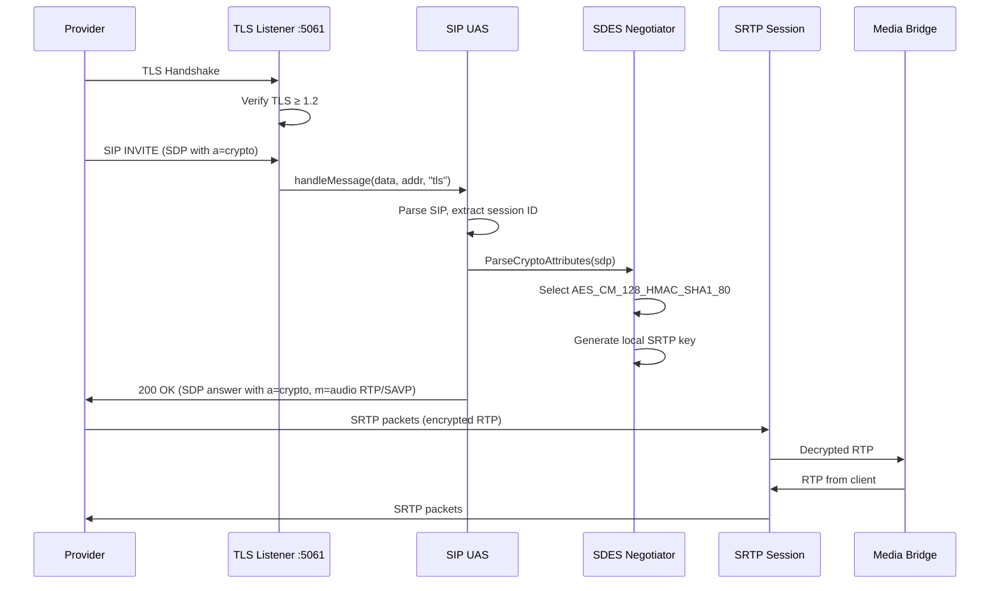

# Design Document: Encrypted SIP

## Overview

This design adds encrypted SIP transport (TLS) and encrypted media (SRTP via SDES) to the Svarla mediabridge. The implementation introduces a parallel TLS listener on port 5061, a Certificate Manager for loading/generating/hot-reloading TLS certificates, and an SDES negotiator integrated into the existing SDP handling pipeline.

The core design principle is **additive, not disruptive**: the existing unencrypted SIP path on port 5060 remains unchanged. The TLS listener feeds messages into the same `handleMessage` processing pipeline, ensuring identical call-handling behavior regardless of transport. SRTP is negotiated opportunistically — only when the provider offers `a=crypto` attributes in the SDP.

### Key Design Decisions

1. **Dual-port always-on**: Both 5060 and 5061 are bound at startup. The sysadmin controls external exposure via Docker port forwarding.
2. **Self-signed fallback**: When no certificate is mounted, the Certificate Manager generates a self-signed cert so TLS is always available (critical for first-boot before Caddy fetches Let's Encrypt certs).
3. **Hot-reload via polling**: File modification times are checked every 30 seconds. A 2-second stabilization debounce prevents loading partially-written files during certificate rotation.
4. **SDES over DTLS-SRTP**: Vonage uses SDES key exchange (crypto keys in SDP), which is simpler for server-to-server media encryption and doesn't require DTLS on the RTP path.
5. **Single supported cipher**: Only `AES_CM_128_HMAC_SHA1_80` is supported, matching Vonage's default and the most widely deployed SRTP cipher suite.

## Architecture



### Component Interaction Flow (TLS + SRTP call)



## Components and Interfaces

### 1. Certificate Manager (`internal/sip/certmanager.go`)

Responsible for loading, validating, generating, and hot-reloading TLS certificates.

```go
// CertManagerConfig holds configuration for the Certificate Manager.
type CertManagerConfig struct {
    CertPath string // Path to PEM-encoded certificate file
    KeyPath  string // Path to PEM-encoded private key file
}

// CertManager manages TLS certificates for the SIP TLS listener.
type CertManager struct {
    cfg        CertManagerConfig
    logger     *slog.Logger
    mu         sync.RWMutex
    current    *tls.Certificate
    lastMod    time.Time       // last observed mod time
    ctx        context.Context
    cancel     context.CancelFunc
}

// NewCertManager creates a CertManager that loads certs from configured paths.
func NewCertManager(cfg CertManagerConfig, logger *slog.Logger) *CertManager

// LoadOrGenerate loads the configured cert/key or generates a self-signed fallback.
// Returns an error only if the self-signed generation itself fails (fatal).
func (cm *CertManager) LoadOrGenerate() error

// GetCertificate returns the current certificate for use in tls.Config.GetCertificate.
func (cm *CertManager) GetCertificate(*tls.ClientHelloInfo) (*tls.Certificate, error)

// StartWatching begins polling for certificate file changes.
func (cm *CertManager) StartWatching(ctx context.Context)

// Stop halts the file watcher.
func (cm *CertManager) Stop()
```

### 2. SDES Negotiator (`internal/sip/sdes.go`)

Parses `a=crypto` attributes from SDP offers and generates SRTP key material for answers.

```go
// CryptoAttribute represents a parsed a=crypto line from SDP.
type CryptoAttribute struct {
    Tag       int    // Crypto tag (e.g., 1)
    Suite     string // e.g., "AES_CM_128_HMAC_SHA1_80"
    KeyParams string // Base64-encoded key material (inline:<base64>)
}

// SDESResult holds the result of SDES negotiation.
type SDESResult struct {
    Selected    CryptoAttribute // The selected offer attribute
    LocalKey    []byte          // Generated local SRTP master key + salt (30 bytes)
    LocalKeyB64 string          // Base64-encoded local key for SDP answer
    RemoteKey   []byte          // Decoded remote key from offer
}

// ParseCryptoAttributes extracts a=crypto lines from SDP body.
func ParseCryptoAttributes(sdpBody []byte) ([]CryptoAttribute, error)

// NegotiateSDES selects the first supported crypto suite and generates local keys.
// Returns nil if no supported suite is found.
func NegotiateSDES(offered []CryptoAttribute) (*SDESResult, error)

// FormatCryptoAnswer formats the a=crypto line for the SDP answer.
func FormatCryptoAnswer(result *SDESResult) string
```

### 3. SRTP Session (`internal/sip/srtp.go`)

Wraps RTP encrypt/decrypt using negotiated SDES keys. Integrates with the existing `RTPListener` and `RTPTransport`.

```go
// SRTPSession wraps an RTP session with SRTP encryption/decryption.
type SRTPSession struct {
    localCtx   srtp.Context  // For encrypting outgoing packets
    remoteCtx  srtp.Context  // For decrypting incoming packets
}

// NewSRTPSession creates an SRTP session from negotiated SDES keys.
func NewSRTPSession(localKey, remoteKey []byte, profile srtp.ProtectionProfile) (*SRTPSession, error)

// DecryptRTP decrypts an incoming SRTP packet to plain RTP.
func (s *SRTPSession) DecryptRTP(encrypted []byte) ([]byte, error)

// EncryptRTP encrypts an outgoing RTP packet to SRTP.
func (s *SRTPSession) EncryptRTP(plainRTP []byte) ([]byte, error)

// Close releases SRTP context resources and zeros key material.
func (s *SRTPSession) Close()
```

### 4. TLS Listener (extension to `internal/sip/uas.go`)

The existing UAS gains a TLS listener alongside its existing UDP and TCP listeners.

```go
// UASConfig additions:
type UASConfig struct {
    Port       int
    TLSPort    int    // TLS listen port (default 5061)
    PublicIP   string
    AllowedIPs []string
    CertManager *CertManager // nil = TLS disabled (shouldn't happen)
}

// New methods on UAS:
// tlsLoop accepts TLS connections, similar to tcpLoop.
func (u *UAS) tlsLoop()
```

### 5. Control API Dual URI Response (extension to `internal/controlapi/handler.go`)

The `createSession` handler constructs both unencrypted and encrypted SIP URIs and returns them in the response. This requires a `TLSPort` field on the Go config (provided by the TLS config section already defined above).

```go
// Updated CreateSessionResponse adds the sipsUri field for encrypted SIP.
type CreateSessionResponse struct {
	SessionID  string         `json:"sessionId"`
	Status     session.Status `json:"status"`
	SIPUri     string         `json:"sipUri"`
	SIPSUri    string         `json:"sipsUri"`
	AudioWsURL string         `json:"audioWsUrl"`
}

// In createSession handler — build both URIs:
sipURI := fmt.Sprintf("sip:%s@%s:%d", req.SessionID, h.cfg.PublicIP, h.cfg.SIPPort)
sipsURI := fmt.Sprintf("sips:%s@%s:%d", req.SessionID, h.cfg.PublicIP, h.cfg.TLS.Port)
```

The existing `sipUri` field is unchanged (backward-compatible). The new `sipsUri` field is additive.

### 6. SIP URI Selection Logic (`src/services/sip-uri-selector.ts`)

A pure function in the Svarla TypeScript server that decides which URI to pass to the NCCO builder. This logic lives upstream of the NCCO builder, which already accepts any URI string.

```typescript
export interface SipUriSelectionInput {
  sipUri: string;
  sipsUri: string;
  supportsSips: boolean; // from provider config
  sipTlsEnabled: boolean; // from server config (sip.tls)
}

/**
 * Selects the appropriate SIP URI for the NCCO connect action.
 *
 * Decision rule:
 *   if provider supports sips AND sip.tls is enabled → use sipsUri
 *   otherwise → use sipUri
 */
export function selectSipUri(input: SipUriSelectionInput): string {
  if (input.supportsSips && input.sipTlsEnabled) {
    return input.sipsUri;
  }
  return input.sipUri;
}
```

This function is called by the call orchestration layer after receiving the Control API session response, before passing the chosen URI into `generateAnswerNcco()` / `buildSipConnectNcco()`.

### 7. Provider Config Extension (`src/providers/vonage-telephony-provider.ts`)

The `VonageProviderConfig` interface gains a `supportsSips` boolean:

```typescript
export interface VonageProviderConfig {
  apiKey: string;
  apiSecret: string;
  applicationId: string;
  privateKey?: string;
  privateKeyPath?: string;
  webhookBaseUrl: string;
  /** Whether the provider supports encrypted SIP (sips:). Defaults to true for Vonage. */
  supportsSips?: boolean;
}
```

When not specified, `supportsSips` defaults to `true` for the Vonage provider (since Vonage supports TLS SIP).

### 8. Server Config Extension (`src/config.ts`)

The `serverConfigFileSchema` gains a `sip` section under the `media_bridge` section:

```typescript
media_bridge: z.object({
  control_api_url: z.string().default('http://localhost:9090'),
  event_websocket_port: z.number().int().positive().default(9095),
  health_check_interval: z.number().int().positive().default(5000),
  sip: z.object({
    tls: z.boolean().default(true),
  }).default({}),
}).default({}),
```

The `AppConfig.mediaBridge` interface gains:

```typescript
mediaBridge: {
  controlApiUrl: string;
  eventWebSocketPort: number;
  healthCheckInterval: number;
  sip: { tls: boolean };
};
```

When `sip.tls` is not configured, it defaults to `true`, meaning the system prefers encrypted SIP when the provider supports it.

### 9. Configuration Extension (`internal/config/config.go`)

```go
// TLSConfig holds TLS-specific configuration.
type TLSConfig struct {
    Port     int    `yaml:"port"`     // TLS listen port, default 5061
    CertPath string `yaml:"certPath"` // Path to cert PEM, default "/etc/mediabridge/tls/cert.pem"
    KeyPath  string `yaml:"keyPath"`  // Path to key PEM, default "/etc/mediabridge/tls/key.pem"
}

// Config additions:
type Config struct {
    // ... existing fields ...
    TLS TLSConfig `yaml:"tls"`
}
```

## Data Models

### TLS Certificate State

```go
// Internal to CertManager — tracks loaded certificate metadata for logging.
type certInfo struct {
    Subject   string
    NotBefore time.Time
    NotAfter  time.Time
    IssuedBy  string
    IsSelfSigned bool
}
```

### SDES Key Material (per-session, ephemeral)

| Field | Type | Description |
|-------|------|-------------|
| `LocalMasterKey` | `[16]byte` | AES-128 master key for encrypting outgoing RTP |
| `LocalMasterSalt` | `[14]byte` | Salt for outgoing SRTP |
| `RemoteMasterKey` | `[16]byte` | AES-128 master key for decrypting incoming RTP |
| `RemoteMasterSalt` | `[14]byte` | Salt for incoming SRTP |
| `Profile` | `srtp.ProtectionProfile` | Always `ProtectionProfileAes128CmHmacSha1_80` |

Key material is stored only in memory for the duration of the SIP session and zeroed on session termination.

### Configuration YAML Schema Extension

```yaml
tls:
  port: 5061                              # TLS listen port
  certPath: "/etc/mediabridge/tls/cert.pem"  # PEM certificate path
  keyPath: "/etc/mediabridge/tls/key.pem"    # PEM private key path
```

### Control API Session Response (extended)

| Field | Type | Description |
|-------|------|-------------|
| `sessionId` | `string` | Session identifier |
| `status` | `string` | Session status (e.g., "created") |
| `sipUri` | `string` | Unencrypted SIP URI: `sip:<sessionId>@<publicIP>:<sipPort>` |
| `sipsUri` | `string` | Encrypted SIP URI: `sips:<sessionId>@<publicIP>:<tlsPort>` |
| `audioWsUrl` | `string` | WebSocket URL for audio streaming |

The `sipUri` field retains its existing format for backward compatibility. The `sipsUri` field is additive.

### SIP URI Selection Decision Table

| `supportsSips` | `sip.tls` | Selected URI |
|:--------------:|:---------:|:------------:|
| `true` | `true` | `sipsUri` |
| `true` | `false` | `sipUri` |
| `false` | `true` | `sipUri` |
| `false` | `false` | `sipUri` |

Only the combination of `supportsSips=true` AND `sip.tls=true` results in the encrypted URI being used.

### SDP Extensions

**Offer (from provider):**
```
m=audio 20000 RTP/SAVP 0
a=crypto:1 AES_CM_128_HMAC_SHA1_80 inline:<base64-key>
```

**Answer (from mediabridge):**
```
m=audio 5062 RTP/SAVP 0
a=crypto:1 AES_CM_128_HMAC_SHA1_80 inline:<base64-key>
```

When no `a=crypto` is offered, the media line uses `RTP/AVP` as before.

## Correctness Properties

*A property is a characteristic or behavior that should hold true across all valid executions of a system — essentially, a formal statement about what the system should do. Properties serve as the bridge between human-readable specifications and machine-verifiable correctness guarantees.*

### Property 1: Transport-Independent SIP Processing

*For any* valid SIP message, processing it through the unencrypted path (UDP/TCP on port 5060) and through the TLS path (port 5061) SHALL produce identical SIP response codes and identical call-routing decisions (session lookup, codec negotiation, dialog creation).

**Validates: Requirements 1.3**

### Property 2: Certificate Pair Validation

*For any* PEM-encoded certificate file and PEM-encoded private key file, the Certificate Manager SHALL accept the pair if and only if (a) both files are valid PEM, (b) the certificate is a valid X.509 certificate, and (c) the private key's public key matches the certificate's public key. When validation fails, the Certificate Manager SHALL fall back to using the previously loaded certificate (or generate a self-signed one on first load).

**Validates: Requirements 2.2, 2.5, 2.6, 3.3, 3.6**

### Property 3: Self-Signed Certificate Correctness

*For any* invocation of self-signed certificate generation, the resulting certificate SHALL be a valid X.509 certificate with: Extended Key Usage set to Server Authentication, Subject Alternative Names containing DNS "localhost" and IP 127.0.0.1, a validity period of 365 days from generation time, and an ECDSA P-256 key pair.

**Validates: Requirements 4.2, 4.3**

### Property 4: SDES Crypto Attribute Parsing Round-Trip

*For any* valid `a=crypto` attribute string conforming to RFC 4568 format (tag, suite identifier, and inline key parameter), parsing it with `ParseCryptoAttributes` SHALL produce a `CryptoAttribute` struct where `FormatCryptoAnswer` produces an equivalent attribute string (same tag, same suite, same key encoding).

**Validates: Requirements 5.1**

### Property 5: Suite Selection Picks First Supported

*For any* ordered list of `CryptoAttribute` entries, `NegotiateSDES` SHALL select the first entry whose `Suite` field equals `AES_CM_128_HMAC_SHA1_80` (case-insensitive). If no entry has a supported suite, it SHALL return nil.

**Validates: Requirements 5.2, 5.5**

### Property 6: SRTP Encrypt/Decrypt Round-Trip

*For any* valid RTP packet payload and any valid 30-byte SRTP master key+salt, encrypting the packet with `EncryptRTP` and then decrypting it with `DecryptRTP` (using the same key material) SHALL produce the original RTP payload.

**Validates: Requirements 5.3**

### Property 7: Unsupported-Only Suites Produce No Selection

*For any* list of `CryptoAttribute` entries where none have a `Suite` of `AES_CM_128_HMAC_SHA1_80`, `NegotiateSDES` SHALL return nil (leading to a 488 rejection).

**Validates: Requirements 5.6**

### Property 8: Malformed Crypto Lines Are Skipped

*For any* SDP body containing a mix of malformed `a=crypto` lines and valid `a=crypto` lines, `ParseCryptoAttributes` SHALL return only the successfully parsed attributes, preserving their relative order, without returning an error for the overall parse.

**Validates: Requirements 5.7**

### Property 9: Invalid Port Configuration Rejected

*For any* integer value outside the range [1, 65535], configuring it as the TLS port SHALL result in a configuration validation error.

**Validates: Requirements 6.5**

### Property 10: Port Conflict Rejected

*For any* valid port number P, configuring both the SIP port and TLS port as P SHALL result in a configuration validation error.

**Validates: Requirements 6.7**

### Property 11: Control API Dual URI Construction

*For any* valid session ID, public IP address, SIP port, and TLS port, the Control API session response SHALL contain a `sipUri` field formatted as `sip:<sessionId>@<publicIP>:<sipPort>` and a `sipsUri` field formatted as `sips:<sessionId>@<publicIP>:<tlsPort>`, with both fields always present.

**Validates: Requirements 9.1, 9.7**

### Property 12: SIP URI Selection Logic

*For any* combination of `supportsSips` (boolean) and `sip.tls` (boolean), the `selectSipUri` function SHALL return the `sipsUri` if and only if `supportsSips` is true AND `sip.tls` is true; otherwise it SHALL return the `sipUri`.

**Validates: Requirements 9.2, 9.3, 9.4**

## Error Handling

### Startup Errors (Fatal)

| Condition | Behavior |
|-----------|----------|
| UDP port 5060 bind fails | Log error, exit with non-zero status |
| TCP port 5060 bind fails | Close UDP, log error, exit |
| TLS port 5061 bind fails | Close UDP+TCP, log error, exit |
| Self-signed cert generation fails | Log error, exit (crypto library failure) |
| Config validation fails (port range, conflict) | Log error, exit before binding |

### Runtime Errors (Graceful)

| Condition | Behavior |
|-----------|----------|
| Certificate file unreadable on reload | Log warning, retain current cert |
| New cert/key mismatch on reload | Log error with reason, retain current cert |
| Expired cert detected on reload | Log warning, retain current cert |
| Malformed `a=crypto` in SDP | Skip attribute, continue negotiation |
| No supported crypto suite in offer | Reject INVITE with 488 |
| SRTP decrypt failure on RTP packet | Drop packet, increment error counter, log at debug level |
| TLS handshake failure (client cert issue, protocol) | Close connection, log at info level |
| One listener stops (socket error) | Other listener continues independently |

### Key Material Security

- SDES keys exist only in memory for session duration
- On session end: keys are explicitly zeroed before deallocation
- No key material is written to logs (keys logged only as `[redacted]`)
- Self-signed private keys are never written to disk

## Testing Strategy

### Property-Based Tests

The feature is well-suited to property-based testing for its parsing, validation, and cryptographic components. We will use [rapid](https://github.com/flyingmutant/rapid) (Go's property-based testing library) for generating test inputs.

**Configuration:**
- Minimum 100 iterations per property test
- Each test tagged with: `Feature: encrypted-sip, Property {N}: {description}`

**Properties to implement:**
1. Transport-independent processing (mock both transports, verify same outputs)
2. Certificate pair validation (generate valid/invalid cert+key combinations)
3. Self-signed certificate correctness (generate certs, inspect fields)
4. SDES parsing round-trip (generate valid crypto attributes)
5. Suite selection (generate random orderings of suites)
6. SRTP encrypt/decrypt round-trip (generate random payloads + keys)
7. Unsupported suites → nil result (generate non-AES_CM_128 names)
8. Malformed crypto lines skipped (generate mixed valid/invalid lines)
9. Invalid port rejected (generate out-of-range integers)
10. Port conflict detection (generate matching port values)
11. Control API dual URI construction (generate random session IDs, IPs, ports — verify both URI fields present with correct format)
12. SIP URI selection logic (generate all boolean combinations of supportsSips/sip.tls — verify correct URI is chosen)

### Unit Tests (Example-Based)

- Startup: both listeners bind successfully
- Listener isolation: one fails, other continues
- Certificate loading: valid cert+key from file
- Fallback: missing cert → self-signed generated
- Hot-reload: new cert loaded after file change
- Debounce: reload waits 2s stabilization period
- SRTP session lifecycle: create → use → close (key zeroed)
- SDP answer: correct `RTP/SAVP` vs `RTP/AVP` selection
- Config defaults: absent TLS section → default paths and port
- Logging: correct transport type in log entries
- Control API response: sipsUri field present alongside existing sipUri (backward compat)
- Vonage provider config: `supportsSips` defaults to true when omitted
- Server config: `sip.tls` defaults to true when omitted
- URI selection: sipsUri chosen when supportsSips=true and sip.tls=true
- URI selection: sipUri chosen when sip.tls=false regardless of supportsSips

### Integration Tests

- Full TLS handshake with self-signed cert
- Full TLS handshake with mounted cert
- Complete INVITE→200OK flow over TLS with SRTP negotiation
- Certificate hot-reload with active connections
- Docker port exposure verification
- End-to-end: Svarla server creates session → receives both URIs → selects sipsUri → builds NCCO with sips: endpoint

### Test Dependencies

- `github.com/flyingmutant/rapid` — property-based testing (Go, for Properties 1–11)
- `github.com/pion/srtp/v3` — SRTP implementation (already in go.mod as indirect dep)
- Standard library `crypto/tls`, `crypto/x509`, `crypto/ecdsa` — cert generation and validation
- `fast-check` — property-based testing (TypeScript, for Property 12: SIP URI selection logic)
- `vitest` — unit test runner (TypeScript, already in devDependencies)
