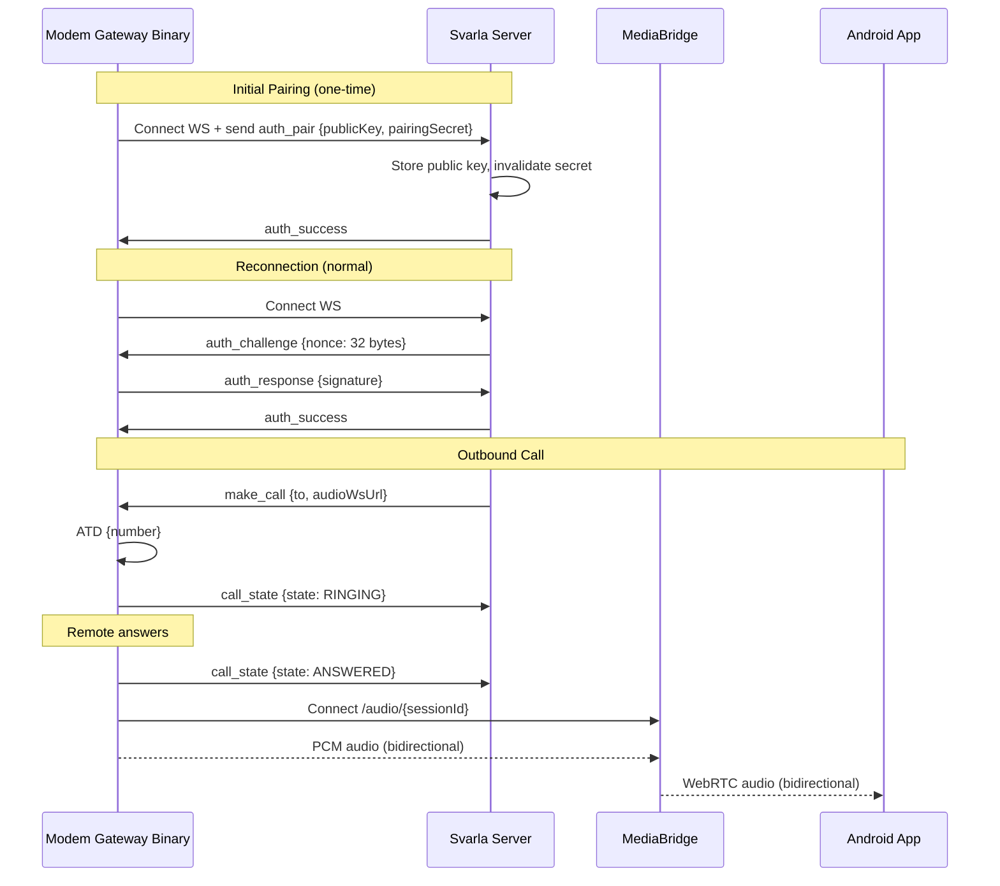
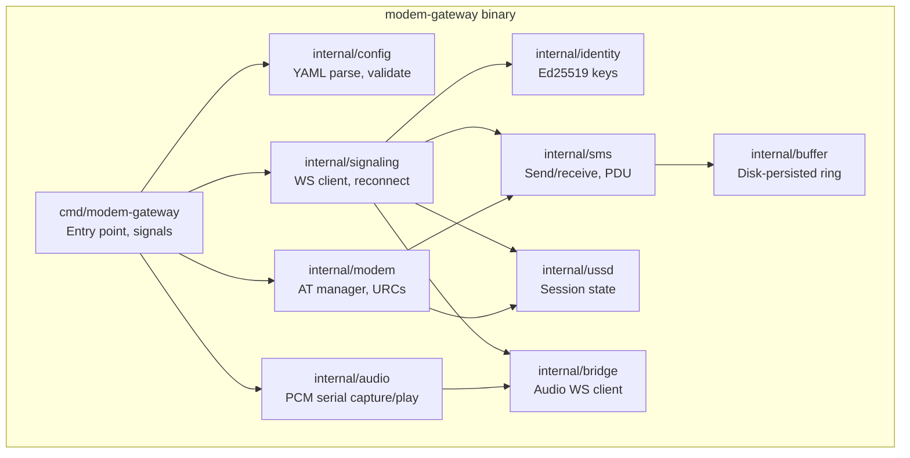
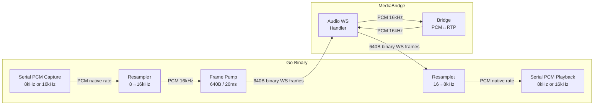
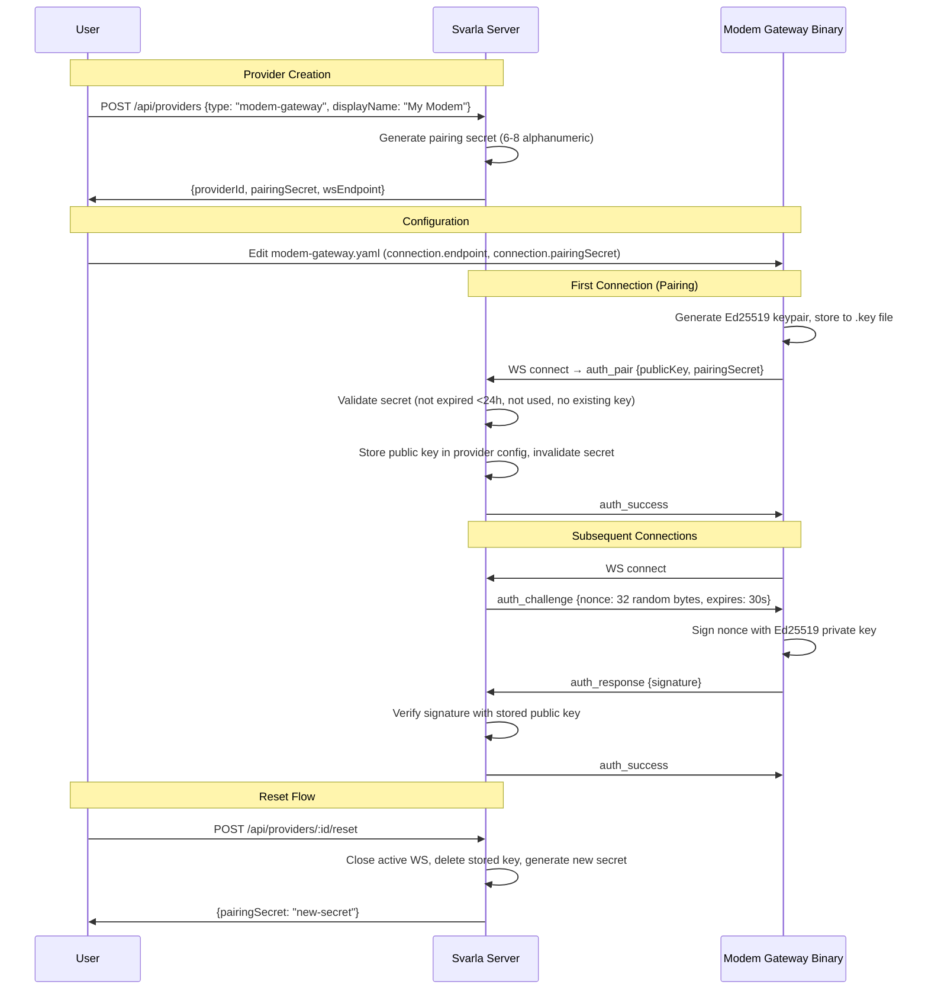

# Technical Design: Modem Gateway Provider

## Overview

The modem-gateway feature introduces a new telephony provider for Svarla that enables SMS and voice calls through a physical USB modem (e.g., SIM7600G-H). It replaces the legacy ModemManager/D-Bus provider with a cleaner, portable architecture consisting of three communicating components:

1. **Modem_Gateway_Binary** — A standalone Go binary running on a Raspberry Pi or similar SBC, communicating with the USB modem via AT commands and streaming audio via PCM audio serial port.
2. **Svarla_Server** — The Node.js backend that hosts the `ModemGatewayTelephonyProvider` implementing the `TelephonyProvider` interface, managing the signaling WebSocket endpoint.
3. **MediaBridge** — The existing Go service that bridges audio between WebRTC clients and telephony providers (unchanged; the Go binary connects to its existing `/audio/{sessionId}` WebSocket endpoint).

The Go binary initiates two outbound WebSocket connections:
- A **persistent Signaling WebSocket** to Svarla for authentication, SMS, call control, DTMF, USSD, and status reporting.
- An **ephemeral per-call Audio WebSocket** to the MediaBridge for bidirectional PCM audio streaming.

This design maintains the existing `TelephonyProvider` interface contract and integrates via the `ProviderRegistry` — no changes to call orchestration, routing, or client-facing APIs are required beyond adding the new provider type.

## Architecture

```mermaid
graph TB
    subgraph "Raspberry Pi / SBC"
        MGB[Modem Gateway Binary<br/>Go]
        MODEM[USB Modem<br/>AT + PCM Audio Serial]
        MGB -->|AT Commands| MODEM
        MGB -->|PCM Serial| MODEM
    end

    subgraph "Svarla Server (Node.js)"
        PR[Provider Registry]
        MGP[ModemGatewayTelephonyProvider]
        WSH[WS Handler<br/>Auth + Signaling]
        PR --> MGP
        MGP --> WSH
    end

    subgraph "MediaBridge (Go)"
        AWS[Audio WS Handler<br/>/audio/{sessionId}]
        BR[Bridge]
        AWS --> BR
    end

    subgraph "Client"
        APP[Android App<br/>WebRTC]
    end

    MGB -->|"wss:// Signaling WS<br/>(persistent)"| WSH
    MGB -->|"wss:// Audio WS<br/>(per-call)"| AWS
    APP -->|WebRTC| BR
```

### Connection Flow



### Go Binary Internal Architecture



## Components and Interfaces

### 1. Go Binary Packages

#### `cmd/modem-gateway`
- Entry point: config loading, `--generate-config` / `--version` flags
- Signal handling (SIGTERM, SIGINT) → graceful shutdown within 10s
- Orchestrates startup: config → identity → modem → signaling → audio
- Lifecycle management: coordinates shutdown order

#### `internal/config`
- YAML config file parsing and validation
- Default generation for `--generate-config`
- Required fields: `connection.endpoint` (Svarla WS URL), `modem.serialPort` (device path)
- Optional: `connection.pairingSecret`, `modem.phoneNumber`, `modem.voiceEnabled`, `modem.networkRegistration`, `modem.simPin`, `modem.pcmAudioPort`, `tls.caCert`, `tls.skipVerify`, `log.level`, `log.file`

```go
type Config struct {
    Connection ConnectionConfig `yaml:"connection"`
    Modem      ModemConfig      `yaml:"modem"`
    TLS        TLSConfig        `yaml:"tls"`
    Log        LogConfig        `yaml:"log"`
}

type ConnectionConfig struct {
    Endpoint      string `yaml:"endpoint"`      // Required: wss://svarla.example/ws/providers/{id}/signaling
    PairingSecret string `yaml:"pairingSecret"` // One-time setup, remove after pairing
}

type ModemConfig struct {
    SerialPort          string `yaml:"serialPort"`          // Default: /dev/ttyUSB2
    PhoneNumber         string `yaml:"phoneNumber"`         // E.164 override
    VoiceEnabled        bool   `yaml:"voiceEnabled"`        // Default: true
    PcmAudioPort        string `yaml:"pcmAudioPort"`        // Optional override, auto-detected
    NetworkRegistration bool   `yaml:"networkRegistration"` // Default: false
    SimPin              string `yaml:"simPin"`              // Optional
}

type TLSConfig struct {
    CACert     string `yaml:"caCert"`     // PEM file path
    SkipVerify bool   `yaml:"skipVerify"` // Default: false
}

type LogConfig struct {
    Level string `yaml:"level"` // Default: info
    File  string `yaml:"file"`  // Optional, empty = stdout
}
```

#### `internal/modem`
- AT serial port manager: opens configured device (115200 baud, 8N1)
- Command queue: single goroutine consuming from a channel, mutex-serialized, one AT command at a time
- URC parser: background goroutine reading the serial port, dispatching RING, +CLIP, +CMTI, +CUSD, +DTMF, +CREG, +CDS
- State machine:

```mermaid
stateDiagram-v2
    [*] --> Disconnected
    Disconnected --> Initializing: Serial port opened
    Initializing --> Ready: Init sequence complete
    Ready --> InCall: ATD<number>;/ATA success
    InCall --> Ready: Call ended (ATH/NO CARRIER)
    Ready --> Error: Command timeout / port error
    InCall --> Error: Modem lost during call
    Error --> Disconnected: Retry triggered
    Initializing --> Error: Init failed
```



- Initialization sequence: `ATE0`, verbose results, `+CLIP` enable, `+DDET` enable (DTMF detection), `+CNMI` configure (SMS arrival notifications), `AT+CMGF=1` (text mode, fallback to PDU)
- Modem detection: exponential backoff (2s → 30s) on USB disconnect/unresponsive
- Command timeout: 30s default (5s for VTS, 60s for CMGS)

```go
type Modem interface {
    SendCommand(cmd string, timeout time.Duration) (string, error)
    State() ModemState
    OnURC(handler func(urc URC))
    Close() error
}

type ModemState int
const (
    StateDisconnected ModemState = iota
    StateInitializing
    StateReady
    StateInCall
    StateError
)
```

#### `internal/audio`
- PCM audio serial port manager: opens the modem's dedicated PCM audio ttyUSB device (configurable, auto-detected from modem USB interfaces)
- On initialization: issues `AT+CPCMFRM=1` to attempt 16kHz sample rate; falls back to 8kHz if command fails or is unsupported
- During call: `AT+CPCMREG=1` enables PCM streaming on the serial port; `AT+CPCMREG=0` disables it
- Re-issues `AT+CPCMFRM=1` after modem resets (setting does not persist across reboots)
- Resampling: linear interpolation upsample 8→16kHz, averaging downsample 16→8kHz (only when operating at 8kHz)
- Capture goroutine: reads raw PCM bytes from the serial port, assembles into frames
- Playback goroutine: writes raw PCM bytes to the serial port
- Frame size at 16kHz: 640 bytes (320 samples × 16-bit = 20ms); at 8kHz: 320 bytes (160 samples × 16-bit = 20ms)
- No ALSA, no CGo, no libasound dependency

```go
type AudioPipeline interface {
    Start() error              // Opens PCM serial port, enables AT+CPCMREG=1
    Stop() error               // Disables AT+CPCMREG=0, closes port
    NativeSampleRate() int     // 8000 or 16000
    CaptureFrames() <-chan []byte  // 640-byte (16kHz) or 320-byte (8kHz) PCM frames
    PlaybackFrames() chan<- []byte // 640-byte PCM frames at 16kHz (resampled if needed)
}
```

#### `internal/signaling`
- Persistent WebSocket client to Svarla server
- Exponential backoff reconnection: 1s → 2s → 4s → ... → 60s cap, indefinite retries
- Re-authentication on reconnect (Ed25519 challenge-response)
- JSON message dispatch by `type` field
- Ping/pong handling (responds to server pings)
- Message send queue for outbound messages

```go
type SignalingClient interface {
    Connect(ctx context.Context) error
    Send(msg Message) error
    OnMessage(handler func(msg Message))
    Close() error
    IsConnected() bool
}
```

#### `internal/bridge`
- Per-call Audio WebSocket client to MediaBridge (`/audio/{sessionId}`)
- Bidirectional PCM frame pump: reads from audio capture → sends to WS; reads from WS → writes to audio playback
- 20ms frame interval (timer-driven send)
- Responds to ping frames
- Normal closure on call end; detects dead connection (no pong within 60s)

```go
type AudioBridge interface {
    Connect(ctx context.Context, url string) error
    StartStreaming(capture <-chan []byte, playback chan<- []byte) error
    Close() error
    IsConnected() bool
}
```

#### `internal/sms`
- SMS send via `AT+CMGS` (text mode default, PDU fallback)
- SMS receive via `+CMTI` URC → `AT+CMGR` to read
- Concatenated SMS reassembly (multi-part): tracks parts by reference number, assembles when complete
- UCS-2 detection: scans message body for characters outside GSM-7, switches encoding
- Delivery report request via `AT+CSMP` configuration
- Delivery report parsing from `+CDS` URC
- 60-second send timeout

```go
type SMSManager interface {
    Send(to, body string) (messageRef int, err error)
    OnReceived(handler func(sms IncomingSMS))
    OnDeliveryReport(handler func(report DeliveryReport))
}
```

#### `internal/ussd`
- USSD session state machine: idle → pending → active → idle
- Execute via `AT+CUSD=1,"code"` 
- Multi-step session support: forward intermediate responses, accept follow-up inputs
- Cancel via `AT+CUSD=2`
- 30-second timeout per step
- Reject during active call

#### `internal/identity`
- Ed25519 keypair generation on first run
- Key storage: PEM file (private key) alongside config, e.g., `modem-gateway.key`
- Challenge signing: receives 32-byte nonce, returns Ed25519 signature
- Public key export for pairing message

```go
type Identity interface {
    PublicKey() ed25519.PublicKey
    Sign(data []byte) []byte
    Exists() bool
    Generate() error
    Load() error
}
```

#### `internal/buffer`
- Disk-persisted ring buffer for SMS notifications and missed calls
- Format: JSON Lines (one JSON object per line, append-only)
- Max capacity: 1000 entries (shared across SMS + missed calls)
- FIFO eviction when full (discard oldest)
- Flush to disk on every write (crash-safe)
- Drain on reconnect: delivers all buffered items in chronological order
- Truncates file after successful delivery

```go
type PersistentBuffer[T any] interface {
    Push(item T) error
    DrainAll() ([]T, error)
    Len() int
    Flush() error
}
```

### 2. Svarla Server Components

#### `src/providers/modem-gateway-telephony-provider.ts`

Implements the `TelephonyProvider` interface. Delegates all operations to the connected Modem_Gateway_Binary via the signaling WebSocket.

```typescript
class ModemGatewayTelephonyProvider implements TelephonyProvider {
  readonly providerId = 'modem-gateway';

  // State
  private wsHandler: ModemGatewayWsHandler;
  private reportedNumber: string | null = null;
  private reportedCapabilities: Set<NumberCapability> = new Set();
  private providerStatus: ProviderStatus = { signal: null, network: null, operator: null, modem: null };
  private pendingOperations: Map<string, PendingOperation> = new Map();

  // TelephonyProvider methods delegate to WS handler
  async makeCall(from, to, sipUri?): Promise<CallInitResult>;
  async endCall(callId): Promise<void>;
  async answerCall(callId, deviceId): Promise<CallAnswerResult>;
  async sendSms(from, to, body): Promise<SmsResult>;
  async listNumbers(): Promise<ProviderNumber[]>;
  onEvent(listener): void;
  getWebhookEndpoints(): string[];     // returns []
  handleWebhook(endpoint, body): Promise<unknown>; // returns {}
  async start(): Promise<void>;         // starts WS listener
  async stop(): Promise<void>;          // closes WS, rejects pending
}
```

#### `src/providers/modem-gateway-ws-handler.ts`

Manages the signaling WebSocket endpoint for a single modem-gateway provider.

```typescript
class ModemGatewayWsHandler {
  // Pairing and auth
  private pairingSecret: string | null;
  private publicKey: Buffer | null;    // Ed25519 stored public key
  private pendingChallenge: { nonce: Buffer; expiresAt: number } | null;
  private lastAuthAttempt: number = 0; // rate-limiting
  
  // Connection state
  private ws: WebSocket | null = null;
  private authenticated: boolean = false;
  
  // Methods
  handleConnection(ws: WebSocket): void;
  sendMessage(msg: SignalingMessage): void;
  close(): void;
  isConnected(): boolean;
  
  // Pairing
  generatePairingSecret(): string;      // 6-8 alphanumeric chars
  resetPairing(): string;               // Delete key, new secret
  
  // Auth flow
  private handleAuthPair(msg): void;    // Initial pairing
  private handleAuthResponse(msg): void; // Challenge-response
  private issueChallenge(): void;
}
```

#### Updated: `src/validators/provider-config-validator.ts`

New Zod schema for modem-gateway (minimal — only display name needed):

```typescript
export const modemGatewayConfigSchema = z.object({
  // No required config fields — pairing secret and WS URL are server-generated
  // The public_key is stored after pairing, not user-provided
}).passthrough();
```

#### Updated: `src/server.ts` (Provider Factory)

```typescript
case 'modem-gateway':
  return new ModemGatewayTelephonyProvider({
    registryId: config._registryId as string,
    // No user-supplied config needed
  });
```

#### Updated: Provider Routes/API

- POST `/api/providers` — when type is "modem-gateway", response includes `pairing_secret` and `ws_endpoint` URL
- POST `/api/providers/:id/reset` — triggers key deletion and new pairing secret generation
- GET `/api/providers/:id/status` — returns modem status JSON (signal, network, operator, modem info)

#### Feature Flag: `EXPERIMENTAL_PROVIDERS`

- Checked only in the GET `/api/provider-types` endpoint (or equivalent UI metadata)
- "modem-gateway" excluded from the list unless `process.env.EXPERIMENTAL_PROVIDERS === 'true'`
- Does NOT gate API creation or operation of existing providers

#### Migration `012_remove_modemmanager.ts`

```typescript
export async function up(db: Kysely<unknown>): Promise<void> {
  // Delete numbers associated with modemmanager providers
  await sql`
    DELETE FROM numbers WHERE provider_id IN (
      SELECT id FROM providers WHERE type = 'modemmanager'
    )
  `.execute(db);
  
  // Delete modemmanager provider rows
  await sql`DELETE FROM providers WHERE type = 'modemmanager'`.execute(db);
}

export async function down(_db: Kysely<unknown>): Promise<void> {
  // No-op: cannot restore deleted data
}
```

#### Files to Delete
- `src/providers/modemmanager-telephony-provider.ts`
- `src/providers/modemmanager-telephony-provider.test.ts`
- Remove `dbus-next` from `package.json` dependencies
- Remove `modemmanagerConfigSchema` export and `modemmanager` entry from `schemasByType` in `provider-config-validator.ts`
- Remove `case 'modemmanager'` from provider factory in `server.ts`
- Remove `modemmanager` from `SENSITIVE_FIELDS` in `config-encryption.ts`
- Remove `modemmanager` from `WEBHOOK_ENDPOINTS` in `provider-registry.ts`

### 3. Signaling Protocol

All messages are JSON text frames with a `type` field identifying the message kind.

#### Binary → Svarla Messages

| Type | Purpose | Key Fields |
|------|---------|------------|
| `auth_pair` | Initial pairing | `publicKey` (base64), `pairingSecret` |
| `auth_response` | Challenge reply | `signature` (base64) |
| `status` | Periodic status | `signal` (0-31, 99=unknown), `network` (registered/searching/denied/unknown), `operator`, `modemModel`, `modemManufacturer`, `firmware`, `stale` (fields list) |
| `number_report` | Phone number | `number` (E.164), `capabilities` (["SMS", "VOICE"]) |
| `incoming_call` | RING detected | `callId`, `from` (CLIP number) |
| `call_state` | State transition | `callId`, `state` (RINGING/ANSWERED/COMPLETED/FAILED/BUSY), `reason?`, `durationSeconds?` |
| `incoming_sms` | Received SMS | `messageId`, `from`, `to`, `body`, `timestamp` |
| `sms_result` | Send outcome | `requestId`, `success`, `messageRef?`, `errorReason?` |
| `dtmf_received` | DTMF digit in | `callId`, `digit` |
| `dtmf_result` | DTMF send outcome | `requestId`, `success`, `errorReason?` |
| `ussd_response` | USSD result | `requestId`, `text`, `sessionActive` |
| `ussd_error` | USSD failure | `requestId`, `errorCode?`, `errorText` |
| `missed_calls` | Buffered missed | `calls` [{`from`, `timestamp`}] |
| `buffered_sms` | Buffered SMS | `messages` [{`messageId`, `from`, `to`, `body`, `timestamp`}] |
| `delivery_report` | SMS delivery status | `messageRef`, `status` (DELIVERED/FAILED) |

#### Svarla → Binary Messages

| Type | Purpose | Key Fields |
|------|---------|------------|
| `auth_challenge` | Nonce for signing | `nonce` (base64, 32 bytes) |
| `auth_success` | Auth complete | — |
| `auth_error` | Auth failed | `reason` |
| `make_call` | Initiate call | `requestId`, `to`, `audioWsUrl` |
| `answer_call` | Answer incoming | `requestId`, `callId`, `audioWsUrl` |
| `end_call` | Hang up | `callId` |
| `send_sms` | Send SMS | `requestId`, `to`, `body` |
| `send_dtmf` | Send DTMF digit | `requestId`, `callId`, `digit` |
| `ussd_request` | Start USSD | `requestId`, `code` |
| `ussd_input` | USSD follow-up | `requestId`, `input` |
| `ussd_cancel` | Cancel USSD | `requestId` |

#### Message Schema Example (TypeScript)

```typescript
// Base message type
interface SignalingMessage {
  type: string;
  [key: string]: unknown;
}

// Inbound from binary
interface AuthPairMessage {
  type: 'auth_pair';
  publicKey: string;    // base64-encoded Ed25519 public key
  pairingSecret: string;
}

interface StatusMessage {
  type: 'status';
  signal: number;              // CSQ value 0-31, 99=unknown
  network: 'registered' | 'searching' | 'denied' | 'unknown' | 'roaming';
  operator: string;
  modemModel?: string;
  modemManufacturer?: string;
  firmware?: string;
  stale?: string[];            // field names with stale values
}

interface MakeCallMessage {
  type: 'make_call';
  requestId: string;
  to: string;
  audioWsUrl: string;          // e.g., wss://media.example/audio/{sessionId}
}
```

### 4. Audio Pipeline



- **Wire format**: Binary WebSocket frames, 640 bytes each (320 samples × 16-bit signed LE = 20ms at 16kHz)
- **Sample rate on wire**: Always 16kHz PCM mono (matching existing MediaBridge audio WS protocol)
- **Local conversion**: If modem PCM port is 8kHz (AT+CPCMFRM=1 failed), binary performs linear interpolation upsampling (capture) and averaging downsampling (playback)
- **Sample rate negotiation**: On init, binary issues `AT+CPCMFRM=1`; if OK → 16kHz (no conversion needed); if ERROR → 8kHz (conversion active). Re-issued after modem resets.
- **Timing**: Dedicated capture goroutine reads from serial port at real-time rate; dedicated send goroutine uses 20ms timer for pacing
- **Jitter**: Small ring buffer (4-5 frames) between capture and WS send to absorb scheduling jitter
- **Authentication**: Session ID in URL path (consistent with existing protocol in `audiows/handler.go`)
- **Call lifecycle**: `AT+CPCMREG=1` enables PCM streaming at call start; `AT+CPCMREG=0` disables at call end

### 5. Identity and Pairing Flow



- **Key generation**: Ed25519 (32-byte public key, 64-byte private key) — compact, fast, no dependencies beyond Go stdlib
- **Key storage**: PEM-encoded private key file in same directory as config (e.g., `modem-gateway.key`)
- **Pairing secret**: 6-8 case-insensitive alphanumeric characters, valid for 24 hours, single-use
- **Challenge**: 32 bytes from `crypto.randomBytes()` (Node.js) or `crypto/rand` (Go), expires in 30 seconds
- **Rate limiting**: Minimum 1-second delay between auth attempts from the same provider
- **Already paired guard**: If provider already has a stored public key, reject pairing with error

### 6. Build System

#### Directory Structure

```
svarla/
├── modem-gateway/           # New Go module
│   ├── go.mod
│   ├── go.sum
│   ├── cmd/
│   │   └── modem-gateway/
│   │       └── main.go
│   ├── internal/
│   │   ├── config/
│   │   ├── modem/
│   │   ├── audio/
│   │   ├── signaling/
│   │   ├── bridge/
│   │   ├── sms/
│   │   ├── ussd/
│   │   ├── identity/
│   │   └── buffer/
│   └── Dockerfile.build     # Pure Go cross-compilation (CGO_ENABLED=0)
├── mediabridge/             # Existing
├── src/                     # Existing (Svarla server)
└── .github/workflows/
    └── release.yml          # Updated with modem-gateway build job
```

#### Cross-Compilation

```dockerfile
# Dockerfile.build for modem-gateway
FROM golang:1.22-bookworm AS builder

ARG TARGETOS=linux
ARG TARGETARCH=amd64
ARG VERSION=dev
ARG COMMIT=unknown
ARG BUILD_DATE=unknown

ENV CGO_ENABLED=0

RUN GOOS=${TARGETOS} GOARCH=${TARGETARCH} \
    go build -ldflags "-X main.version=${VERSION} -X main.commit=${COMMIT} -X main.buildDate=${BUILD_DATE}" \
      -o /out/modem-gateway ./cmd/modem-gateway
```

#### Release Workflow Addition

New job `modem-gateway` in `.github/workflows/release.yml`:

```yaml
modem-gateway:
  runs-on: ubuntu-latest
  needs: verify
  strategy:
    matrix:
      arch: [amd64, arm64]
  steps:
    - uses: actions/checkout@v4
    - name: Build modem-gateway (${{ matrix.arch }})
      run: |
        docker buildx build \
          --platform linux/${{ matrix.arch }} \
          --build-arg VERSION=${{ needs.verify.outputs.tag }} \
          --build-arg COMMIT=${{ github.sha }} \
          --build-arg BUILD_DATE=$(date -u +%Y-%m-%dT%H:%M:%SZ) \
          --output type=local,dest=./out \
          -f modem-gateway/Dockerfile.build \
          modem-gateway/
    - uses: actions/upload-artifact@v4
      with:
        name: modem-gateway-linux-${{ matrix.arch }}
        path: ./out/modem-gateway
```

The `create-draft-release` job attaches both binaries as release assets with naming: `modem-gateway-linux-amd64`, `modem-gateway-linux-arm64`.

#### Version Flag

```go
var (
    version   = "dev"
    commit    = "unknown"
    buildDate = "unknown"
)

func main() {
    if os.Args[1] == "--version" {
        fmt.Printf("modem-gateway %s (commit: %s, built: %s)\n", version, commit, buildDate)
        os.Exit(0)
    }
    // ...
}
```

## Data Models

### Provider Config (Database JSONB)

After pairing, the provider's `config` column in the `providers` table stores:

```json
{
  "public_key": "base64-encoded-ed25519-public-key",
  "pairing_secret": null,
  "pairing_secret_created_at": null,
  "ws_endpoint": "/ws/providers/{provider-id}/signaling"
}
```

Before pairing (freshly created):

```json
{
  "pairing_secret": "abc123xy",
  "pairing_secret_created_at": "2024-01-15T10:30:00Z",
  "public_key": null,
  "ws_endpoint": "/ws/providers/{provider-id}/signaling"
}
```

### Provider Status (In-Memory)

```typescript
interface ModemGatewayStatus {
  connected: boolean;
  lastSeen: Date | null;
  signal: {
    csq: number;           // 0-31, 99=unknown
    dbm: number;           // Derived: -113 + 2*csq
    bars: number;          // 0-5 UI representation
  } | null;
  network: {
    state: 'registered' | 'searching' | 'denied' | 'unknown' | 'roaming';
    operator: string;
  } | null;
  modem: {
    model: string;
    manufacturer: string;
    firmware: string;
  } | null;
  number: string | null;   // E.164
  capabilities: NumberCapability[];
  staleFields: string[];   // Fields with stale data (modem unresponsive)
}
```

### Go Binary Config File (`modem-gateway.yaml`)

```yaml
# Connection to Svarla server
connection:
  endpoint: "wss://svarla.example/ws/providers/abc-123/signaling"
  pairingSecret: "abc123xy"  # Remove after successful pairing

# Modem settings
modem:
  serialPort: "/dev/ttyUSB2"
  phoneNumber: "+46701234567"  # Optional E.164 override
  voiceEnabled: true
  pcmAudioPort: ""               # Optional override, auto-detected from modem USB interfaces
  networkRegistration: false
  simPin: ""

# TLS settings
tls:
  caCert: ""                   # Path to custom CA certificate (PEM)
  skipVerify: false            # Disable certificate verification

# Logging
log:
  level: "info"                # error, warn, info, debug, verbose
  file: ""                     # Empty = stdout
```

### SMS Buffer Entry (JSON Lines on disk)

```json
{"type":"sms","messageId":"1","from":"+46701234567","to":"+46709876543","body":"Hello","timestamp":1705312200}
{"type":"missed_call","from":"+46701234567","timestamp":1705312300}
```

### Key Design Decisions

| Decision | Rationale |
|----------|-----------|
| AT command serialization via single goroutine + channel | Modems only support one command at a time; mutex-protected channel ensures strict ordering without deadlocks |
| Modem state machine (5 states) | Clear lifecycle management; prevents invalid operations (e.g., DTMF when no call active) |
| Separate capture/playback goroutines with ring buffers | Decouples serial port timing from WebSocket timing; absorbs jitter without blocking audio |
| PCM over serial port (no ALSA) | No C dependencies, fully static binary, simple cross-compilation, works on standard SIM7600 firmware without modification |
| JSON Lines for buffer persistence | Append-only writes are crash-safe; simple to parse line-by-line; no external dependencies |
| YAML config format | Consistent with existing `server-config.yaml` and `mediabridge-config.yaml` in the project |
| Ed25519 for device auth | Compact keys (32 bytes), fast signing, no certificate management, Go stdlib support |
| PEM key file in config directory | Simple deployment; no key management service needed for edge device |
| Feature flag gates UI only, not API | Allows testing via API/curl while hiding from non-technical users |
| Pairing secret is case-insensitive alphanumeric | Easy to type via SSH into a headless Pi; no ambiguous characters |
| Binary connects outbound to Svarla | Pi is typically behind NAT; outbound WS avoids port forwarding requirements |

## Error Handling

### Go Binary Error Handling

| Error Scenario | Handling Strategy |
|---------------|-------------------|
| Serial port unavailable | Report `modem_disconnected` to Svarla, retry with exponential backoff (2s → 30s), reject incoming operations |
| AT command timeout (30s default) | Return error to caller, log warning, do NOT close port (modem may recover) |
| Signaling WS disconnected | Exponential backoff reconnect (1s → 60s), buffer incoming SMS/missed calls to disk, reject calls while disconnected |
| Audio WS dropped mid-call | Hang up modem (`ATH`), report `call_state: COMPLETED` with `reason: audio_ws_lost` to Svarla |
| Modem lost during call | Close audio WS, report `call_state: COMPLETED` with `reason: modem_lost` to Svarla |
| SMS send timeout (60s) | Report failure with `reason: timeout` to Svarla |
| DTMF send failure | Report failure with specific digit and error reason |
| USSD timeout (30s) | Report timeout error, cancel USSD session on modem |
| Invalid AT response | Log at debug level, retry once if appropriate, report error if persistent |
| PCM audio serial port unavailable | Disable voice capability, report only SMS, reject call operations |
| Config file invalid | Print descriptive error, exit non-zero |
| No config file found | Print suggestion to use `--generate-config`, exit non-zero |
| SIM PIN rejected | Report error to Svarla, do NOT retry (avoid SIM lock) |
| Graceful shutdown timeout (10s) | Force exit after 10 seconds regardless of pending operations |
| Buffer full (1000 entries) | Discard oldest entry, log warning |

### Svarla Server Error Handling

| Error Scenario | Handling Strategy |
|---------------|-------------------|
| WS auth failed (invalid signature) | Close WS with error code, enforce 1s delay before next attempt |
| Pairing secret expired (>24h) | Reject with `auth_error {reason: "secret_expired"}` |
| Pairing secret already used | Reject with `auth_error {reason: "secret_already_used"}` |
| Provider already paired | Reject with `auth_error {reason: "already_paired"}` |
| Challenge timeout (30s) | Close WS connection |
| Binary disconnected mid-operation | Reject pending promises with `ProviderUnavailableError` |
| makeCall/sendSms when binary not connected | Throw `ProviderUnavailableError` immediately |
| Invalid signaling message | Ignore and continue (per protocol spec) |
| Provider removal with active WS | Close WS, delete key, orphan numbers |

### Error Propagation

Operations initiated by the Svarla server (makeCall, sendSms, etc.) use a request-response pattern with `requestId` correlation:

1. Svarla sends request with unique `requestId`
2. Svarla starts a timeout (30s for calls, 60s for SMS)
3. Binary processes and responds with same `requestId`
4. If timeout expires before response: reject with `ProviderTimeoutError`
5. If WS disconnects before response: reject with `ProviderUnavailableError`

## Testing Strategy

### Unit Testing

**Svarla Server (TypeScript, Vitest)**:
- `ModemGatewayTelephonyProvider`: Mock WS handler, test all TelephonyProvider method behaviors
- `ModemGatewayWsHandler`: Mock WebSocket, test pairing flow, challenge-response, message routing, rate limiting, timeout handling
- `provider-config-validator.ts`: Test modem-gateway schema validation
- Provider factory: Test new `case 'modem-gateway'`
- Feature flag logic: Test `EXPERIMENTAL_PROVIDERS` gating
- Migration 012: Test modemmanager row deletion

**Go Binary (Go testing)**:
- `internal/config`: Parse valid/invalid YAML, defaults, `--generate-config` output
- `internal/modem`: Mock serial port, test AT command serialization, URC parsing, state machine transitions
- `internal/sms`: Test concatenated SMS reassembly, UCS-2 detection, delivery report parsing
- `internal/ussd`: Test session state machine, timeout handling
- `internal/identity`: Test key generation, signing, verification
- `internal/buffer`: Test persistence, capacity limits, drain ordering, crash recovery
- `internal/signaling`: Mock WS server, test reconnection backoff, auth flow, message dispatch
- `internal/audio`: Test resampling (8→16kHz, 16→8kHz)

### Integration Testing

- End-to-end pairing flow with real WebSocket connections (in-process test server)
- Signaling protocol round-trip: send command → receive response
- Audio pipeline: verify PCM frames flow bidirectionally through WS
- Buffer persistence: write entries, kill process, restart, verify entries survive
- Modem state machine: simulate USB disconnect/reconnect cycle

### Property-Based Testing

Property-based testing is appropriate for several pure-function aspects of this feature:
- Audio resampling (round-trip properties)
- SMS encoding/decoding (round-trip properties)
- Buffer serialization (round-trip properties)
- Signaling message serialization (round-trip properties)
- AT command parsing (invariants)

See Correctness Properties section below for formal property specifications.

### Test Configuration

- **Property-based tests**: Minimum 100 iterations per property (Go: `rapid` library; TypeScript: `fast-check`)
- **Tag format**: `Feature: modem-gateway, Property {N}: {description}`
- Unit tests use mocks for external dependencies (serial port, WebSocket)
- Integration tests use in-process servers and mock serial devices

## Correctness Properties

*A property is a characteristic or behavior that should hold true across all valid executions of a system — essentially, a formal statement about what the system should do. Properties serve as the bridge between human-readable specifications and machine-verifiable correctness guarantees.*

### Property 1: Audio Resampling Round Trip (8kHz → 16kHz → 8kHz)

*For any* valid PCM audio frame at 8kHz (array of int16 samples), upsampling to 16kHz and then downsampling back to 8kHz SHALL produce an output where each sample is within ±1 of the original sample value (accounting for integer rounding in interpolation).

**Validates: Requirements 26.2, 26.3**

### Property 2: Audio Resampling Frame Size Invariant

*For any* PCM audio frame of N samples at 8kHz, upsampling to 16kHz SHALL produce exactly 2N samples, and for any frame of M samples at 16kHz, downsampling to 8kHz SHALL produce exactly M/2 samples.

**Validates: Requirements 26.2, 26.3, 6.1**

### Property 3: SMS Buffer Serialization Round Trip

*For any* valid SMS notification (containing messageId, from, to, body, and timestamp fields with arbitrary Unicode content), serializing to JSON Lines format and then deserializing SHALL produce an entry identical to the original.

**Validates: Requirements 4.5, 4.8**

### Property 4: SMS Buffer Capacity Invariant

*For any* sequence of N push operations on a buffer with maximum capacity 1000, the buffer length SHALL never exceed 1000, and when N > 1000, the buffer SHALL contain the most recent 1000 entries in chronological order.

**Validates: Requirements 4.4, 21.4**

### Property 5: SMS Buffer Drain Ordering

*For any* sequence of entries pushed to the buffer, draining all entries SHALL return them in the exact order they were pushed (FIFO — oldest first).

**Validates: Requirements 4.6, 21.3**

### Property 6: Signaling Message Serialization Round Trip

*For any* valid signaling message (any of the defined message types with valid field values), serializing to JSON and deserializing SHALL produce a message with identical type and field values.

**Validates: Requirements 3.1, 3.2**

### Property 7: Exponential Backoff Bounds

*For any* sequence of N consecutive reconnection failures (where N ≥ 0), the computed backoff delay SHALL equal min(initialDelay × 2^N, maxDelay), and SHALL never exceed the configured maximum delay (60s for signaling, 30s for modem retry).

**Validates: Requirements 3.3, 11.1**

### Property 8: Pairing Secret Format Invariant

*For any* generated pairing secret, the secret SHALL be between 6 and 8 characters in length (inclusive) and SHALL consist only of alphanumeric characters (a-z, 0-9, case-insensitive).

**Validates: Requirements 1.2**

### Property 9: Ed25519 Signature Verification Round Trip

*For any* 32-byte challenge nonce and any valid Ed25519 keypair, signing the nonce with the private key and verifying the signature with the corresponding public key SHALL always succeed, and verifying with any different public key SHALL always fail.

**Validates: Requirements 2.3, 2.4, 2.5**

### Property 10: AT Command Serialization Order

*For any* sequence of AT commands submitted concurrently to the command queue, the commands SHALL be sent to the serial port in exactly the order they were received by the queue (FIFO), with no interleaving of command bytes.

**Validates: Requirements 14.1, 14.5**

### Property 11: Concatenated SMS Reassembly Completeness

*For any* multi-part SMS consisting of N parts (where 1 ≤ N ≤ 255) delivered in any order, once all N parts are received, the reassembled message SHALL equal the concatenation of parts in their correct sequence order regardless of arrival order.

**Validates: Requirements 18.1**

### Property 12: UCS-2 Detection Correctness

*For any* string, if the string contains at least one character outside the GSM-7 character set, UCS-2 encoding SHALL be selected; if all characters are within GSM-7, GSM-7 encoding SHALL be selected.

**Validates: Requirements 18.3**

### Property 13: Call Duration Calculation

*For any* call with an answer timestamp and a hangup timestamp (where hangup ≥ answer), the reported duration in seconds SHALL equal floor(hangup - answer) in seconds, and for calls that were never answered, the duration SHALL be null.

**Validates: Requirements 20.1, 20.2, 20.3**
