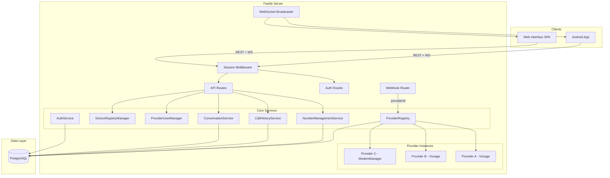
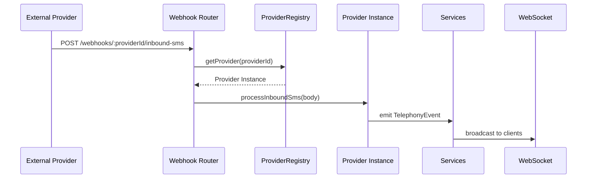
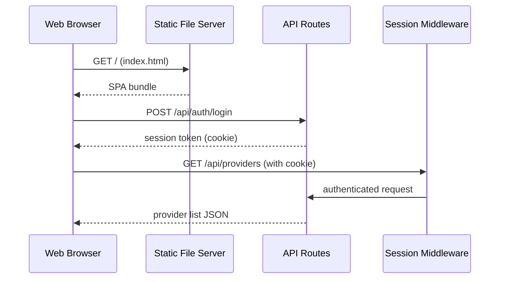

# Design Document: Multi-Provider Web Interface

## Overview

This design transforms the softphone server from a single-provider architecture into a multi-provider platform with a responsive web management interface. The system currently supports one telephony provider at a time (selected via config file); the new architecture stores provider configurations in the database, routes webhooks dynamically by Provider_ID, and allows runtime management of multiple simultaneous provider instances (including multiple instances of the same type).

A web interface (SPA served by Fastify) provides full management capabilities: provider CRUD, number/device management, conversations, call history, and password changes. The web UI shares the same authentication backend and session model as the mobile app.

The database is restructured with a single fresh migration replacing all Vonage-specific naming with generic provider terminology.

### Key Design Decisions

1. **SPA served by Fastify** — The web interface is a client-side SPA (vanilla TypeScript + a lightweight framework like Preact or lit-html) bundled into `dist/web/` and served by `@fastify/static`. No separate dev server needed in production.
2. **Provider instances stored in DB** — Provider configs live in the `providers` table (JSONB config column), loaded at startup and manageable at runtime via API.
3. **ProviderRegistry in-memory map** — A `ProviderRegistry` class holds initialized `TelephonyProvider` instances keyed by Provider_ID, enabling dynamic add/remove without restart.
4. **Webhook routing by path segment** — Webhook URLs use the pattern `/webhooks/:providerId/<endpoint>`, eliminating the need for signature-based provider identification.
5. **Fresh single migration** — All existing migrations are removed; a single `001_initial_schema.ts` creates the complete multi-provider schema from scratch.
6. **Web interface gated by config** — `web_interface.enabled` in server-config.yaml (defaults to `false`) controls whether web routes and static assets are served.

## Architecture



### Request Flow — Webhook



### Request Flow — Web Interface



## Components and Interfaces

### ProviderRegistry

Central registry managing all active telephony provider instances. Replaces the current single-provider `createTelephonyProvider()` factory.

```typescript
interface ProviderRegistryEntry {
  id: string;           // UUID
  type: string;         // "vonage" | "modemmanager" | "dummy"
  displayName: string;
  config: Record<string, unknown>;
  enabled: boolean;
  instance: TelephonyProvider | null;  // null if failed to initialize
  status: "active" | "unavailable" | "disabled";
}

interface ProviderRegistry {
  /** Load all enabled providers from DB and initialize them */
  loadAll(): Promise<void>;
  
  /** Get an active provider by ID */
  getProvider(providerId: string): ProviderRegistryEntry | undefined;
  
  /** Get all registered providers (active + inactive) */
  listProviders(): ProviderRegistryEntry[];
  
  /** Register a new provider, persist to DB, initialize, return webhook URLs */
  addProvider(type: string, displayName: string, config: Record<string, unknown>): Promise<{
    providerId: string;
    webhookUrls: string[];
  }>;
  
  /** Update a provider's display name, config, or enabled status */
  updateProvider(providerId: string, updates: Partial<{
    displayName: string;
    config: Record<string, unknown>;
    enabled: boolean;
  }>): Promise<void>;
  
  /** Remove a provider (fails if numbers still assigned or active calls) */
  removeProvider(providerId: string): Promise<void>;
  
  /** Get webhook URLs for a provider instance */
  getWebhookUrls(providerId: string): string[];
}
```

### WebhookRouter

Replaces the current fixed `/webhooks/*` routes with dynamic provider-scoped routing.

```typescript
interface WebhookRouter {
  /** Register all webhook routes for a provider type */
  registerProvider(providerId: string, type: string): void;
  
  /** Deregister webhook routes for a provider */
  deregisterProvider(providerId: string): void;
}
```

Webhook URL pattern: `/webhooks/:providerId/<endpoint>`

Provider type endpoint suffixes:
- **Vonage**: `answer`, `event`, `inbound-sms`, `sms-status`
- **ModemManager**: (no webhooks — uses D-Bus signals)
- **Dummy**: `inbound-sms`, `event` (for testing)

### ProviderManagement API

New REST endpoints for managing providers (all require authentication):

| Method | Path | Description |
|--------|------|-------------|
| GET | `/api/providers` | List all providers |
| POST | `/api/providers` | Add a new provider |
| GET | `/api/providers/:id` | Get provider details |
| PUT | `/api/providers/:id` | Update provider |
| DELETE | `/api/providers/:id` | Remove provider |

### NumberManagementService (updated)

The existing `NumberManagementService` is updated to be multi-provider-aware:
- Numbers are associated with a `provider_id`
- `syncNumbers()` syncs per-provider
- `getNumbers()` returns numbers with their provider context
- Outbound routing uses the number's provider_id to select the correct provider instance

### Web Interface Architecture

The SPA uses a simple component structure:

```
web/
├── index.html           # Shell HTML with mounting point
├── src/
│   ├── main.ts          # Entry point, router setup
│   ├── api.ts           # HTTP client (fetch wrapper with auth)
│   ├── ws.ts            # WebSocket client for real-time updates
│   ├── router.ts        # Client-side hash router
│   ├── state.ts         # Simple reactive state store
│   ├── components/
│   │   ├── login.ts
│   │   ├── providers.ts
│   │   ├── numbers.ts
│   │   ├── devices.ts
│   │   ├── conversations.ts
│   │   ├── call-history.ts
│   │   ├── settings.ts
│   │   └── nav.ts
│   └── styles/
│       └── main.css     # Responsive styles (mobile-first)
└── build.ts             # esbuild bundler script
```

**Technology choice**: Preact (3KB gzipped) for reactive UI with JSX, bundled with esbuild. Served as static files from `dist/web/`.

### Updated TelephonyProvider Interface

The `TelephonyProvider` interface gains a method to declare webhook endpoint suffixes:

```typescript
interface TelephonyProvider {
  // ... existing methods ...
  
  /** Return the webhook endpoint suffixes this provider type requires */
  getWebhookEndpoints(): string[];
}
```

### Password Change API

New endpoint:

| Method | Path | Description |
|--------|------|-------------|
| POST | `/api/auth/change-password` | Change password (requires current + new) |

### Provider Configuration Validators

Each provider type defines a Zod schema for its required configuration fields:

```typescript
const vonageConfigSchema = z.object({
  api_key: z.string().min(1),
  api_secret: z.string().min(1),
  application_id: z.string().uuid(),
  private_key_path: z.string().min(1),
  webhook_base_url: z.string().url(),
});

const modemmanagerConfigSchema = z.object({
  number_overrides: z.record(z.string(), z.string()).optional(),
});
```

## Data Models

### Database Schema (new single migration)

```sql
-- Providers table
CREATE TABLE providers (
  id UUID PRIMARY KEY DEFAULT gen_random_uuid(),
  type VARCHAR(50) NOT NULL,
  display_name VARCHAR(100) NOT NULL,
  config JSONB NOT NULL DEFAULT '{}',
  enabled BOOLEAN NOT NULL DEFAULT true,
  created_at TIMESTAMPTZ NOT NULL DEFAULT NOW(),
  updated_at TIMESTAMPTZ NOT NULL DEFAULT NOW()
);

-- Numbers table (replaces vonage_numbers)
CREATE TABLE numbers (
  number VARCHAR(20) PRIMARY KEY,
  provider_id UUID NOT NULL REFERENCES providers(id) ON DELETE RESTRICT,
  label VARCHAR(30),
  is_active BOOLEAN NOT NULL DEFAULT true,
  added_at TIMESTAMPTZ NOT NULL DEFAULT NOW(),
  last_used_at TIMESTAMPTZ
);

CREATE INDEX idx_numbers_provider ON numbers(provider_id);

-- Auth table (single-row)
CREATE TABLE auth (
  id INTEGER PRIMARY KEY DEFAULT 1 CHECK (id = 1),
  password_hash VARCHAR(256) NOT NULL,
  failed_attempts INTEGER NOT NULL DEFAULT 0,
  locked_until TIMESTAMPTZ
);

-- Device registry
CREATE TABLE device_registry (
  device_id UUID PRIMARY KEY DEFAULT gen_random_uuid(),
  device_name VARCHAR(100) NOT NULL,
  push_topic_id VARCHAR(200) NOT NULL,
  push_endpoint_url TEXT,
  registered_at TIMESTAMPTZ NOT NULL DEFAULT NOW(),
  last_seen_at TIMESTAMPTZ NOT NULL DEFAULT NOW(),
  session_token VARCHAR(256) NOT NULL UNIQUE,
  is_active BOOLEAN NOT NULL DEFAULT true
);

-- Provider users (replaces vonage_users)
CREATE TABLE provider_users (
  id UUID PRIMARY KEY DEFAULT gen_random_uuid(),
  provider_id UUID NOT NULL REFERENCES providers(id) ON DELETE RESTRICT,
  device_id UUID NOT NULL REFERENCES device_registry(device_id),
  provider_user_id VARCHAR(200) NOT NULL,
  provider_user_name VARCHAR(100) NOT NULL,
  display_name VARCHAR(100) NOT NULL,
  push_topic VARCHAR(200) NOT NULL,
  created_at TIMESTAMPTZ NOT NULL DEFAULT NOW(),
  updated_at TIMESTAMPTZ NOT NULL DEFAULT NOW()
);

CREATE INDEX idx_provider_users_device ON provider_users(device_id);
CREATE INDEX idx_provider_users_provider ON provider_users(provider_id);

-- Conversations
CREATE TABLE conversations (
  phone_number VARCHAR(20) PRIMARY KEY,
  last_message_preview VARCHAR(50),
  last_message_timestamp TIMESTAMPTZ,
  created_at TIMESTAMPTZ NOT NULL DEFAULT NOW()
);

-- Messages (replaces vonage_message_id/vonage_number)
CREATE TABLE messages (
  id UUID PRIMARY KEY DEFAULT gen_random_uuid(),
  provider_message_id VARCHAR(100) UNIQUE,
  conversation_number VARCHAR(20) NOT NULL REFERENCES conversations(phone_number),
  provider_number VARCHAR(20) REFERENCES numbers(number),
  body TEXT NOT NULL,
  direction VARCHAR(10) NOT NULL CHECK (direction IN ('SENT', 'RECEIVED')),
  status VARCHAR(10) NOT NULL CHECK (status IN ('PENDING', 'SENT', 'DELIVERED', 'FAILED', 'QUEUED')),
  timestamp TIMESTAMPTZ NOT NULL DEFAULT NOW(),
  retry_count INTEGER NOT NULL DEFAULT 0
);

CREATE INDEX idx_messages_conversation ON messages(conversation_number, timestamp DESC);

-- Call history (replaces vonage_number/vonage_call_id)
CREATE TABLE call_history (
  id UUID PRIMARY KEY DEFAULT gen_random_uuid(),
  phone_number VARCHAR(20) NOT NULL,
  provider_number VARCHAR(20) REFERENCES numbers(number),
  call_type VARCHAR(10) NOT NULL CHECK (call_type IN ('INCOMING', 'OUTGOING', 'MISSED', 'UNANSWERED', 'DECLINED')),
  timestamp TIMESTAMPTZ NOT NULL DEFAULT NOW(),
  duration_seconds INTEGER,
  provider_call_id VARCHAR(100),
  answered_by_device UUID REFERENCES device_registry(device_id)
);

CREATE INDEX idx_call_history_timestamp ON call_history(timestamp DESC);

-- Read state
CREATE TABLE read_state (
  id UUID PRIMARY KEY DEFAULT gen_random_uuid(),
  item_type VARCHAR(20) NOT NULL CHECK (item_type IN ('missed_calls', 'messages')),
  item_key VARCHAR(50) NOT NULL,
  read_at TIMESTAMPTZ NOT NULL DEFAULT NOW()
);

-- Notification queue
CREATE TABLE notification_queue (
  id UUID PRIMARY KEY DEFAULT gen_random_uuid(),
  device_id UUID NOT NULL REFERENCES device_registry(device_id),
  notification_type VARCHAR(20) NOT NULL,
  payload JSONB NOT NULL,
  created_at TIMESTAMPTZ NOT NULL DEFAULT NOW(),
  expires_at TIMESTAMPTZ NOT NULL,
  delivered BOOLEAN NOT NULL DEFAULT false
);

CREATE INDEX idx_notification_queue_device ON notification_queue(device_id);
```

### Kysely Type Definitions (updated)

```typescript
interface Database {
  providers: ProvidersTable;
  numbers: NumbersTable;
  auth: AuthTable;
  device_registry: DeviceRegistryTable;
  provider_users: ProviderUsersTable;
  conversations: ConversationsTable;
  messages: MessagesTable;
  call_history: CallHistoryTable;
  read_state: ReadStateTable;
  notification_queue: NotificationQueueTable;
}

interface ProvidersTable {
  id: Generated<string>;
  type: string;
  display_name: string;
  config: unknown;  // JSONB
  enabled: Generated<boolean>;
  created_at: Generated<Date>;
  updated_at: Generated<Date>;
}

interface NumbersTable {
  number: string;
  provider_id: string;
  label: string | null;
  is_active: Generated<boolean>;
  added_at: Generated<Date>;
  last_used_at: Date | null;
}

interface ProviderUsersTable {
  id: Generated<string>;
  provider_id: string;
  device_id: string;
  provider_user_id: string;
  provider_user_name: string;
  display_name: string;
  push_topic: string;
  created_at: Generated<Date>;
  updated_at: Generated<Date>;
}

interface MessagesTable {
  id: Generated<string>;
  provider_message_id: string | null;
  conversation_number: string;
  provider_number: string | null;
  body: string;
  direction: 'SENT' | 'RECEIVED';
  status: 'PENDING' | 'SENT' | 'DELIVERED' | 'FAILED' | 'QUEUED';
  timestamp: Generated<Date>;
  retry_count: Generated<number>;
}

interface CallHistoryTable {
  id: Generated<string>;
  phone_number: string;
  provider_number: string | null;
  call_type: 'INCOMING' | 'OUTGOING' | 'MISSED' | 'UNANSWERED' | 'DECLINED';
  timestamp: Generated<Date>;
  duration_seconds: number | null;
  provider_call_id: string | null;
  answered_by_device: string | null;
}
```

### Config File Schema Update

```yaml
# New web_interface section added to server-config.yaml
web_interface:
  enabled: false  # Defaults to false

# telephony section simplified — providers now live in DB
# Config file still declares server settings but no longer has provider config
telephony:
  # Legacy fallback removed; providers managed via API
```

## Correctness Properties

*A property is a characteristic or behavior that should hold true across all valid executions of a system — essentially, a formal statement about what the system should do. Properties serve as the bridge between human-readable specifications and machine-verifiable correctness guarantees.*

### Property 1: Provider storage round-trip

*For any* valid provider definition (type, display name ≤100 chars, valid config for that type, enabled status), adding it via the Provider Management API and then retrieving it by the returned Provider_ID SHALL produce the same type, display name, config, and enabled status, and the response SHALL include the Provider_ID (a valid UUID) and a non-empty list of webhook URLs containing the Provider_ID as a path segment.

**Validates: Requirements 1.1, 1.2, 2.1, 2.5, 3.2**

### Property 2: Multiple providers of same type coexist independently

*For any* set of N provider definitions of the same provider type (N ≥ 2), adding all of them SHALL produce N distinct Provider_IDs, and listing providers SHALL return all N entries independently addressable by their respective IDs.

**Validates: Requirements 1.6, 1.2**

### Property 3: Webhook routing delivers to correct provider

*For any* registered enabled provider and any valid webhook endpoint suffix for that provider's type, sending a webhook request to `/webhooks/:providerId/<endpoint>` SHALL invoke that provider's specific webhook handler (not any other provider's handler).

**Validates: Requirements 2.2**

### Property 4: Webhook routing rejects invalid and disabled providers

*For any* Provider_ID that does not exist in the registry, a webhook request SHALL return HTTP 404. *For any* Provider_ID that matches a disabled provider, a webhook request SHALL return HTTP 503.

**Validates: Requirements 2.3, 2.4**

### Property 5: Non-existent provider operations return error

*For any* UUID that does not match a registered provider, update and remove API requests SHALL return a not-found error response.

**Validates: Requirements 3.3**

### Property 6: Provider config validation rejects invalid configs and reports fields

*For any* provider type and any configuration object missing one or more required fields or containing invalid values, adding a provider SHALL fail with an error response that enumerates each invalid/missing field name.

**Validates: Requirements 3.5, 3.6**

### Property 7: Provider removal blocked by associated numbers

*For any* provider that has one or more associated Numbers in the `numbers` table, attempting to remove that provider SHALL fail with an error indicating numbers are still assigned. *For any* provider with zero associated numbers and zero active calls, removal SHALL succeed.

**Validates: Requirements 3.7, 14.9, 1.5**

### Property 8: Provider update persists changes

*For any* registered provider and any valid update (new display name ≤100 chars, valid config, or changed enabled status), applying the update and then retrieving the provider SHALL reflect the updated values.

**Validates: Requirements 3.4**

### Property 9: Operations route through the owning provider

*For any* Number associated with a Provider via provider_id, sending an SMS from that Number SHALL invoke `sendSms` on the owning Provider instance (and no other), and initiating a call from that Number SHALL invoke `makeCall` on the owning Provider instance.

**Validates: Requirements 4.2, 4.3**

### Property 10: Operations on numbers with disabled providers are rejected

*For any* Number whose owning Provider has `enabled = false` or is in an unavailable state, attempting to send a message or initiate a call SHALL be rejected with an error indicating the provider is not available.

**Validates: Requirements 4.5**

### Property 11: API responses include provider context for numbers and calls

*For any* Number returned by the numbers API, the response SHALL include the `provider_id` and provider `display_name`. *For any* call history entry that has a `provider_number`, the response SHALL include the associated provider display name.

**Validates: Requirements 4.4, 13.2**

### Property 12: Secret masking shows only last 4 characters

*For any* string value identified as a secret field in provider configuration, the masked representation SHALL consist of asterisk characters followed by the last 4 characters of the original value (or the entire value masked if shorter than 4 characters).

**Validates: Requirements 7.7**

### Property 13: Password change round-trip

*For any* valid current password and any new password that passes all validation rules, submitting a password change with the correct current password SHALL result in the new password being accepted for subsequent login authentication.

**Validates: Requirements 8.2**

### Property 14: Password validation returns specific rule failures

*For any* password string that violates exactly one validation rule (too short, missing uppercase, missing lowercase, missing digit, or missing special character), the password validator SHALL return an error message identifying that specific rule.

**Validates: Requirements 8.4**

### Property 15: Device removal invalidates session

*For any* active device, removing it SHALL cause its session token to be rejected on subsequent API requests (return 401 unauthorized).

**Validates: Requirements 10.3**

### Property 16: Self-removal prevention

*For any* authenticated request to remove a device, if the target device_id matches the requesting session's device_id, the operation SHALL be rejected.

**Validates: Requirements 10.5**

### Property 17: Conversations ordered by most recent message

*For any* set of conversations with distinct `last_message_timestamp` values, the conversations list endpoint SHALL return them ordered by `last_message_timestamp` descending (most recent first).

**Validates: Requirements 11.1**

### Property 18: Messages limited to 100 and ordered chronologically

*For any* conversation with N messages (N ≥ 0), retrieving messages SHALL return at most 100 messages ordered by timestamp ascending (oldest first within the returned set), and when N > 100, only the most recent 100 SHALL be returned.

**Validates: Requirements 11.2**

### Property 19: Message body length validation

*For any* string of length 0 or greater than 1600 characters, the message validator SHALL reject it. *For any* string of length 1 to 1600 characters inclusive, the message validator SHALL accept it.

**Validates: Requirements 11.3**

### Property 20: E.164 phone number validation

*For any* string that does not match E.164 format (starting with `+` followed by 1-15 digits), the phone number validator SHALL reject it as invalid.

**Validates: Requirements 11.5**

### Property 21: Call history pagination ordered by timestamp descending

*For any* set of call history entries, the paginated history endpoint SHALL return entries ordered by timestamp descending, with each page containing at most `pageSize` entries and page boundaries computed correctly.

**Validates: Requirements 13.1**

## Error Handling

### Provider Initialization Errors

- If a provider fails to initialize (bad credentials, unreachable API, invalid config), the ProviderRegistry marks it as `status: "unavailable"` and logs the error. Other providers continue initializing.
- Operations targeting an unavailable provider return HTTP 503 with a descriptive message.

### Webhook Errors

- Unknown Provider_ID in webhook path → HTTP 404, logged as warning
- Disabled provider → HTTP 503, logged as warning  
- Malformed webhook body → HTTP 400, logged as error
- Provider handler throws → HTTP 500, logged as error (does not crash server)

### Provider Management Errors

- Missing/invalid config fields → HTTP 400 with field-level error details
- Remove provider with numbers → HTTP 409 (Conflict) with explanation
- Remove provider with active calls → HTTP 409 (Conflict) with explanation
- Provider not found → HTTP 404

### Authentication Errors

- Invalid password → HTTP 401, generic message
- Account locked → HTTP 423, includes lockout duration
- Expired session → HTTP 401, web UI redirects to login

### Number/Message Errors

- Send from number with disabled provider → HTTP 503, identifies provider
- Invalid E.164 format → HTTP 400 with format guidance
- Message too long (>1600 chars) → HTTP 400 with length info
- Label too long (>30 chars) → HTTP 400 with constraint info

### WebSocket Errors

- Connection authentication failure → close with code 4001
- Provider becomes unavailable → broadcast `provider_status_changed` event
- Message send failure → update status via WebSocket `message_status` event

## Testing Strategy

### Property-Based Testing

This feature includes significant pure logic suitable for property-based testing:
- Provider config validation (Zod schema + custom validators)
- Webhook URL construction and routing logic
- Secret masking function
- Password validation
- Message/phone number validation
- Sort/pagination logic for conversations, call history, devices
- Number-to-provider routing decisions

**Library**: `fast-check` (already in devDependencies)  
**Configuration**: Minimum 100 iterations per property test  
**Tag format**: `Feature: multi-provider-web-interface, Property {N}: {title}`

### Unit Tests (Example-Based)

- AuthService: login flow, lockout, password change
- ProviderRegistry: add/remove/update lifecycle
- WebhookRouter: route registration/deregistration
- DeviceRegistryManager: self-removal prevention
- Config loading: web_interface.enabled parsing
- Web UI components: render correct elements per state

### Integration Tests

- Full API flow: add provider → add number → send message → verify routing
- Webhook end-to-end: external POST → provider handler → service → WebSocket broadcast
- Server startup with multiple providers in DB
- Database migration: verify schema matches expected structure
- WebSocket: verify real-time events reach connected clients

### Test Organization

```
src/
├── services/
│   ├── provider-registry.test.ts          # Unit + property tests
│   ├── provider-registry.property.test.ts # Pure property tests
│   └── ...
├── routes/
│   ├── provider-routes.test.ts            # API integration tests
│   ├── webhook-router.test.ts             # Routing property tests
│   └── ...
├── validators/
│   ├── provider-config-validator.test.ts  # Property tests per type
│   └── ...
└── formatters/
    └── secret-masker.test.ts              # Property tests for masking
```

### Migration Testing

- Run migration against empty database, verify all tables/indexes/constraints created
- Verify foreign key constraints (RESTRICT on providers deletion)
- Verify NOT NULL constraints on provider_id references
- Verify check constraints on enum columns
