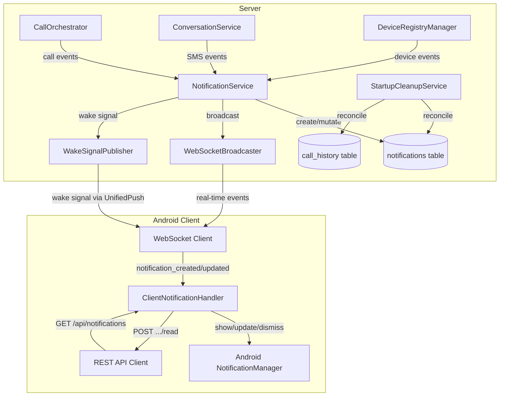
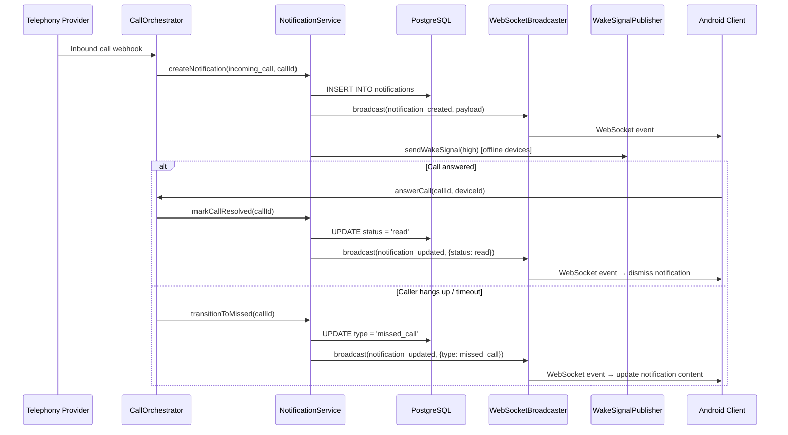

# Design Document: Server-Managed Notifications

## Overview

This design replaces the existing `notification_queue` table and ad-hoc `GET /api/notifications/:id` auto-detect route with a unified `notifications` table and `NotificationService` that owns the full notification lifecycle. The server becomes the single source of truth for notification state — creation, type mutation, status transitions, delivery, and cross-device synchronization.

The key architectural shift: notifications become first-class entities with their own identity and lifecycle, decoupled from the source records they reference. The client no longer needs in-memory deduplication or suppression logic; it simply renders what the server tells it to render and dismisses what the server tells it to dismiss.

### Design Decisions

1. **Single notification per call lifecycle** — Rather than creating separate `incoming_call` and `missed_call` notifications, the server mutates the existing notification's `type` field. This eliminates race conditions and duplicate notifications.

2. **Server-authoritative state** — The client does not decide whether to show/suppress a notification. The server broadcasts `notification_created` and `notification_updated` events; the client reacts to them declaratively.

3. **Startup cleanup** — Since call state is in-memory (CallOrchestrator's `activeCalls` Map), a server restart loses all active call tracking. The Startup_Cleanup_Service reconciles stale entries before accepting connections.

4. **Idempotent creation** — The service uses `source_entity_id + type` as a logical uniqueness key (enforced in application logic) to prevent duplicates from race conditions or retries.

## Architecture



### Data Flow: Incoming Call Lifecycle



## Components and Interfaces

### NotificationService (Server)

**File:** `src/services/notification-service.ts`

The central service managing notification CRUD, lifecycle mutations, and delivery orchestration.

```typescript
interface NotificationServiceDeps {
  db: Kysely<Database>;
  wsBroadcaster: WebSocketBroadcaster;
  wakeSignalPublisher: WakeSignalPublisher;
  deviceRegistryManager: DeviceRegistryManager;
  logger: CallOrchestratorLogger;
}

interface CreateNotificationInput {
  type: NotificationType;
  sourceEntityId: string;
  sourceEntityType: 'call_history' | 'messages' | 'device_registry';
  payload: NotificationPayload;
}

interface NotificationEntity {
  id: string;
  type: NotificationType;
  status: NotificationStatus;
  sourceEntityId: string;
  sourceEntityType: string;
  payload: NotificationPayload;
  createdAt: Date;
  updatedAt: Date;
}

type NotificationType = 'incoming_call' | 'missed_call' | 'incoming_sms' | 'blocked_call' | 'new_device_login';
type NotificationStatus = 'pending' | 'read';

interface NotificationPayload {
  callerNumber?: string;
  senderNumber?: string;
  providerNumber?: string;
  providerLabel?: string;
  contactName?: string | null;
  messagePreview?: string;
  deviceId?: string;
  deviceLabel?: string;
  timestamp: string; // ISO 8601
}

class NotificationService {
  /** Create a notification entity. Returns null if duplicate (same sourceEntityId + type). */
  async createNotification(input: CreateNotificationInput): Promise<NotificationEntity | null>;

  /** Mark a single notification as read by ID. No-op if already read or doesn't exist. */
  async markRead(notificationId: string): Promise<boolean>;

  /** Mark all pending notifications of given types as read. */
  async markAllRead(types?: NotificationType[]): Promise<number>;

  /** Mark all SMS notifications for a conversation as read. */
  async markConversationRead(conversationNumber: string): Promise<number>;

  /** Transition an incoming_call notification to missed_call (type mutation). */
  async transitionToMissed(sourceEntityId: string): Promise<NotificationEntity | null>;

  /** Mark the notification for a call as read (answered or declined). */
  async markCallResolved(sourceEntityId: string): Promise<boolean>;

  /** Get all pending notifications ordered by created_at ASC. */
  async getPendingNotifications(): Promise<NotificationEntity[]>;

  /** Deliver pending notifications to a reconnecting device. */
  async deliverPendingToDevice(deviceId: string): Promise<void>;
}
```

### NotificationRoutes (Server)

**File:** `src/routes/notification-routes.ts` (replaces existing file)

```typescript
// GET  /api/notifications           → returns all pending notifications
// POST /api/notifications/:id/read  → marks one notification as read
// POST /api/notifications/read-all  → marks all/filtered pending as read
```

### StartupCleanupService (Server)

**File:** `src/services/startup-cleanup-service.ts`

```typescript
interface StartupCleanupServiceDeps {
  db: Kysely<Database>;
  logger: CallOrchestratorLogger;
}

class StartupCleanupService {
  /**
   * Run all cleanup operations. Must complete before server accepts connections.
   * Throws on database errors to abort startup.
   */
  async run(): Promise<void>;
}
```

### ClientNotificationHandler (Android)

**File:** `app/src/main/kotlin/app/svarla/domain/notifications/NotificationHandler.kt` (refactored)

The handler becomes a reactive consumer of server events:

- `handleNotificationCreated(payload)` — show or update Android notification
- `handleNotificationUpdated(payload)` — update content (type change) or dismiss (status = read)
- Remove: `shownNotificationIds`, `isDuplicate()`, `isCallStale()`, all `wasCallDeclined*` / `wasAlreadyNotified*` / `wasRecentlyNotified*` checks

### WebSocket Event Types

New event types added to `WebSocketEventType`:

```typescript
type WebSocketEventType =
  | ... // existing types
  | 'notification_created'
  | 'notification_updated';
```

**notification_created payload:**
```json
{
  "type": "notification_created",
  "data": {
    "id": "uuid",
    "notificationType": "incoming_call",
    "status": "pending",
    "sourceEntityId": "call-uuid",
    "sourceEntityType": "call_history",
    "payload": { "callerNumber": "+1234...", "providerNumber": "+5678...", ... },
    "createdAt": "2024-01-01T00:00:00Z"
  }
}
```

**notification_updated payload:**
```json
{
  "type": "notification_updated",
  "data": {
    "id": "uuid",
    "notificationType": "missed_call",
    "status": "pending",
    "updatedAt": "2024-01-01T00:01:00Z"
  }
}
```

## Data Models

### notifications Table (PostgreSQL)

```sql
CREATE TABLE notifications (
    id UUID PRIMARY KEY DEFAULT gen_random_uuid(),
    type TEXT NOT NULL,
    status TEXT NOT NULL DEFAULT 'pending',
    source_entity_id TEXT NOT NULL,
    source_entity_type TEXT NOT NULL,
    payload JSONB NOT NULL DEFAULT '{}',
    created_at TIMESTAMPTZ NOT NULL DEFAULT now(),
    updated_at TIMESTAMPTZ NOT NULL DEFAULT now()
);

-- Efficient lookup of pending notifications
CREATE INDEX idx_notifications_status_pending
    ON notifications (created_at ASC)
    WHERE status = 'pending';

-- Efficient lookup by source entity (for mutations by call ID, message ID, etc.)
CREATE INDEX idx_notifications_source_entity_id
    ON notifications (source_entity_id);
```

### Kysely Type Definition

```typescript
export interface NotificationsTable {
  id: Generated<string>;
  type: string;
  status: Generated<string>;
  source_entity_id: string;
  source_entity_type: string;
  payload: unknown; // JSONB
  created_at: Generated<Date>;
  updated_at: Generated<Date>;
}

// Added to Database interface:
export interface Database {
  // ... existing tables
  notifications: NotificationsTable;
  // notification_queue removed after migration
}
```

### Migration Strategy

Two migrations in sequence:

1. **`009_notifications_table.ts`** — Creates the `notifications` table with indexes.
2. **`010_drop_notification_queue.ts`** — Migrates undelivered entries from `notification_queue` to `notifications`, then drops `notification_queue`.

The migration mapping from old queue entries:
- `notification_type` → `type` (direct mapping)
- `device_id` → not carried over (notifications are user-level, not device-level)
- `payload` → `payload` (JSONB, restructured to match new schema)
- Status: all migrated entries get `status = 'pending'`
- `source_entity_id`: extracted from the payload's `callId` or signal `id` field

## Correctness Properties

*A property is a characteristic or behavior that should hold true across all valid executions of a system — essentially, a formal statement about what the system should do. Properties serve as the bridge between human-readable specifications and machine-verifiable correctness guarantees.*

### Property 1: Notification creation produces correct entity for any event type

*For any* valid event (inbound call, inbound SMS, blocked call, or device registration) with any valid input data, the NotificationService SHALL create exactly one notification entity with the correct `type`, `source_entity_id`, `source_entity_type`, and all required payload fields populated according to the notification type.

**Validates: Requirements 2.1, 2.2, 2.3, 2.4, 2.5, 2.6, 2.7**

### Property 2: Notification creation is idempotent

*For any* notification creation input, calling `createNotification` multiple times with the same `source_entity_id` and `type` SHALL result in exactly one row in the notifications table.

**Validates: Requirements 2.8, 6.1**

### Property 3: SMS message preview truncation

*For any* SMS message body of any length, the `messagePreview` field in the notification payload SHALL have length ≤ 160 characters.

**Validates: Requirements 2.6**

### Property 4: Call resolution marks notification as read

*For any* incoming_call notification in pending status, when the call is answered or declined (via `markCallResolved`), the notification status SHALL become `read` and `updated_at` SHALL be updated.

**Validates: Requirements 3.1, 3.2**

### Property 5: Missed call transition mutates type without changing status

*For any* incoming_call notification in pending status, when `transitionToMissed` is called, the notification type SHALL become `missed_call`, the status SHALL remain `pending`, and `updated_at` SHALL be updated.

**Validates: Requirements 3.3, 6.2**

### Property 6: Batch read marks only matching notifications

*For any* set of notifications with mixed types and statuses, calling `markAllRead` with a type filter SHALL mark as read only those notifications whose type matches the filter AND whose current status is `pending`. Notifications of other types or already in `read` status SHALL remain unchanged.

**Validates: Requirements 3.4, 3.5, 8.3**

### Property 7: Mutations on non-existent or already-terminal notifications are no-ops

*For any* notification ID that does not exist in the database, or any notification already in `read` status, calling `markRead` or `markCallResolved` SHALL complete without error and without emitting a broadcast event.

**Validates: Requirements 3.6**

### Property 8: Every state change triggers a broadcast with correct event type

*For any* notification creation or mutation that changes the notification's state (status or type), the NotificationService SHALL invoke the WebSocketBroadcaster exactly once with event type `notification_created` for creations or `notification_updated` for mutations, and the broadcast payload SHALL contain the notification `id`, current `type`, current `status`, and `updatedAt`.

**Validates: Requirements 4.1, 4.2, 4.3**

### Property 9: Wake signal priority matches notification type for offline devices

*For any* notification creation where at least one device is not connected via WebSocket, the WakeSignalPublisher SHALL be called with priority `high` if and only if the notification type is `incoming_call`, and `normal` for all other types.

**Validates: Requirements 5.1, 5.2**

### Property 10: Pending notifications API returns only pending, ordered chronologically

*For any* set of notifications with mixed statuses, `GET /api/notifications` SHALL return only those with status `pending`, ordered by `created_at` ascending. No notification with status `read` SHALL appear in the response.

**Validates: Requirements 8.1, 5.5**

### Property 11: Startup cleanup transitions all stale entries to terminal states

*For any* set of call_history entries with `call_type = 'INCOMING'` and `answered_by_device IS NULL`, and any set of notifications with `type = 'incoming_call'` and `status = 'pending'`, after the StartupCleanupService runs: all such call_history entries SHALL have `call_type = 'MISSED'`, and all such notifications SHALL have `type = 'missed_call'` with `status` remaining `pending`.

**Validates: Requirements 7.1, 7.2, 7.3**

### Property 12: Data migration preserves all undelivered queue entries

*For any* set of undelivered, non-expired entries in the `notification_queue` table, after the migration runs, the `notifications` table SHALL contain one entry per migrated queue entry with correct type mapping and status `pending`, and the `notification_queue` table SHALL no longer exist.

**Validates: Requirements 9.1, 9.2**

## Error Handling

| Scenario | Behavior |
|----------|----------|
| Database error during notification creation | Log error, do not crash. The source event (call/SMS) still proceeds. Notification will be created on next relevant event or startup cleanup. |
| Database error during mutation | Log error, return false/null. Client will eventually sync via GET /api/notifications. |
| WebSocket broadcast failure (device disconnected mid-send) | Best-effort delivery. Device will sync pending notifications on reconnect. |
| Wake signal delivery failure (push endpoint unreachable) | Log warning. Device will receive notifications on next WebSocket reconnect. |
| Startup cleanup database failure | Abort server startup with error log. Do not accept connections with inconsistent state. |
| Duplicate notification creation race condition | Application-level check (SELECT before INSERT) plus database-level handling via `ON CONFLICT DO NOTHING` on a unique index on `(source_entity_id, type)`. |
| Invalid notification ID on mark-read API | Return HTTP 404. No side effects. |
| Invalid type parameter on read-all API | Return HTTP 400 with error message listing valid types. |
| Missing/invalid auth token on any notification endpoint | Return HTTP 401 via existing session middleware. |

## Testing Strategy

### Property-Based Tests (Server — TypeScript with fast-check)

Property-based testing is well-suited for this feature because:
- The NotificationService has pure logic for creation, mutation, and querying
- Input space is large (UUIDs, phone numbers, message bodies, device states)
- Universal invariants apply across all notification types

**Configuration:**
- Library: `fast-check` (TypeScript)
- Minimum iterations: 100 per property
- Each test tagged with: `Feature: server-managed-notifications, Property N: <property_text>`

**Properties to implement:**
- Property 1–12 as defined above, testing the NotificationService with a real or in-memory database

### Unit Tests (Server)

- NotificationService: specific examples for each notification type creation
- NotificationService: edge cases (null contact name, empty message body, max-length fields)
- StartupCleanupService: empty database, mixed stale entries
- Migration: verify schema correctness, index existence

### Unit Tests (Android/Kotlin)

- ClientNotificationHandler: `handleNotificationCreated` shows correct notification type
- ClientNotificationHandler: `handleNotificationUpdated` with status `read` dismisses notification
- ClientNotificationHandler: `handleNotificationUpdated` with type change updates notification content
- ClientNotificationHandler: event for unknown notification ID is ignored without error

### Integration Tests

- Full flow: inbound call → notification created → answered → notification read → broadcast received
- Full flow: inbound call → missed → notification mutated → broadcast received
- Reconnection: device reconnects, receives all pending notifications
- API: GET /api/notifications returns correct data after various mutations
- Migration: verify data migration from notification_queue to notifications table

### What Is NOT Property-Tested

- WebSocket delivery timing (2-second SLA) — measured via integration/load tests
- Android notification icon appearance — visual inspection
- Code removal verification — build compilation check
