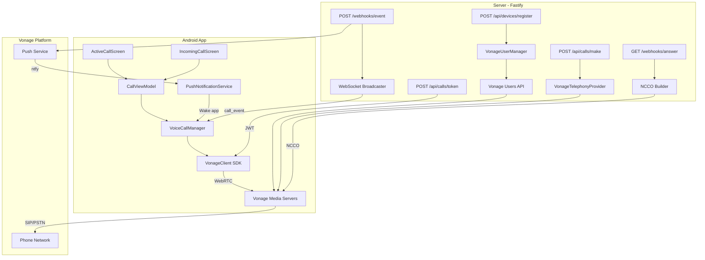
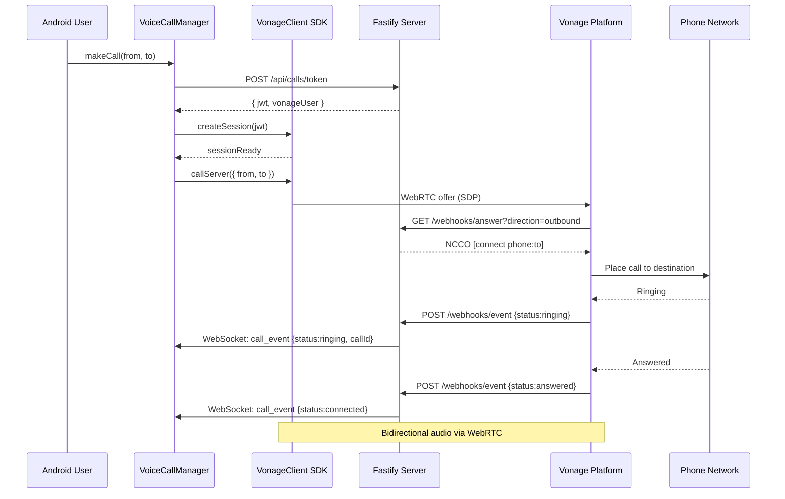
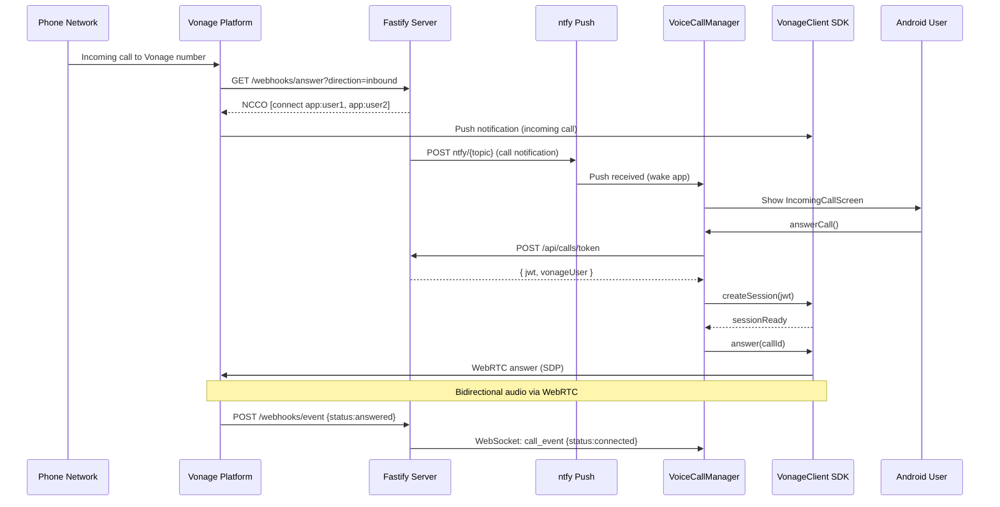

# Design Document: Voice Call Integration

## Overview

This design addresses the missing voice call integration layer between the existing softphone server (TypeScript/Fastify) and the Android client (Kotlin/Compose). The current system can initiate calls via the Vonage Voice API but lacks the critical WebRTC audio path — the Vonage Client SDK is not integrated on Android, no client JWT endpoint exists, Vonage Users are not provisioned, and the NCCO never connects the originator's device.

The solution introduces the Vonage Client SDK on Android for WebRTC audio, a server-side token endpoint and user management system, corrected NCCOs that connect both call legs, and push notification delivery for inbound calls. The server remains the coordinator (JWT generation, NCCO routing, user provisioning) while the Client SDK handles all WebRTC/audio transport on-device.

## Architecture



## Sequence Diagrams

### Outbound Call Flow



### Inbound Call Flow



## Components and Interfaces

### Component 1: VonageUserManager (Server)

**Purpose**: Manages Vonage Application Users — one per registered device. Required by the Client SDK to authenticate WebRTC sessions.

**Interface**:
```typescript
interface VonageUserManager {
  /** Create or retrieve existing Vonage user for a device */
  ensureUser(deviceId: string, displayName: string): Promise<VonageUser>
  /** Get all registered Vonage users (for ring-all on inbound) */
  listUsers(): Promise<VonageUser[]>
  /** Delete a Vonage user (device unregistered) */
  deleteUser(deviceId: string): Promise<void>
  /** Generate a Client SDK JWT for a specific user */
  generateClientJwt(vonageUserId: string): string
}
```

**Responsibilities**:
- Create Vonage users via Vonage Users API on device registration
- Store device-to-vonageUser mapping in PostgreSQL
- Generate RS256 JWTs with correct ACL paths for Client SDK
- Provide user list for inbound call NCCO (ring all devices)

### Component 2: Token Endpoint (Server)

**Purpose**: Provides authenticated Android clients with a Vonage Client SDK JWT for WebRTC session establishment.

**Interface**:
```typescript
// POST /api/calls/token
interface TokenRequest {
  deviceId: string
}

interface TokenResponse {
  jwt: string
  vonageUser: string
  expiresAt: number  // epoch seconds
}
```

**Responsibilities**:
- Authenticate request via session middleware
- Look up or create Vonage user for the device
- Generate time-limited JWT (24h expiry)
- Return JWT and user identifier to client

### Component 3: Fixed NCCO Builder (Server)

**Purpose**: Generates correct NCCOs that connect BOTH legs of a call — the originator via WebRTC and the destination via PSTN.

**Interface**:
```typescript
interface NccoBuilder {
  buildOutboundNcco(callerVonageUser: string, destinationNumber: string, from: string, eventUrl?: string): NccoAction[]
  buildInboundNcco(vonageUsers: string[], eventUrl?: string): NccoAction[]
}
```

**Responsibilities**:
- Outbound: Connect to destination phone number (existing) — the originator connects automatically via Client SDK WebRTC
- Inbound: Connect to all registered Vonage users (ring all devices)
- Include event URLs for call state tracking

### Component 4: VonageClientManager (Android)

**Purpose**: Wraps the Vonage Client SDK lifecycle — session management, call operations, and audio routing.

**Interface**:
```kotlin
interface VonageClientManager {
    val sessionState: StateFlow<SessionState>
    val incomingCall: SharedFlow<IncomingCallInfo>

    suspend fun initialize(jwt: String, user: String)
    suspend fun callServer(context: Map<String, String>): VonageCall
    suspend fun answerCall(callId: String): VonageCall
    suspend fun rejectCall(callId: String)
    suspend fun hangup(callId: String)
    fun setMuted(muted: Boolean)
    fun setSpeaker(enabled: Boolean)
    fun destroy()
}
```

**Responsibilities**:
- Initialize Vonage Client SDK with JWT
- Handle SDK callbacks (onCall, onHangup, onError)
- Manage audio session and routing (earpiece, speaker, Bluetooth)
- Expose incoming call events for push notification handling
- Clean up resources on logout/destroy

### Component 5: Updated VoiceCallManager (Android)

**Purpose**: Orchestrates the full call lifecycle by coordinating between the token API, VonageClientManager, and UI state.

**Interface** (additions to existing):
```kotlin
// New methods added to existing VoiceCallManager
interface VoiceCallManagerAdditions {
    suspend fun initializeVonageSession()
    fun setMuted(muted: Boolean)
    fun setSpeakerEnabled(enabled: Boolean)
    fun setAudioRoute(route: AudioRoute)
    val isMuted: StateFlow<Boolean>
    val isSpeakerOn: StateFlow<Boolean>
    val currentAudioRoute: StateFlow<AudioRoute>
}
```

### Component 6: PushNotificationHandler (Android)

**Purpose**: Receives ntfy push notifications for incoming calls and wakes the app to display the incoming call UI.

**Interface**:
```kotlin
interface PushNotificationHandler {
    fun onCallNotificationReceived(callId: String, from: String, vonageNumber: String)
    fun registerForPush(deviceId: String, pushTopic: String)
}
```


## Data Models

### VonageUser (Server - PostgreSQL)

```typescript
interface VonageUserRecord {
  id: string                  // Internal UUID
  device_id: string           // Device identifier from registration
  vonage_user_id: string      // Vonage-assigned user ID
  vonage_user_name: string    // Vonage username (e.g., "device-{deviceId}")
  display_name: string        // Human-readable name
  push_topic: string          // ntfy topic for push notifications
  created_at: Date
  updated_at: Date
}
```

**Validation Rules**:
- `device_id` must be unique (one Vonage user per device)
- `vonage_user_name` must match pattern `^[a-zA-Z0-9_-]+$`
- `push_topic` must be non-empty for inbound call notifications

### AudioRoute (Android)

```kotlin
enum class AudioRoute {
    EARPIECE,
    SPEAKER,
    BLUETOOTH,
    WIRED_HEADSET
}
```

### SessionState (Android)

```kotlin
sealed class SessionState {
    object Disconnected : SessionState()
    object Connecting : SessionState()
    data class Connected(val user: String) : SessionState()
    data class Error(val message: String) : SessionState()
}
```

### IncomingCallInfo (Android)

```kotlin
data class IncomingCallInfo(
    val callId: String,
    val from: String,
    val vonageNumber: String,
    val timestamp: Long
)
```

## Algorithmic Pseudocode

### Outbound Call Algorithm

```typescript
async function handleOutboundCall(from: string, to: string): Promise<void> {
  // Precondition: callState.status === IDLE
  // Precondition: from is valid E.164 Vonage number
  // Precondition: to is valid E.164 phone number

  setState(DIALING, { from, to, isInbound: false })
  startOutboundTimeout(30_000)
  startNetworkMonitoring()

  try {
    // Step 1: Acquire Vonage Client SDK token
    const { jwt, vonageUser } = await api.getCallToken(deviceId)

    // Step 2: Initialize Vonage Client session
    await vonageClient.initialize(jwt, vonageUser)

    // Step 3: Place call via Client SDK
    // The SDK connects to Vonage via WebRTC, which triggers
    // the answer webhook on the server. The server returns
    // an NCCO to connect to the destination phone.
    const call = await vonageClient.callServer({
      "from": from,
      "to": to
    })

    // Step 4: Update state with callId from SDK
    updateCallId(call.id)

    // The call_event WebSocket message will transition
    // state from DIALING → CONNECTED when remote answers

  } catch (error) {
    cancelTimeout()
    endCall(FAILED, error.message)
  }

  // Postcondition: callState.status ∈ {DIALING, ENDED}
  // Invariant: Only one active call at a time
}
```

### Inbound Call Algorithm

```typescript
async function handleInboundCall(callId: string): Promise<void> {
  // Precondition: callState.status === RINGING
  // Precondition: callId matches activeCallInfo.callId

  try {
    // Step 1: Acquire token for this session
    const { jwt, vonageUser } = await api.getCallToken(deviceId)

    // Step 2: Initialize Client SDK session
    await vonageClient.initialize(jwt, vonageUser)

    // Step 3: Answer the call via SDK
    const call = await vonageClient.answerCall(callId)

    // Step 4: Transition to CONNECTED
    setState(CONNECTED, { connectedTime: now() })
    startDurationTimer()
    startNetworkMonitoring()

  } catch (error) {
    endCall(FAILED, error.message)
  }

  // Postcondition: callState.status ∈ {CONNECTED, ENDED}
}
```

### Token Generation Algorithm (Server)

```typescript
function generateClientJwt(vonageUserId: string, applicationId: string, privateKey: string): string {
  // Precondition: vonageUserId is a valid registered Vonage user
  // Precondition: privateKey is a valid RSA private key
  // Precondition: applicationId is a valid Vonage application UUID

  const now = Math.floor(Date.now() / 1000)

  const payload = {
    iat: now,
    exp: now + 86400,                          // 24h expiry
    jti: `${now}-${randomString(12)}`,         // Unique token ID
    sub: vonageUserId,                         // The Vonage user
    application_id: applicationId,
    acl: {
      paths: {
        '/*/users/**': {},
        '/*/conversations/**': {},
        '/*/sessions/**': {},
        '/*/devices/**': {},
        '/*/image/**': {},
        '/*/media/**': {},
        '/*/applications/**': {},
        '/*/push/**': {},
        '/*/knocking/**': {},
        '/*/legs/**': {},
      }
    }
  }

  return jwt.sign(payload, privateKey, { algorithm: 'RS256' })

  // Postcondition: returned JWT is valid RS256 token
  // Postcondition: JWT.sub === vonageUserId
  // Postcondition: JWT.exp > JWT.iat
}
```

### NCCO Generation Algorithm (Server)

```typescript
function buildOutboundNcco(
  destinationNumber: string,
  fromNumber: string,
  eventUrl?: string
): NccoAction[] {
  // Precondition: destinationNumber is E.164 format
  // Precondition: fromNumber is E.164 format owned by Vonage app
  //
  // NOTE: The originator connects via Client SDK WebRTC automatically.
  // The NCCO only needs to connect the DESTINATION leg.

  const actions: NccoAction[] = [
    {
      action: 'connect',
      endpoint: [{ type: 'phone', number: destinationNumber }],
      from: fromNumber,
      ...(eventUrl && { eventUrl: [eventUrl] })
    }
  ]

  return actions

  // Postcondition: NCCO connects to phone endpoint
  // Postcondition: from field is set for caller ID
}

function buildInboundNcco(
  vonageUsers: string[],
  eventUrl?: string
): NccoAction[] {
  // Precondition: vonageUsers.length > 0
  // Precondition: all users are registered Vonage application users
  //
  // Connect to all registered app users (ring all devices)

  const actions: NccoAction[] = vonageUsers.map(user => ({
    action: 'connect',
    endpoint: [{ type: 'app', user }],
    ...(eventUrl && { eventUrl: [eventUrl] })
  }))

  return actions

  // Postcondition: NCCO connects to all registered users
  // Postcondition: Each action targets one app user endpoint
}
```

### Push Notification Algorithm (Server)

```typescript
async function notifyIncomingCall(
  callId: string,
  from: string,
  vonageNumber: string,
  users: VonageUserRecord[]
): Promise<void> {
  // Precondition: callId is a valid active call UUID
  // Precondition: users.length > 0

  const notifications = users.map(user =>
    fetch(`https://ntfy.sh/${user.push_topic}`, {
      method: 'POST',
      headers: {
        'Title': 'Incoming Call',
        'Priority': 'urgent',
        'Tags': 'phone_ringing',
        'Actions': `view, Answer, /call/${callId}`,
      },
      body: JSON.stringify({
        type: 'incoming_call',
        callId,
        from,
        vonageNumber,
        timestamp: Date.now()
      })
    })
  )

  await Promise.allSettled(notifications)

  // Postcondition: All registered devices notified (best-effort)
  // Invariant: Failure to notify one device does not block others
}
```

## Key Functions with Formal Specifications

### Function: VonageClientManager.initialize()

```kotlin
suspend fun initialize(jwt: String, user: String)
```

**Preconditions:**
- `jwt` is a valid RS256-signed Vonage Client SDK token
- `jwt.sub` matches `user` parameter
- `jwt.exp` > current time
- No existing active session (or previous session destroyed)

**Postconditions:**
- `sessionState` emits `Connected(user)`
- SDK is ready to place/receive calls
- Audio permissions granted at OS level

**Error cases:**
- Invalid JWT → `sessionState` emits `Error("Invalid token")`
- Network unreachable → `sessionState` emits `Error("Connection failed")`
- Expired JWT → `sessionState` emits `Error("Token expired")`

### Function: VonageUserManager.ensureUser()

```typescript
async function ensureUser(deviceId: string, displayName: string): Promise<VonageUser>
```

**Preconditions:**
- `deviceId` is a non-empty string uniquely identifying the device
- `displayName` is a non-empty string

**Postconditions:**
- If user exists for deviceId: returns existing VonageUser (idempotent)
- If user does not exist: creates via Vonage API AND stores in DB, then returns
- Returned VonageUser has valid `vonage_user_id`
- Database record exists for this device_id

**Loop Invariants:** N/A (single operation)

### Function: buildInboundNcco()

```typescript
function buildInboundNcco(vonageUsers: string[], eventUrl?: string): NccoAction[]
```

**Preconditions:**
- `vonageUsers` is non-empty array
- Each element is a valid Vonage username string

**Postconditions:**
- Returns array with one connect action per user
- Each action has `endpoint[0].type === 'app'`
- Each action has `endpoint[0].user` matching input user
- Result length equals `vonageUsers.length`

## Example Usage

### Server: Token Endpoint

```typescript
// POST /api/calls/token handler
server.post('/api/calls/token', async (request, reply) => {
  const session = request.session // from auth middleware
  const { deviceId } = request.body as { deviceId: string }

  if (!deviceId) {
    return reply.status(400).send({ error: 'deviceId required' })
  }

  // Ensure Vonage user exists for this device
  const vonageUser = await vonageUserManager.ensureUser(
    deviceId,
    session.username
  )

  // Generate Client SDK JWT
  const jwt = vonageUserManager.generateClientJwt(vonageUser.vonage_user_name)

  return reply.status(200).send({
    jwt,
    vonageUser: vonageUser.vonage_user_name,
    expiresAt: Math.floor(Date.now() / 1000) + 86400
  })
})
```

### Android: Outbound Call with SDK

```kotlin
// In VoiceCallManager - updated makeCall implementation
fun makeCall(from: String, to: String) {
    if (_callState.value.status != CallStatus.IDLE) return

    _callState.value = CallState(
        status = CallStatus.DIALING,
        activeCallInfo = ActiveCallInfo(
            callId = "",
            remoteNumber = to,
            vonageNumber = from,
            startTime = System.currentTimeMillis(),
            isInbound = false
        )
    )

    startOutboundTimeout()
    startNetworkMonitoring()

    scope.launch {
        try {
            // 1. Get Vonage Client SDK token
            val tokenResponse = callsApi.getCallToken(deviceId)

            // 2. Initialize Vonage Client SDK
            vonageClientManager.initialize(
                jwt = tokenResponse.jwt,
                user = tokenResponse.vonageUser
            )

            // 3. Place call via SDK (triggers server answer webhook)
            val call = vonageClientManager.callServer(
                mapOf("from" to from, "to" to to)
            )

            // 4. Update call state with real callId
            _callState.value = _callState.value.copy(
                activeCallInfo = _callState.value.activeCallInfo?.copy(
                    callId = call.id
                )
            )
        } catch (e: Exception) {
            endCallInternal(CallEndReason.FAILED, e.message)
        }
    }
}
```

### Android: Active Call Screen

```kotlin
@Composable
fun ActiveCallScreen(
    viewModel: CallViewModel = hiltViewModel()
) {
    val callState by viewModel.callState.collectAsStateWithLifecycle()
    val duration by viewModel.elapsedDuration.collectAsStateWithLifecycle()
    val isMuted by viewModel.isMuted.collectAsStateWithLifecycle()
    val isSpeaker by viewModel.isSpeakerOn.collectAsStateWithLifecycle()

    Column(
        modifier = Modifier.fillMaxSize(),
        horizontalAlignment = Alignment.CenterHorizontally
    ) {
        // Remote party info
        Text(callState.activeCallInfo?.remoteNumber ?: "")

        // Duration timer
        Text(formatDuration(duration))

        // Call controls
        Row {
            IconButton(onClick = { viewModel.toggleMute() }) {
                Icon(if (isMuted) Icons.Filled.MicOff else Icons.Filled.Mic)
            }
            IconButton(onClick = { viewModel.toggleSpeaker() }) {
                Icon(if (isSpeaker) Icons.Filled.VolumeUp else Icons.Filled.VolumeDown)
            }
            IconButton(onClick = { viewModel.endCall() }) {
                Icon(Icons.Filled.CallEnd, tint = Color.Red)
            }
        }
    }
}
```

## Correctness Properties

*A property is a characteristic or behavior that should hold true across all valid executions of a system — essentially, a formal statement about what the system should do. Properties serve as the bridge between human-readable specifications and machine-verifiable correctness guarantees.*

### Property 1: Single Active Call Invariant

*For any* sequence of call operations (make, answer, reject, hangup), at most one call can be in an active state (DIALING, RINGING, or CONNECTED) at any given time. A new call attempt while another is active is rejected.

**Validates: Requirements 8.2, 6.6**

### Property 2: State Machine Validity

*For any* random pair of (current call state, incoming event), only the defined transitions are permitted: IDLE → DIALING, IDLE → RINGING, DIALING → CONNECTED, DIALING → ENDED, RINGING → CONNECTED, RINGING → ENDED, CONNECTED → ENDED. All other transitions are rejected. Additionally, CONNECTED state always has non-null connectedTime and IDLE state always has null activeCallInfo.

**Validates: Requirements 8.1, 8.4, 8.5**

### Property 3: Token Freshness

*For any* valid deviceId and user, the generated Client SDK JWT has sub matching the vonage user, exp - iat = 86400, a unique jti, and contains all required ACL paths (users, conversations, sessions, devices, image, media, applications, push, knocking, legs).

**Validates: Requirements 2.2, 2.3, 2.4, 2.7**

### Property 4: User Idempotency

*For any* deviceId d, calling ensureUser(d, name) N times produces exactly one Vonage user record in the database. All calls return the same vonage_user_id, and the resulting record has a non-empty push_topic and a vonage_user_name matching ^[a-zA-Z0-9_-]+$.

**Validates: Requirements 1.2, 1.3, 1.5, 1.6**

### Property 5: NCCO Completeness (Outbound)

*For any* valid E.164 destination number and from number, buildOutboundNcco produces an NCCO containing exactly one connect action with endpoint type 'phone', the destination number in E.164 format, and the from field set to the caller's number. When an eventUrl is provided, it is included in the action.

**Validates: Requirements 3.1, 3.2, 3.3, 3.4**

### Property 6: NCCO Completeness (Inbound)

*For any* non-empty list of N registered Vonage users, buildInboundNcco produces an NCCO containing exactly N connect actions, each with endpoint type 'app' and a user field matching one input user. When an eventUrl is provided, it appears in every action.

**Validates: Requirements 4.1, 4.2, 4.3**

### Property 7: Timeout Guarantee

*For any* outbound call that remains in DIALING state, if no CONNECTED transition occurs within 30 seconds, the call transitions to ENDED with reason UNANSWERED.

**Validates: Requirements 6.4**

### Property 8: Cleanup on End

*For any* call transitioning to ENDED (from DIALING, RINGING, or CONNECTED), the activeCallInfo is cleared, the duration timer is stopped, and network monitoring is stopped.

**Validates: Requirements 8.3**

### Property 9: Push Notification Isolation

*For any* inbound call with N registered devices where a subset of push notifications fail, the remaining devices still receive their notifications. Failure to deliver to one device does not block delivery to others.

**Validates: Requirements 10.3**

### Property 10: Audio Route Consistency

*For any* sequence of audio route selections during an active call, the currentAudioRoute state always equals the last user selection. Mute toggle sequences produce alternating isMuted values consistent with the toggle count.

**Validates: Requirements 9.1, 9.2, 9.3**

## Error Handling

### Error Scenario 1: Token Generation Failure

**Condition**: Server cannot generate JWT (private key missing, Vonage user not found)
**Response**: Return 500 with error message; client shows "Call setup failed"
**Recovery**: Client can retry; if persistent, user must re-register device

### Error Scenario 2: SDK Session Timeout

**Condition**: Vonage Client SDK fails to establish WebRTC session within 10s
**Response**: Transition call to ENDED with reason FAILED
**Recovery**: User can retry the call; token is re-acquired on next attempt

### Error Scenario 3: Network Loss During Active Call

**Condition**: Device loses network connectivity while call status is CONNECTED or DIALING
**Response**: Disconnect SDK session, transition to ENDED with reason CONNECTIVITY_LOST
**Recovery**: User is notified; can initiate new call when connectivity restored

### Error Scenario 4: Push Notification Not Received

**Condition**: ntfy push doesn't reach device (app killed, network issues)
**Response**: The Vonage Client SDK also delivers incoming call push natively; WebSocket delivers call_event as backup
**Recovery**: Three delivery paths ensure at least one notification arrives; if none work, call goes unanswered after Vonage timeout

### Error Scenario 5: Vonage User Creation Failure

**Condition**: Vonage Users API returns error during device registration
**Response**: Return 500 to device registration endpoint; device cannot make/receive calls
**Recovery**: Retry on next app launch; server logs error for debugging

### Error Scenario 6: Concurrent Call Attempt

**Condition**: User tries to make a call while already in a call
**Response**: makeCall() returns early (no-op) if state is not IDLE
**Recovery**: User must end current call before placing another

## Testing Strategy

### Unit Testing Approach

- **VonageUserManager**: Test ensureUser idempotency, JWT generation with correct claims, user deletion cleanup
- **NCCO Builder**: Test outbound/inbound NCCO structure, event URL inclusion, multi-user inbound
- **Token Endpoint**: Test auth requirement, device ID validation, response format
- **VoiceCallManager**: Test state machine transitions, timeout behavior, network loss handling
- **VonageClientManager**: Mock SDK, test initialize/call/hangup sequences

### Property-Based Testing Approach

**Property Test Library**: fast-check (server), kotest-property (Android)

- **Token Claims Property**: For any valid deviceId and privateKey, the generated JWT always has sub matching the vonageUser, exp > iat, and valid ACL paths
- **State Machine Property**: For any sequence of call events, the CallState never reaches an invalid state combination (e.g., IDLE with non-null activeCallInfo, CONNECTED without connectedTime)
- **NCCO Structure Property**: For any list of vonageUsers, buildInboundNcco produces actions where each has exactly one app endpoint and the total count matches input length
- **E.164 Normalization Property**: For any valid phone number input, normalizeToE164 produces a string matching `^\+[1-9]\d{1,14}$`

### Integration Testing Approach

- **End-to-end outbound call**: Mock Vonage SDK responses, verify token → session → callServer → state transitions
- **End-to-end inbound call**: Simulate push notification → UI display → answer → connected state
- **Webhook integration**: Send realistic Vonage webhook payloads, verify NCCO responses and event broadcasting

## Performance Considerations

- **Token caching**: Client SDK sessions persist across calls within the same app session. Only re-acquire token if expired or on error.
- **Push notification latency**: ntfy delivers within 1-2 seconds; supplemented by WebSocket for already-connected clients.
- **WebRTC establishment**: Vonage Client SDK typically establishes media in < 2 seconds. The 30s timeout is generous to account for poor network.
- **Concurrent user lookup**: On inbound calls, the user list query should be indexed on `device_id` for fast lookup.

## Security Considerations

- **JWT scope**: Client SDK JWTs are scoped to a single Vonage user with minimal ACL permissions. Tokens cannot access other users' data.
- **Token expiry**: 24-hour expiry limits exposure if a token is compromised.
- **Private key storage**: The Vonage private key is stored server-side only (never sent to client). Client receives only signed JWTs.
- **Push notification security**: ntfy topics use device-specific random UUIDs, making topic guessing infeasible.
- **Session authentication**: All /api/calls/* endpoints require valid session middleware authentication before token issuance.

## Dependencies

### Server (new)
- `@vonage/server-sdk` (existing) — extended for Users API
- `jsonwebtoken` (existing) — JWT generation for Client SDK tokens

### Android (new)
- `com.vonage:client-sdk-voice:4.x` — Vonage Client SDK for WebRTC voice
- `androidx.media:media:1.7.0` — Audio focus management (likely already available)

### Infrastructure
- ntfy server (self-hosted or ntfy.sh) — push notification delivery
- Vonage Application configured with Users enabled
- Vonage Application answer_url and event_url pointing to server webhooks
