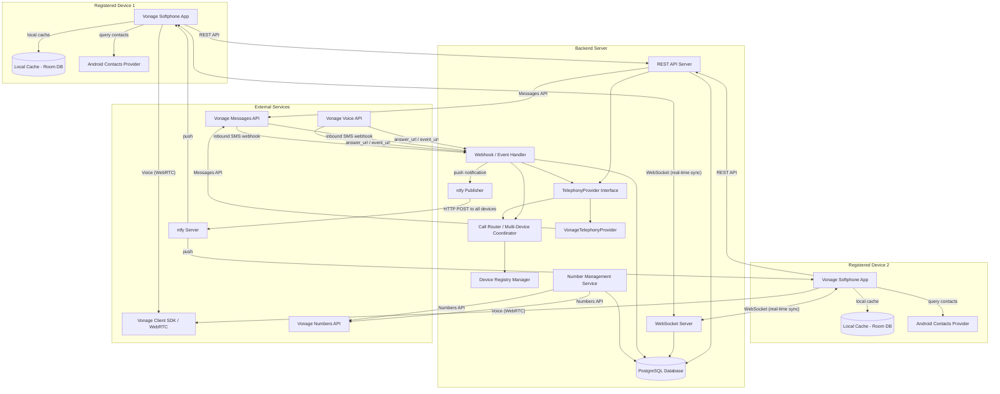
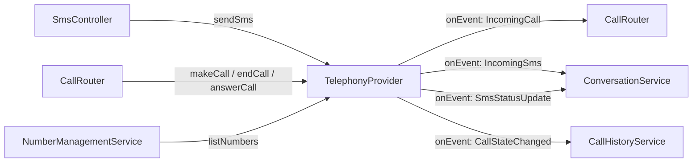
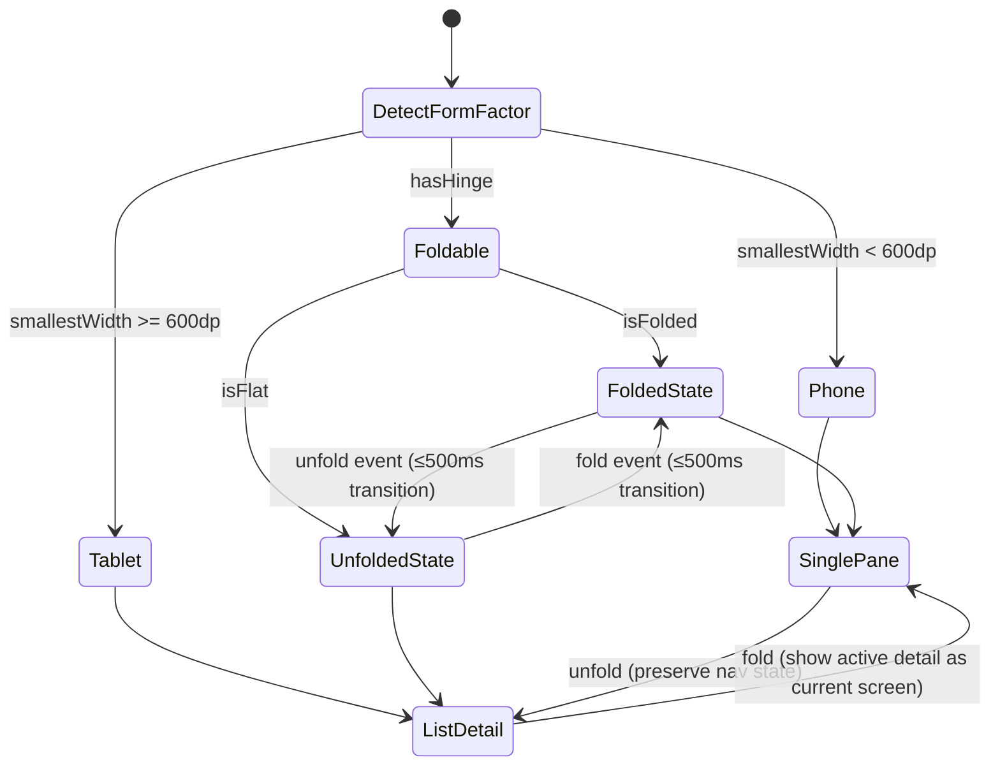

# Design Document: Vonage Softphone

## Overview

The vonage-softphone is a native Android application (Kotlin) that provides voice calling and SMS messaging over a data-only connection using one or more Vonage-purchased phone numbers. The system follows a client-server architecture where:

- The **Server** is the source of truth for all call history, SMS messages, Vonage number labels, and device registration data, backed by a PostgreSQL database
- The **Android app** is a thin client that syncs state from the server, handles UI, audio, and uses the Vonage Client SDK for WebRTC voice
- A **real-time sync layer** (WebSocket) ensures all registered devices receive updates within seconds
- **Multiple devices** (up to 5) can be registered simultaneously, all sharing the same call/message data
- **Multiple Vonage numbers** are supported, each with a user-defined label (e.g., "Personal", "Business"). The user selects which number to use for outbound calls/SMS
- **Contact name resolution** uses the native Android Contacts Provider on each device independently

The app targets a single user with no multi-tenancy. Authentication is handled via server-side session tokens with device registration in the Device_Registry.

### Key Design Decisions

1. **Vonage Client SDK for voice**: The Android app uses the Vonage Client SDK (WebRTC-based) for in-app voice rather than raw SIP. This provides SRTP encryption, NAT traversal, and codec negotiation out of the box.
2. **Server as source of truth**: All call history and SMS messages are stored in a PostgreSQL database on the server. Devices sync from the server rather than maintaining independent local state. This enables seamless multi-device operation.
3. **Multi-device call routing (ring-all, first-answer-wins)**: On incoming calls, the server notifies ALL registered devices simultaneously. The first device to answer gets the call, and the server immediately sends cancellation signals to all other devices.
4. **WebSocket for real-time sync**: Each connected device maintains a WebSocket connection to the server for immediate state updates (new messages, call events, device registry changes). Polling is used as a fallback when WebSocket is unavailable.
5. **ntfy for push notifications**: The server publishes to ntfy topics to wake the Android app for incoming calls/SMS when the app is backgrounded or the device is asleep. No Firebase/GCM dependency.
6. **Native Android Contacts Provider**: Contact name resolution uses the device's local contacts via Android's `ContentResolver` API. No server-side contact storage, no Nextcloud/CardDAV sync. Each device resolves names independently from its own contacts.
7. **Local cache with server sync**: The app maintains a local Room DB cache of server data for offline access and fast UI rendering, but the server database is authoritative.
8. **Multiple Vonage numbers with labels**: The server stores all Vonage numbers associated with the user's account along with user-defined labels. The app syncs the number list and labels, and allows the user to select which number to use for outbound operations. Defaults to most recently used number; auto-selects if only one number exists.
9. **TelephonyProvider abstraction**: All telephony operations (make call, send SMS, receive call, receive SMS, list numbers) are accessed through a `TelephonyProvider` interface. The Vonage implementation is the initial (and currently only) provider. This abstraction enables future alternative backends (e.g., ModemManager with a USB modem) to be added without modifying the core server logic, call routing, or client app.

## Technology Stack

### Backend Server

| Category | Technology | Version | Rationale |
|----------|-----------|---------|-----------|
| Runtime | Node.js | 20 LTS+ | Event-loop architecture handles WebSocket connections and webhook responses naturally; right-sized for single-user |
| Language | TypeScript | 5.x | Type safety, better IDE support, catches errors at compile time |
| HTTP Framework | Fastify | 4.x | High-performance, built-in schema validation (JSON Schema/Zod), plugin architecture, TypeScript-first |
| WebSocket | `ws` | 8.x | Lightweight, production-grade WebSocket library; integrates with Fastify via `@fastify/websocket` |
| Database Driver | `pg` (node-postgres) | 8.x | Battle-tested PostgreSQL client for Node.js |
| Query Builder | Kysely | 0.27+ | Type-safe SQL query builder, no ORM overhead, generates clean queries |
| Database Migrations | Kysely Migrations | — | Co-located with query builder, TypeScript-based migration files |
| Vonage SDK | `@vonage/server-sdk` | 3.x | First-class Node.js SDK for Voice, Messages, and Numbers APIs; best-maintained Vonage SDK |
| Validation | Zod | 3.x | Runtime schema validation for request bodies, environment config, and webhook payloads |
| Authentication | bcrypt + crypto | — | `bcrypt` for password hashing; `crypto.randomBytes` for session tokens |
| HTTP Client (ntfy) | `undici` (Node built-in fetch) | — | Built into Node.js 20+, no external dependency needed for ntfy HTTP POST |
| Process Manager | PM2 or systemd | — | Production process management, auto-restart on crash |
| Logging | Pino | 8.x | Fast, structured JSON logging; native Fastify integration |
| Testing | Vitest + fast-check | — | Vitest for unit/integration tests; fast-check for property-based testing |
| Linting | ESLint + Prettier | — | Code quality and formatting |

### Android App

| Category | Technology | Version | Rationale |
|----------|-----------|---------|-----------|
| Language | Kotlin | 2.0+ | Official Android language, coroutines for async, concise syntax |
| UI Framework | Jetpack Compose | 1.6+ | Modern declarative UI, Material3-native, less boilerplate than XML Views |
| Design System | Material3 (`androidx.compose.material3`) | 1.2+ | Maps directly to Requirement 13 (polished M3 design), dark mode built-in |
| Adaptive Layout | Material3 Adaptive (`androidx.compose.material3.adaptive`) | 1.0+ | `ListDetailPaneScaffold` for tablet/foldable list-detail layouts |
| Navigation | Compose Navigation (`androidx.navigation.compose`) | 2.7+ | Type-safe navigation, deep link support, back-stack management |
| DI | Hilt (`dagger.hilt.android`) | 2.51+ | Standard Android DI, minimal setup, ViewModel integration |
| Local Database | Room (`androidx.room`) | 2.6+ | SQLite wrapper with compile-time query verification, Flow support |
| Networking (REST) | Ktor Client | 2.3+ | Kotlin-native, coroutine-based, multiplatform-ready |
| Networking (WebSocket) | OkHttp WebSocket | 4.12+ | Built into OkHttp (already a transitive dep), reliable reconnection |
| Voice/WebRTC | Vonage Client SDK for Android | latest | First-party WebRTC integration for in-app voice |
| Push Notifications | UnifiedPush connector library | 2.x | ntfy-compatible, no Google Play Services dependency |
| Contacts | Android ContentResolver | platform | Standard API for querying device contacts |
| Window Management | Jetpack WindowManager (`androidx.window`) | 1.2+ | Fold state detection, hinge awareness for foldable devices |
| Image/Icons | Coil (`io.coil-kt:coil-compose`) | 2.6+ | Compose-native image loading, lightweight |
| Async | Kotlin Coroutines + Flow | 1.8+ | Structured concurrency, reactive state management |
| Serialization | Kotlinx Serialization | 1.6+ | Kotlin-native JSON parsing, compile-time safe |
| Testing (Unit) | Kotest | 5.x | Property-based testing module for correctness properties |
| Testing (UI) | Compose UI Test | 1.6+ | Compose testing APIs for UI verification |
| Build | Gradle (Kotlin DSL) | 8.x | Standard Android build system |
| Min SDK | API 26 (Android 8.0) | — | Covers 95%+ of active devices, notification channels required |
| Target SDK | API 34 (Android 14) | — | Latest platform features and security |

### Infrastructure & Deployment

| Category | Technology | Rationale |
|----------|-----------|-----------|
| Database | PostgreSQL 16 | Robust, feature-rich RDBMS; excellent JSON support for notification payloads |
| Push Service | ntfy (self-hosted or ntfy.sh) | Already in user's infrastructure; UnifiedPush-compatible |
| Server Hosting | Any Linux VPS (systemd) | Single-user app doesn't need container orchestration |
| TLS | Caddy or nginx reverse proxy | Automatic HTTPS for webhook endpoints and API |
| Monitoring | Pino logs + systemd journal | Simple, sufficient for single-user personal tool |

### Key Library Interaction Map

```mermaid
graph LR
    subgraph "Android App"
        COMPOSE[Jetpack Compose] --> M3[Material3]
        COMPOSE --> NAV[Compose Navigation]
        HILT[Hilt DI] --> VM[ViewModels]
        KTOR[Ktor Client] --> REST[REST API Calls]
        OKHTTP[OkHttp WS] --> SYNC[Real-time Sync]
        ROOM[Room DB] --> CACHE[Local Cache]
        VONAGE_SDK[Vonage Client SDK] --> WEBRTC[Voice Calls]
        UP[UnifiedPush] --> NTFY_RCV[Notifications]
    end

    subgraph "Backend Server"
        FASTIFY[Fastify] --> ROUTES[REST Routes]
        WS_LIB[ws] --> BROADCAST[WebSocket Broadcast]
        KYSELY[Kysely] --> PG[PostgreSQL]
        VONAGE_NODE[@vonage/server-sdk] --> TELPROV[TelephonyProvider]
        ZOD[Zod] --> VALIDATE[Request Validation]
        PINO[Pino] --> LOGS[Structured Logging]
    end
```

## Architecture



### Call Flow: Outbound

1. User initiates call in app → User selects (or app auto-selects) the Vonage number to use as caller ID
2. App calls `VoiceClient.callServer()` via Vonage Client SDK, passing the selected number
3. Server receives the call request and delegates to `TelephonyProvider.makeCall(from, to)`
4. `VonageTelephonyProvider` triggers the Vonage Voice API → Vonage hits the backend's `answer_url` webhook
5. `VonageTelephonyProvider` returns NCCO: `[{ action: "connect", endpoint: [{ type: "phone", number: "<destination>" }], from: "<selected_vonage_number>" }]`
6. Vonage connects the WebRTC leg to the PSTN leg
7. `TelephonyProvider` emits `CallStateChanged` events → server records call in PostgreSQL → broadcasts update via WebSocket to all registered devices

### Call Flow: Inbound (Multi-Device)

1. External caller dials one of the user's numbers → `TelephonyProvider` emits `IncomingCall` event (in Vonage's case: Vonage hits `answer_url`, `VonageTelephonyProvider` normalizes it)
2. Server identifies which number was called and looks up its label
3. `VonageTelephonyProvider` returns NCCO to Vonage: `[{ action: "connect", endpoint: [{ type: "app", user: "<user>" }] }]`
4. **Call Router** queries the Device_Registry for all registered devices
5. Server pushes high-priority notification to ntfy for ALL registered devices, including the number label
6. ALL registered devices ring simultaneously, displaying the called number's label
7. **First device to answer** → Server calls `TelephonyProvider.answerCall(callId, deviceId)` → connection established on that device
8. Server immediately sends **cancellation signal** via WebSocket to all other devices → they stop ringing and dismiss the call notification
9. If no device answers within 30s or user declines on one device → Server calls `TelephonyProvider.endCall(callId)`, sends stop-ringing signal to all devices, records missed call in database

### SMS Flow: Outbound

1. User composes SMS in app → User selects (or app auto-selects) the number to use as sender
2. App sends to backend REST API, including the selected sender number
3. Backend delegates to `TelephonyProvider.sendSms(from, to, body)` → `VonageTelephonyProvider` calls Vonage Messages API
4. Backend stores message in PostgreSQL with PENDING status (recording which number was used)
5. `TelephonyProvider` emits `SmsStatusUpdate` event on delivery receipt → server updates status to SENT → broadcasts via WebSocket to all devices

### SMS Flow: Inbound

1. External sender texts one of the user's numbers → `TelephonyProvider` emits `IncomingSms` event (in Vonage's case: webhook hits backend, `VonageTelephonyProvider` normalizes it)
2. Server identifies which number received the message and looks up its label
3. Server stores message in PostgreSQL in the appropriate conversation thread (recording the receiving number)
4. Server pushes notification via ntfy to all registered devices, including the number label
5. Each device receives push → syncs from server via WebSocket/REST → updates local cache → displays message with the number's label

### Real-Time Sync Flow

1. Each device maintains a persistent WebSocket connection to the server
2. Server broadcasts events: new messages, call state changes, device registry updates
3. On WebSocket message, the app updates its local Room DB cache and refreshes the UI
4. If WebSocket disconnects, app falls back to periodic polling (every 10s) and reconnects with exponential backoff

## Components and Interfaces

### Android App Components

| Component | Responsibility |
|-----------|---------------|
| `AuthManager` | Login/logout, session management, lockout logic, credential encryption, device registration |
| `VoiceCallManager` | Vonage Client SDK interaction, call state machine, audio routing |
| `SmsManager` | Compose/send SMS via backend API, manage conversation thread display |
| `NumberSelector` | UI for choosing which Vonage number to use for outbound calls/SMS, auto-selects if only one number, defaults to most recently used |
| `NumberManagementView` | Number management screen: list numbers with labels, edit labels |
| `NotificationHandler` | UnifiedPush/ntfy subscription, notification display, wake-on-push, notification dismissal |
| `ContactResolver` | Query Android Contacts Provider via ContentResolver, E.164 normalization, contact search |
| `SyncManager` | WebSocket connection management, server sync, local cache invalidation, fallback polling |
| `CallHistoryRepository` | Read/display call history from local cache, sync from server |
| `ConversationRepository` | Read/display SMS threads from local cache, sync from server |
| `AudioRouter` | Audio device selection, speakerphone toggle, Bluetooth/wired handling, priority routing |
| `DeviceRegistryView` | Display registered devices, allow remote deregistration |
| `FormFactorManager` | Detects device form factor (Phone/Tablet/Foldable), listens for fold state changes via Jetpack WindowManager, selects appropriate layout mode, emits layout configuration events |
| `AdaptiveLayoutHost` | Hosts adaptive layout scaffolding: switches between single-pane (phone) and list-detail two-pane (tablet) based on `FormFactorManager` output, manages pane proportions and transition animations |

### Backend Server Components

| Component | Responsibility |
|-----------|---------------|
| `TelephonyProvider` (interface) | Abstract interface for all telephony operations: make/end calls, send/receive SMS, list available numbers, handle inbound events. Implementations are swappable via server configuration |
| `VonageTelephonyProvider` | Implementation of `TelephonyProvider` using Vonage APIs: Voice API for calls (via NCCO/webhooks), Messages API for SMS, Numbers API for number listing |
| `WebhookController` | Handles inbound webhooks from the active `TelephonyProvider` (e.g., Vonage answer_url, event_url, inbound SMS). Routes events to the provider which normalizes them into internal events |
| `NccoBuilder` | Constructs NCCO JSON for Vonage call routing (Vonage-specific, used internally by `VonageTelephonyProvider`) |
| `CallRouter` | Multi-device call coordination: ring-all, first-answer-wins, cancel-others. Receives normalized call events from `TelephonyProvider` |
| `DeviceRegistryManager` | CRUD for registered devices, enforces max 5 limit, tracks device connectivity |
| `NumberManagementService` | CRUD for phone numbers and their labels. Delegates number discovery to the active `TelephonyProvider.listNumbers()`, stores labels in DB, broadcasts changes via WebSocket |
| `NtfyPublisher` | Publishes notifications to ntfy for all registered devices |
| `WebSocketBroadcaster` | Manages WebSocket connections, broadcasts real-time events to connected devices |
| `SmsController` | Accepts outbound SMS requests from app, delegates to `TelephonyProvider.sendSms()` with the selected sender number |
| `AuthController` | Validates credentials, issues/validates session tokens, manages device enrollment |
| `CallHistoryService` | CRUD for call history in PostgreSQL, enforces 1000 entry cap |
| `ConversationService` | CRUD for conversations/messages in PostgreSQL, deduplication, thread management |
| `NotificationQueueService` | Queues notifications for offline devices, manages TTL expiry |

### TelephonyProvider Interface

The `TelephonyProvider` is the abstraction layer between the server's core logic and the underlying telephony backend. All call and SMS operations flow through this interface. The active provider is selected via server configuration at startup.

```typescript
/**
 * Abstract telephony provider interface.
 * Implementations handle the specifics of a telephony backend (Vonage, ModemManager, etc.)
 * The server core never directly calls vendor-specific APIs — it always goes through this interface.
 */
interface TelephonyProvider {
  /** Unique identifier for this provider (e.g., "vonage", "modemmanager") */
  readonly providerId: string;

  /** Initiate an outbound call from the given source number to the destination. */
  makeCall(from: string, to: string): Promise<CallInitResult>;

  /** End an active call by its provider-specific call ID. */
  endCall(callId: string): Promise<void>;

  /** Answer an incoming call on the specified device. Returns connection details for the client. */
  answerCall(callId: string, deviceId: string): Promise<CallAnswerResult>;

  /** Send an SMS message from the given source number. */
  sendSms(from: string, to: string, body: string): Promise<SmsResult>;

  /** List all available phone numbers from the telephony backend. */
  listNumbers(): Promise<ProviderNumber[]>;

  /** Register a listener for inbound events (incoming calls, SMS, call state changes). */
  onEvent(listener: (event: TelephonyEvent) => void): void;

  /** Start the provider (connect to APIs, start listening for webhooks/signals). */
  start(): Promise<void>;

  /** Stop the provider and release resources. */
  stop(): Promise<void>;
}

// --- Result and event types ---

interface CallInitResult {
  callId: string;               // provider-specific call ID
  clientToken: string | null;   // token for client SDK connection (e.g., Vonage JWT)
}

interface CallAnswerResult {
  success: boolean;
  clientToken: string | null;   // token for WebRTC/SIP connection on the answering device
  errorReason: string | null;
}

interface SmsResult {
  messageId: string;            // provider-specific message ID
  success: boolean;
  errorReason: string | null;
}

interface ProviderNumber {
  number: string;                          // E.164 format
  capabilities: Set<NumberCapability>;     // what the number can do
}

type NumberCapability = "VOICE" | "SMS" | "MMS";

type TelephonyEvent =
  | { type: "incoming_call"; callId: string; from: string; to: string; timestamp: number }
  | { type: "call_state_changed"; callId: string; state: CallState; timestamp: number; durationSeconds: number | null }
  | { type: "incoming_sms"; messageId: string; from: string; to: string; body: string; timestamp: number }
  | { type: "sms_status_update"; messageId: string; status: SmsDeliveryStatus };

type CallState = "RINGING" | "ANSWERED" | "COMPLETED" | "FAILED";
type SmsDeliveryStatus = "DELIVERED" | "FAILED";
```

#### Provider Configuration

The active provider is selected at server startup via configuration:

```yaml
# server-config.yaml
telephony:
  provider: "vonage"          # "vonage" is the only supported provider initially
  vonage:
    api_key: "${VONAGE_API_KEY}"
    api_secret: "${VONAGE_API_SECRET}"
    application_id: "${VONAGE_APP_ID}"
    private_key_path: "${VONAGE_PRIVATE_KEY_PATH}"
    webhook_base_url: "https://your-server.example.com"
  # Future: modemmanager provider config would go here
  # modemmanager:
  #   dbus_path: "/org/freedesktop/ModemManager1"
  #   modem_index: 0
  #   webrtc_bridge_port: 8location
```

#### How Server Components Use the Provider



The server core subscribes to `TelephonyProvider.onEvent()` at startup. When the provider emits events (incoming call, incoming SMS, status updates), the server processes them identically regardless of which provider implementation generated them.

### Key Interfaces

#### Backend REST API

```
POST   /api/auth/login              - Authenticate, register device, returns session token
POST   /api/auth/logout             - Invalidate session, deregister device
GET    /api/devices                  - List all registered devices
DELETE /api/devices/{deviceId}       - Remotely deregister a device

GET    /api/numbers                  - List all Vonage numbers with labels
PUT    /api/numbers/{number}/label   - Update the label for a Vonage number
POST   /api/numbers/sync             - Trigger sync of numbers from Vonage API (detects additions/removals)

POST   /api/sms/send                - Send outbound SMS (includes selected sender number)
GET    /api/conversations            - List conversation threads (paginated)
GET    /api/conversations/{number}   - Get messages in a thread (last 100)

GET    /api/calls/history            - Get call history (paginated, max 1000)
POST   /api/calls/answer/{callId}    - Signal that this device is answering the call
POST   /api/calls/decline/{callId}   - Signal that this device is declining the call

GET    /api/sync/state               - Full state sync (fallback for initial load)
```

#### WebSocket Events (Server → Device)

```json
{ "type": "new_message", "data": { "conversationNumber": "+1...", "message": {...}, "vonageNumberLabel": "Personal" } }
{ "type": "message_status", "data": { "messageId": "...", "status": "SENT" } }
{ "type": "call_event", "data": { "callId": "...", "status": "ringing", "from": "+1...", "vonageNumber": "+1...", "vonageNumberLabel": "Business" } }
{ "type": "call_cancelled", "data": { "callId": "...", "reason": "answered_elsewhere" } }
{ "type": "call_history_update", "data": { "entry": {...} } }
{ "type": "device_registered", "data": { "deviceId": "...", "name": "..." } }
{ "type": "device_deregistered", "data": { "deviceId": "..." } }
{ "type": "number_label_updated", "data": { "number": "+1...", "label": "New Label" } }
{ "type": "numbers_changed", "data": { "numbers": [{ "number": "+1...", "label": "...", "isActive": true }], "added": ["+1..."], "removed": ["+1..."] } }
```

#### WebSocket Events (Device → Server)

```json
{ "type": "ack_message", "data": { "messageId": "..." } }
{ "type": "typing_indicator", "data": { "conversationNumber": "+1..." } }
```

#### Vonage Webhooks (VonageTelephonyProvider receives — provider-specific)

```
GET/POST  /webhooks/answer      - Returns NCCO for call routing
POST      /webhooks/event       - Call state events (ringing, answered, completed)
POST      /webhooks/inbound-sms - Inbound SMS delivery
POST      /webhooks/sms-status  - Outbound SMS delivery receipts
```

*Note: These endpoints are specific to the `VonageTelephonyProvider`. Alternative providers would have different inbound event mechanisms (e.g., D-Bus signals for ModemManager).*

#### ntfy Topics

```
Topic: vonage-softphone-calls-{deviceId}   - High priority (5), incoming call notifications (per-device)
Topic: vonage-softphone-sms-{deviceId}     - Default priority (3), incoming SMS notifications (per-device)
Topic: vonage-softphone-missed-{deviceId}  - Default priority (3), missed call notifications (per-device)
Topic: vonage-softphone-status-{deviceId}  - Low priority (2), SMS delivery status updates (per-device)
```

## Data Models

### Server Database (PostgreSQL)

```sql
-- Vonage Numbers (user's purchased numbers with labels)
CREATE TABLE vonage_numbers (
    number          VARCHAR(20) PRIMARY KEY,    -- E.164 format
    label           VARCHAR(30),                -- user-defined label (1-30 chars), NULL means use E.164 as display
    added_at        TIMESTAMPTZ NOT NULL DEFAULT NOW(),
    is_active       BOOLEAN NOT NULL DEFAULT TRUE,
    last_used_at    TIMESTAMPTZ                 -- tracks most recently used for default selection
);

-- Device Registry
CREATE TABLE device_registry (
    device_id       UUID PRIMARY KEY DEFAULT gen_random_uuid(),
    device_name     VARCHAR(100) NOT NULL,
    push_topic_id   VARCHAR(200) NOT NULL,      -- ntfy topic identifier
    registered_at   TIMESTAMPTZ NOT NULL DEFAULT NOW(),
    last_seen_at    TIMESTAMPTZ NOT NULL DEFAULT NOW(),
    session_token   VARCHAR(256) NOT NULL UNIQUE,
    is_active       BOOLEAN NOT NULL DEFAULT TRUE
);

-- Call History (source of truth)
CREATE TABLE call_history (
    id              UUID PRIMARY KEY DEFAULT gen_random_uuid(),
    phone_number    VARCHAR(20) NOT NULL,       -- E.164 (remote party)
    vonage_number   VARCHAR(20) REFERENCES vonage_numbers(number),  -- which Vonage number was used/called
    call_type       VARCHAR(10) NOT NULL CHECK (call_type IN ('INCOMING', 'OUTGOING', 'MISSED', 'UNANSWERED')),
    timestamp       TIMESTAMPTZ NOT NULL DEFAULT NOW(),
    duration_seconds INTEGER,                    -- NULL for missed calls
    vonage_call_id  VARCHAR(100),
    answered_by_device UUID REFERENCES device_registry(device_id)
);

CREATE INDEX idx_call_history_timestamp ON call_history(timestamp DESC);

-- Conversations (thread metadata)
CREATE TABLE conversations (
    phone_number        VARCHAR(20) PRIMARY KEY,  -- E.164 normalized (thread key)
    last_message_preview VARCHAR(50),
    last_message_timestamp TIMESTAMPTZ,
    created_at          TIMESTAMPTZ NOT NULL DEFAULT NOW()
);

-- Messages
CREATE TABLE messages (
    id                  UUID PRIMARY KEY DEFAULT gen_random_uuid(),
    vonage_message_id   VARCHAR(100) UNIQUE,      -- for deduplication
    conversation_number VARCHAR(20) NOT NULL REFERENCES conversations(phone_number),
    vonage_number       VARCHAR(20) REFERENCES vonage_numbers(number),  -- which Vonage number sent/received
    body                TEXT NOT NULL,
    direction           VARCHAR(10) NOT NULL CHECK (direction IN ('SENT', 'RECEIVED')),
    status              VARCHAR(10) NOT NULL CHECK (status IN ('PENDING', 'SENT', 'DELIVERED', 'FAILED', 'QUEUED')),
    timestamp           TIMESTAMPTZ NOT NULL DEFAULT NOW(),
    retry_count         INTEGER NOT NULL DEFAULT 0
);

CREATE INDEX idx_messages_conversation ON messages(conversation_number, timestamp DESC);

-- Authentication
CREATE TABLE auth (
    id              INTEGER PRIMARY KEY DEFAULT 1 CHECK (id = 1),  -- single user
    password_hash   VARCHAR(256) NOT NULL,     -- bcrypt
    failed_attempts INTEGER NOT NULL DEFAULT 0,
    locked_until    TIMESTAMPTZ
);

-- Notification Queue (for offline devices)
CREATE TABLE notification_queue (
    id              UUID PRIMARY KEY DEFAULT gen_random_uuid(),
    device_id       UUID NOT NULL REFERENCES device_registry(device_id),
    notification_type VARCHAR(20) NOT NULL,
    payload         JSONB NOT NULL,
    created_at      TIMESTAMPTZ NOT NULL DEFAULT NOW(),
    expires_at      TIMESTAMPTZ NOT NULL,
    delivered       BOOLEAN NOT NULL DEFAULT FALSE
);

CREATE INDEX idx_notification_queue_device ON notification_queue(device_id, delivered, expires_at);
```

### Android Local Cache (Room DB)

```kotlin
// Local cache of Vonage numbers with labels
@Entity(tableName = "vonage_numbers_cache")
data class VonageNumber(
    @PrimaryKey val number: String,       // E.164
    val label: String?,                   // user-defined label (1-30 chars), null = show E.164
    val addedAt: Long,                    // epoch millis
    val isActive: Boolean,
    val lastUsedAt: Long?,                // for default selection logic
    val lastSyncedAt: Long
)

// Local cache of server call history
@Entity(tableName = "call_history_cache")
data class CallHistoryEntry(
    @PrimaryKey val id: String,           // UUID from server
    val phoneNumber: String,              // E.164 (remote party)
    val vonageNumber: String?,            // which Vonage number was used/called
    val callType: CallType,              // INCOMING, OUTGOING, MISSED
    val timestamp: Long,                  // epoch millis
    val durationSeconds: Int?,            // null for missed calls
    val vonageCallId: String?,
    val answeredByDeviceId: String?,
    val lastSyncedAt: Long               // when this was last synced from server
)

enum class CallType { INCOMING, OUTGOING, MISSED, UNANSWERED }

// Local cache of server conversations
@Entity(tableName = "conversations_cache")
data class Conversation(
    @PrimaryKey val phoneNumber: String,  // E.164 normalized (thread key)
    val lastMessagePreview: String,       // truncated to 50 chars
    val lastMessageTimestamp: Long,
    val lastSyncedAt: Long
)

// Local cache of server messages
@Entity(tableName = "messages_cache")
data class Message(
    @PrimaryKey val id: String,           // UUID from server
    val vonageMessageId: String?,
    val conversationNumber: String,       // FK to Conversation.phoneNumber
    val vonageNumber: String?,            // which Vonage number sent/received this message
    val body: String,
    val direction: MessageDirection,      // SENT, RECEIVED
    val status: MessageStatus,           // PENDING, SENT, DELIVERED, FAILED, QUEUED
    val timestamp: Long,
    val retryCount: Int = 0,
    val lastSyncedAt: Long
)

enum class MessageDirection { SENT, RECEIVED }
enum class MessageStatus { PENDING, SENT, DELIVERED, FAILED, QUEUED }

// Local device registration state
@Entity(tableName = "device_state")
data class DeviceState(
    @PrimaryKey val id: Int = 1,          // single row
    val deviceId: String?,                // server-assigned UUID
    val sessionToken: String?,
    val sessionExpiresAt: Long?,
    val lastFullSyncAt: Long?
)
```

### ContactResolver (Android Contacts Provider)

```kotlin
// Not a Room entity — queries Android ContentResolver directly
data class ResolvedContact(
    val displayName: String,
    val phoneNumber: String,              // E.164 normalized
    val contactId: Long                   // Android contact ID
)

// ContactResolver interface
interface ContactResolver {
    /**
     * Resolve a phone number to a contact name using Android Contacts Provider.
     * Returns null if no matching contact or if READ_CONTACTS permission is denied.
     */
    suspend fun resolveNumber(phoneNumber: String): ResolvedContact?

    /**
     * Search contacts by name or number substring.
     * Returns empty list if READ_CONTACTS permission is denied.
     */
    suspend fun searchContacts(query: String): List<ResolvedContact>

    /**
     * Check if READ_CONTACTS permission is granted.
     */
    fun hasContactsPermission(): Boolean

    /**
     * Register a ContentObserver to detect contact changes within 30 seconds.
     */
    fun registerContactChangeObserver(onChange: () -> Unit)
}
```

### ntfy Notification Payloads

```json
// Incoming call notification (priority 5 - max) — sent to all device topics
{
  "topic": "vonage-softphone-calls-{deviceId}",
  "title": "Incoming Call",
  "message": "Call from +1234567890 to Business",
  "priority": 5,
  "tags": ["phone_call"],
  "extras": {
    "callId": "uuid-of-call",
    "callerNumber": "+1234567890",
    "vonageNumber": "+19876543210",
    "vonageNumberLabel": "Business"
  },
  "actions": [
    { "action": "view", "label": "Answer", "url": "softphone://call/answer/{callId}" },
    { "action": "http", "label": "Decline", "url": "https://backend/api/calls/decline/{callId}" }
  ]
}

// Call cancellation (answered elsewhere) — sent to non-answering devices
{
  "topic": "vonage-softphone-calls-{deviceId}",
  "title": "Call Ended",
  "message": "Call answered on another device",
  "priority": 3,
  "extras": {
    "callId": "uuid-of-call",
    "action": "cancel_ring"
  }
}

// Incoming SMS notification (priority 3 - default)
{
  "topic": "vonage-softphone-sms-{deviceId}",
  "title": "New Message (Personal)",
  "message": "+1234567890: Hey, are you available for...",
  "priority": 3,
  "tags": ["envelope"],
  "extras": {
    "conversationNumber": "+1234567890",
    "messageId": "uuid-of-message",
    "vonageNumber": "+19876543210",
    "vonageNumberLabel": "Personal"
  }
}
```

### Adaptive Layout Architecture

The app uses a `FormFactorManager` component that determines the device's current form factor and drives layout decisions across the entire UI.

#### Technology Stack

| Technology | Purpose |
|-----------|---------|
| Jetpack WindowManager (`androidx.window`) | Fold state detection, hinge awareness, `WindowInfoTracker` for layout changes |
| WindowSizeClass API (`androidx.compose.material3.windowsizeclass`) | Classifies screen into Compact/Medium/Expanded based on dp width |
| Jetpack Compose adaptive layouts | `ListDetailPaneScaffold` (Material3 adaptive) for list-detail two-pane UI |
| Activity configuration change handling | `android:configChanges="orientation|screenSize|smallestScreenSize|screenLayout"` to handle transitions without activity recreation |

#### FormFactorManager

```kotlin
/**
 * Classifies device form factor and observes fold state changes.
 * Emits LayoutMode that drives the entire app's adaptive layout decisions.
 */
class FormFactorManager(
    private val activity: ComponentActivity,
    private val windowInfoTracker: WindowInfoTracker
) {
    enum class FormFactor { PHONE, TABLET, FOLDABLE_FOLDED, FOLDABLE_UNFOLDED }
    enum class LayoutMode { SINGLE_PANE, LIST_DETAIL }

    /**
     * Classifies the form factor based on smallest screen width.
     * Phone: smallest width < 600dp
     * Tablet: smallest width >= 600dp
     */
    fun classifyFormFactor(smallestWidthDp: Int): FormFactor

    /**
     * Observes fold state changes from Jetpack WindowManager.
     * Emits layout mode transitions within 500ms of physical fold state change.
     */
    fun observeFoldState(): Flow<FoldingFeature?>

    /**
     * Returns the current LayoutMode based on form factor and fold state.
     */
    fun currentLayoutMode(): StateFlow<LayoutMode>

    /**
     * Determines orientation lock policy.
     * Phone/Foldable-folded: portrait only
     * Tablet/Foldable-unfolded: all orientations
     */
    fun orientationPolicy(): OrientationPolicy
}

data class OrientationPolicy(
    val locked: Boolean,
    val allowedOrientations: Set<Int>  // ActivityInfo.SCREEN_ORIENTATION_* constants
)
```

#### Layout Strategy

| Form Factor | Layout Mode | Orientation | Navigation |
|-------------|-------------|-------------|------------|
| Phone (smallest width < 600dp) | Single-pane | Portrait only | Standard back-stack navigation |
| Tablet (smallest width ≥ 600dp) | List-detail two-pane | Portrait + Landscape | List pane 30-40% width, detail pane fills remainder |
| Foldable (folded) | Single-pane | Portrait only | Same as Phone |
| Foldable (unfolded) | List-detail two-pane | Portrait + Landscape | Same as Tablet, transition within 500ms preserving state |

#### Screens Using List-Detail Layout on Tablet/Unfolded

| Screen | List Pane Content | Detail Pane Content |
|--------|-------------------|---------------------|
| Conversations | Conversation thread list (sorted by most recent) | Open conversation thread messages |
| Call History | Call history entries (reverse chronological) | Call detail with callback/SMS options |

#### Screens Remaining Single-Pane on All Form Factors

- In-call screen (always full-screen for audio controls and call info)
- Number management screen
- Settings / Account screen
- Login screen

#### Fold State Transition Handling



On fold state transitions:
- **Folded → Unfolded**: Current single-pane screen becomes the detail pane; list pane appears alongside. Navigation state preserved.
- **Unfolded → Folded**: Active detail pane becomes the full-screen single-pane view. User can navigate back to list.

#### List Pane Proportion Calculation

```kotlin
/**
 * Calculates list pane width for list-detail layout.
 * Allocates 30-40% of total width to list pane depending on available width.
 * Narrower tablets get 40% (more space for list readability).
 * Wider tablets get 30% (detail pane benefits more from extra space).
 */
fun calculateListPaneWidthFraction(totalWidthDp: Int): Float {
    // 600dp → 0.40, 1200dp+ → 0.30, linear interpolation between
    return when {
        totalWidthDp <= 600 -> 0.40f
        totalWidthDp >= 1200 -> 0.30f
        else -> 0.40f - ((totalWidthDp - 600).toFloat() / 600f) * 0.10f
    }
}
```

## Correctness Properties

*A property is a characteristic or behavior that should hold true across all valid executions of a system — essentially, a formal statement about what the system should do. Properties serve as the bridge between human-readable specifications and machine-verifiable correctness guarantees.*

### Property 1: E.164 Phone Number Validation

*For any* string input, the E.164 validator SHALL accept the string if and only if it matches the pattern `^\+[1-9]\d{1,14}$` (a leading `+`, followed by 1–15 digits not starting with 0). All strings not matching this pattern SHALL be rejected, and the system SHALL prevent call initiation or SMS sending for rejected inputs.

**Validates: Requirements 1.5, 3.5**

### Property 2: Call Duration Formatting Round-Trip

*For any* non-negative integer representing elapsed seconds, the duration formatter SHALL produce a string in the format `HH:MM:SS` where HH is zero-padded hours, MM is zero-padded minutes (0–59), and SS is zero-padded seconds (0–59), such that parsing the formatted string back yields the original seconds value.

**Validates: Requirements 1.3, 6.2**

### Property 3: Call State Machine Terminal Transitions

*For any* active call state and any terminal event (API error, timeout, user decline, caller hangup, connectivity loss), the call state machine SHALL transition to the idle state. If the call was never answered, a missed call entry SHALL be recorded in the server's call history.

**Validates: Requirements 1.4, 1.6, 2.4, 2.5**

### Property 4: Multi-Device Notification Delivery

*For any* set of N registered devices in the Device_Registry (1 ≤ N ≤ 5) and any incoming call or SMS event, the server SHALL deliver a push notification to exactly N devices — one for each registered device.

**Validates: Requirements 2.1, 4.1, 5.1, 5.2**

### Property 5: First-Answer-Wins Call Routing

*For any* set of N registered devices (N ≥ 2) that are all ringing for an incoming call, when one device answers, the server SHALL establish the voice connection on exactly that device AND send a cancellation signal to exactly N-1 other devices. No two devices SHALL simultaneously hold the same active call.

**Validates: Requirements 2.2**

### Property 6: Multi-Device Call Termination

*For any* set of N registered devices ringing for an incoming call, when a terminal event occurs (user declines on any device, no device answers within 30 seconds, or caller disconnects), the server SHALL send a stop-ringing signal to all N devices and record exactly one missed call entry in the server's call history.

**Validates: Requirements 2.4, 2.5**

### Property 7: Missed Call Notification TTL Window

*For any* incoming call that goes unanswered while all devices are offline, the server SHALL deliver the missed-call notification if and only if a device regains connectivity within 5 minutes of the original call attempt. Notifications for calls older than 5 minutes SHALL be discarded and not delivered.

**Validates: Requirements 2.6**

### Property 8: Message Thread Assignment by Normalized Number

*For any* SMS message sent to or received from a phone number, the message SHALL be assigned to the conversation thread whose key is the E.164 normalization of that number. Two phone numbers that normalize to the same E.164 value SHALL always map to the same thread, regardless of their original formatting.

**Validates: Requirements 3.1, 7.1**

### Property 9: SMS Retry Bound

*For any* outbound SMS message that receives delivery failures, the system SHALL retry at most 3 times. After 3 failed retries (retry_count = 3), the message status SHALL be FAILED and no further retry attempts SHALL be made.

**Validates: Requirements 3.3**

### Property 10: SMS Body Validation

*For any* string, the SMS body validator SHALL accept the string if and only if its character count is between 1 and 1600 inclusive AND the string is not composed entirely of whitespace. Empty strings, whitespace-only strings, and strings exceeding 1600 characters SHALL be rejected. The character counter SHALL display `1600 - len(body)` remaining characters.

**Validates: Requirements 3.4, 3.5**

### Property 11: Message Preview Truncation

*For any* SMS message body, the notification preview SHALL contain exactly the first `min(100, len(body))` characters of the message. No additional characters shall be appended or modified.

**Validates: Requirements 4.1, 5.2**

### Property 12: Multi-Segment SMS Reassembly Round-Trip

*For any* SMS message body that is split into multiple concatenated segments by the carrier, reassembling the segments in their correct order SHALL produce a string identical to the original message body.

**Validates: Requirements 4.4**

### Property 13: Message Deduplication

*For any* sequence of inbound messages where some share the same Vonage message ID, the server SHALL store exactly one entry per unique message ID. Duplicate deliveries SHALL not create additional entries in the database.

**Validates: Requirements 4.6**

### Property 14: Call History Ordering

*For any* set of call history entries, the displayed list SHALL be ordered by timestamp in strictly descending order (most recent first). No entry with an earlier timestamp SHALL appear before an entry with a later timestamp.

**Validates: Requirements 6.4**

### Property 15: Call History Size Cap

*For any* sequence of call additions to call history, the total number of entries on the server SHALL never exceed 1000. When an addition would exceed this limit, the entry with the oldest timestamp SHALL be removed before the new entry is added.

**Validates: Requirements 6.5**

### Property 16: Conversation Thread List Ordering and Preview

*For any* set of conversation threads, the displayed list SHALL be ordered by the timestamp of each thread's most recent message in descending order. Each thread's preview SHALL contain at most 50 characters of the most recent message body.

**Validates: Requirements 7.2**

### Property 17: Thread Message Pagination

*For any* conversation thread containing N messages, opening the thread SHALL display exactly `min(100, N)` messages — specifically the most recent 100 — in ascending chronological order (oldest of the displayed set first, newest last).

**Validates: Requirements 7.3**

### Property 18: Contact Name Resolution

*For any* phone number appearing in a call or message, if a contact exists in the device's Android Contacts Provider whose phone number normalizes to the same E.164 value as the input number, the system SHALL display that contact's display name. If no such contact exists, the system SHALL display the phone number in E.164 format.

**Validates: Requirements 7.4, 7.5, 8.1**

### Property 19: Contact Search

*For any* search query string and set of device contacts, the search results SHALL include exactly those contacts whose display name or any phone number contains the query as a case-insensitive substring. No contacts failing this match SHALL appear in results, and no contacts passing this match SHALL be excluded.

**Validates: Requirements 8.2**

### Property 20: Authentication Gate

*For any* application action except receiving push notifications, the system SHALL deny access if no valid authenticated session exists. Only push notification receipt SHALL be exempt from authentication.

**Validates: Requirements 9.1**

### Property 21: Password Strength Validation

*For any* string, the password validator SHALL accept the string if and only if it has length ≥ 12 AND contains at least one uppercase letter AND at least one lowercase letter AND at least one digit AND at least one character from the set `!@#$%^&*()-_+=[]{}|;:',.<>?/~``. Strings failing any one of these criteria SHALL be rejected.

**Validates: Requirements 9.2**

### Property 22: Session Expiry

*For any* authenticated session created at time T with a configured duration D (default 30 days), the session SHALL be valid for requests made at any time T' where T' < T + D, and SHALL be invalid (requiring re-authentication) for any time T' ≥ T + D.

**Validates: Requirements 9.3**

### Property 23: Account Lockout State Machine

*For any* sequence of login attempts, the account SHALL be locked for 15 minutes if and only if the 5 most recent consecutive attempts all failed. A successful login at any point SHALL reset the failure counter to zero, and the lockout SHALL expire exactly 15 minutes after it was triggered.

**Validates: Requirements 9.4, 9.5**

### Property 24: Device Registry Size Cap

*For any* sequence of device registration attempts, the Device_Registry SHALL contain at most 5 active devices at any time. If a registration would exceed this limit, the registration SHALL be rejected.

**Validates: Requirements 9.9**

### Property 25: Audio Device Priority Selection

*For any* set of currently available audio output devices, the system SHALL route audio to the highest-priority device according to the fixed order: wired headphones > Bluetooth headset > earpiece. If the set changes during a call, routing SHALL immediately update to the new highest-priority device.

**Validates: Requirements 10.3**

### Property 26: Outbound Caller ID Membership

*For any* outbound call or SMS, the caller ID / sender number used in the Vonage API request SHALL be one of the active numbers in the user's `vonage_numbers` set. No outbound communication SHALL use a number not present in the user's active Vonage_Numbers.

**Validates: Requirements 1.1, 3.1, 11.1**

### Property 27: Vonage Number Label Validation

*For any* string, the label validator SHALL accept the string if and only if its character count is between 1 and 30 inclusive. Empty strings and strings exceeding 30 characters SHALL be rejected.

**Validates: Requirements 11.3**

### Property 28: Default Number Selection

*For any* sequence of outbound actions (calls or SMS) where the user has more than one Vonage number, the default number selection presented to the user SHALL be the Vonage_Number with the most recent `last_used_at` timestamp. If no previous outbound action exists (all `last_used_at` are NULL), any active number may be the default. If only one active number exists, it SHALL be auto-selected without presenting a selector.

**Validates: Requirements 1.7, 3.7, 11.8**

### Property 29: Event Display Includes Number Label

*For any* call or message event involving a Vonage_Number that has an assigned label, the display output (notification payload, call screen, conversation thread) SHALL include the Vonage_Number_Label for the number involved in that event. If no label is assigned, the E.164 number SHALL be shown in its place.

**Validates: Requirements 2.1, 2.7, 4.1, 4.7, 11.4, 11.7**

### Property 30: Form Factor Classification

*For any* non-negative integer representing the device's smallest screen width in dp, the `FormFactorManager` SHALL classify the form factor as Phone if and only if the value is less than 600, and as Tablet if and only if the value is 600 or greater. The classification SHALL be deterministic and consistent for the same input value.

**Validates: Requirements 12.9**

### Property 31: List Pane Width Proportion

*For any* screen width in dp where the layout mode is list-detail (i.e., on Tablet or Unfolded Foldable form factors with width ≥ 600dp), the calculated list pane width fraction SHALL be between 0.30 and 0.40 inclusive. The remaining width (1.0 minus the list pane fraction) SHALL be allocated to the detail pane.

**Validates: Requirements 12.10**

## Error Handling

### Network Errors

| Scenario | Behavior |
|----------|----------|
| Data loss during active call | End call immediately, show "Disconnected: network lost" notification, transition to idle |
| Data loss during SMS send | Queue message with QUEUED status locally, auto-send on reconnection |
| WebSocket disconnection | Fall back to polling (every 10s), attempt WebSocket reconnection with exponential backoff (max 60s) |
| Backend unreachable | Show connectivity warning banner, queue operations locally, retry with exponential backoff (max 60s) |
| Offline device reconnects | Sync full state from server, deliver queued notifications within 30s |

### Telephony Provider Errors

| Scenario | Behavior |
|----------|----------|
| Call setup failure (provider returns error) | Display error with reason text from provider, return to idle, record failed attempt |
| Call setup timeout (>30s) | Cancel attempt, display timeout error, return to idle |
| SMS delivery failure | Mark message FAILED on server, notify all devices, show retry button, allow up to 3 retries |
| Invalid provider credentials | Log error, display "Configuration error" to user, prevent further telephony operations |
| Provider unavailable/disconnected | Queue operations, show "Telephony service unavailable" banner, retry with exponential backoff |

### Multi-Device Errors

| Scenario | Behavior |
|----------|----------|
| Answering device loses connection during call setup | Server times out after 3s, re-rings remaining devices |
| Multiple devices answer simultaneously | Server accepts first `answer` API call received, cancels all others (race resolution) |
| Device registration exceeds limit (5) | Reject registration, return error indicating max devices reached |
| Device deregistered while on active call | Call continues on that device, but device is removed from future routing |
| WebSocket reconnect after device deregistration | Server rejects WebSocket, app shows "Device deregistered" and returns to login |

### Authentication Errors

| Scenario | Behavior |
|----------|----------|
| Invalid password | Increment failure counter on server, display "Invalid credentials" (no specifics about which field) |
| Account locked | Display lockout message with remaining time, reject all login attempts |
| Session expired | Redirect to login screen, display "Session expired, please log in again" |
| Session token invalid (e.g., after remote deregistration) | Clear local state, redirect to login |

### Push Notification Errors

| Scenario | Behavior |
|----------|----------|
| ntfy server unreachable | Queue notifications server-side, deliver within 30s of availability |
| Missed call while all devices offline | Server queues notification with 5-minute TTL, discard if no device reconnects in time |
| Duplicate notification delivery | Client deduplicates by notification ID before display |
| Device receives call notification for already-answered call | Client checks call state via WebSocket, dismisses stale notification |

### Data Integrity

| Scenario | Behavior |
|----------|----------|
| Duplicate inbound SMS | Server discards by Vonage message ID, stores single copy |
| Local cache corruption | App detects on startup, clears local cache, performs full re-sync from server |
| Concurrent message inserts from multiple webhooks | PostgreSQL transaction isolation handles correctly |
| Call history at 1000 limit | Server removes oldest before inserting new entry (enforced in DB trigger or application logic) |
| Server database unavailable | App operates on local cache (read-only mode), queues writes, syncs when DB recovers |

## Testing Strategy

### Property-Based Tests (using [Vitest](https://vitest.dev/) with [fast-check](https://fast-check.dev/) for server, [Kotest](https://kotest.io/) for Android)

Property-based tests validate the 31 correctness properties defined above. Each test runs a minimum of 100 iterations with generated inputs.

**Configuration:**
- Server: Vitest + fast-check (`fast-check`) — minimum 100 runs per property
- Android: Kotest Property Testing (`io.kotest:kotest-property`) — minimum 100 runs per property
- Tag format: `Feature: vonage-softphone, Property {N}: {title}`

**Properties to implement:**

| Property | Module Under Test | Generator Strategy |
|----------|------------------|-------------------|
| 1: E.164 Validation | `PhoneNumberValidator` | Random strings, valid E.164 numbers, near-miss formats |
| 2: Duration Formatting | `DurationFormatter` | Random non-negative integers (0 to 360000) |
| 3: Call State Machine | `CallStateMachine` | Random states × random terminal events |
| 4: Multi-Device Notification | `NtfyPublisher` + `DeviceRegistryManager` | Random device sets (1-5), random events |
| 5: First-Answer-Wins | `CallRouter` | Random device sets (2-5), random answering device |
| 6: Multi-Device Termination | `CallRouter` | Random device sets, random terminal events |
| 7: Missed Call TTL | `NotificationQueueService` | Random timestamps, random reconnection delays |
| 8: Thread Assignment | `ConversationService` | Random phone numbers in varied formats |
| 9: SMS Retry Bound | `SmsController` | Random sequences of failure events |
| 10: SMS Body Validation | `MessageValidator` | Random strings (empty, whitespace, 1-2000 chars) |
| 11: Preview Truncation | `MessagePreview` | Random strings (0-5000 chars) |
| 12: Segment Reassembly | `SmsReassembler` | Random strings split at random boundaries |
| 13: Deduplication | `ConversationService` | Random message lists with duplicated IDs |
| 14: Call History Order | `CallHistoryService` | Random entries with random timestamps |
| 15: History Size Cap | `CallHistoryService` | Random insertion sequences (>1000 entries) |
| 16: Thread List Order | `ConversationService` | Random threads with random message timestamps |
| 17: Thread Pagination | `ConversationService` | Threads with 0-500 random messages |
| 18: Contact Resolution | `ContactResolver` | Random contacts, random lookup numbers |
| 19: Contact Search | `ContactResolver` | Random contacts, random query substrings |
| 20: Auth Gate | `AuthController` | Random endpoints × random auth states |
| 21: Password Validation | `PasswordValidator` | Random strings with controlled character classes |
| 22: Session Expiry | `SessionManager` | Random creation times, random check times, random durations |
| 23: Lockout State Machine | `AuthController` | Random sequences of pass/fail attempts |
| 24: Device Registry Cap | `DeviceRegistryManager` | Random registration sequences (>5 attempts) |
| 25: Audio Device Priority | `AudioRouter` | Random subsets of audio devices |
| 26: Outbound Caller ID Membership | `NccoBuilder` + `SmsController` | Random outbound requests × random sets of active Vonage numbers |
| 27: Label Validation | `LabelValidator` | Random strings (length 0-100, including empty, boundary values 1, 30, 31) |
| 28: Default Number Selection | `NumberSelector` | Random sequences of outbound actions with random number choices, random number sets (1-10 numbers) |
| 29: Event Display Includes Label | `NotificationPayloadBuilder` + `CallEventRenderer` | Random events with random Vonage numbers (some with labels, some without) |
| 30: Form Factor Classification | `FormFactorManager` | Random smallest-width values (0 to 2000dp), verify Phone for <600 and Tablet for ≥600 |
| 31: List Pane Width Proportion | `AdaptiveLayoutHost` / `calculateListPaneWidthFraction` | Random screen widths (600-2000dp), verify list pane fraction is between 0.30 and 0.40 |

### Unit Tests (Example-Based)

- Call UI controls visible during active state
- Notification tap opens call screen with answer/decline options
- Logout invalidates session and deregisters device
- SMS status transitions (PENDING → SENT, PENDING → FAILED)
- Empty call history displays placeholder message
- Permission denial prevents call (microphone/audio)
- Permission denial disables contact resolution (READ_CONTACTS)
- Message queued when offline
- Device list shown in account settings
- Notification dismissed when user views relevant conversation
- Number selector hidden when only one Vonage number exists (auto-select)
- Number management screen lists all numbers with labels
- Number with no label displays E.164 format as default
- Incoming call notification shows Vonage_Number_Label of called number
- Incoming SMS shows Vonage_Number_Label of receiving number
- Phone form factor locks orientation to portrait
- Tablet form factor displays list-detail layout for conversations and call history
- Foldable in folded state uses phone single-pane layout
- In-call screen remains single-pane on all form factors
- Minimum screen size (below 320×480 dp) shows unsupported message

### Integration Tests

- TelephonyProvider mock: verify server core works with a mock provider (no Vonage dependency)
- VonageTelephonyProvider: Vonage Client SDK call establishment (end-to-end with sandbox)
- VonageTelephonyProvider: Vonage Messages API send/receive with real webhook
- ntfy publish and subscribe round-trip (per-device topics)
- Multi-device ring and cancellation flow (2+ emulated devices)
- WebSocket connection, event broadcast, and reconnection
- PostgreSQL persistence across server restarts
- Full state sync from server to newly registered device
- Audio routing with mocked Android AudioManager
- ContentResolver contact query and ContentObserver change detection
- Encrypted local storage verification (data not readable as plaintext)
- Number sync from Vonage Numbers API (mock): detect added/removed numbers, propagate to devices
- Label update propagation: edit label on one device, verify all connected devices receive update via WebSocket
- Outbound call with selected number: verify NCCO `from` field matches selected number
- Outbound SMS with selected number: verify Vonage Messages API `from` matches selected number
- Fold state transition (folded → unfolded): verify layout switches to list-detail within 500ms, navigation state preserved
- Fold state transition (unfolded → folded): verify layout switches to single-pane within 500ms, active detail view becomes current screen
- UI rendering on phone-sized screen (360dp width): single-pane, portrait-locked
- UI rendering on tablet-sized screen (800dp width): list-detail layout, both orientations
- UI rendering on foldable (folded 360dp → unfolded 840dp): layout transitions correctly

### End-to-End Tests

- Full outbound call flow: select number → dial → connect → talk → hang up → history entry (with number) on all devices
- Full inbound call flow (multi-device): push (with number label) → all ring → one answers → others cancel → history synced
- Full inbound call flow (decline): push → all ring → decline → all stop → missed call on all devices
- Full SMS flow: select number → compose → send → delivery receipt → status synced to all devices
- Full inbound SMS flow: webhook → server stores (with receiving number) → push to all (with label) → all devices display with label
- Device registration: login → device in registry → receives notifications
- Device deregistration: remote deregister → device removed → no longer receives events
- Offline-to-online reconnection: queue messages → reconnect → sync from server → display
- Number management: add label → synced to all devices → incoming call shows label → outbound uses selected number
- Number set change: simulate number added in Vonage account → server detects → all devices update within 60s
