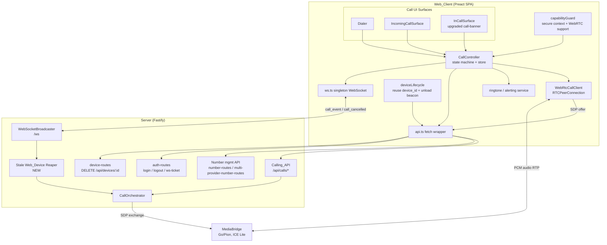
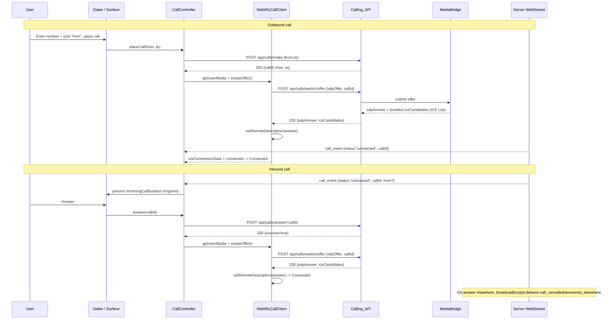

# Design Document: Web Calling Voice

## Overview

Today the Svarla web UI (`web/`, a Preact SPA) is a **passive observer** of calling. `web/src/components/call-banner.tsx` subscribes to the Server WebSocket `call_event`/`call_cancelled` messages and renders a "Call in progress" banner, but the browser has no `RTCPeerConnection`, no microphone capture, no remote-audio playback, no dialer, and no answer/decline surface. This feature brings the browser to parity with the Android reference client so a user can **place outbound calls** and **receive and answer inbound calls** directly in the browser.

The central thesis of this design is: **reuse the existing backend; build a browser WebRTC client plus a call UI.** The Server already exposes a complete, provider-agnostic calling REST API (`src/routes/call-routes.ts`), the MediaBridge (Go/Pion) already terminates a WebRTC client leg and bridges it to the telephony provider, and real-time call signaling already reaches the browser over the Server WebSocket (`web/src/ws.ts`). The browser device is already provisioned at login (`web/src/components/login.tsx`). This feature is therefore predominantly **frontend** work plus **one** genuinely new server component (a stale Web_Device reaper, Requirement 13).

The browser client mirrors the lifecycle of the Android `WebRtcAudioClient` (`android/app/src/main/kotlin/app/svarla/domain/call/WebRtcAudioClientImpl.kt`): create offer → POST offer → apply answer → play remote track → mute via `track.enabled` → DTMF via `RTCDTMFSender` → teardown closes the peer connection and stops tracks. The MediaBridge negotiates a PCM audio codec (16-bit LE, 16kHz mono) via SDP; because `RTCPeerConnection` negotiates the codec through SDP, the browser client does not special-case this. The MediaBridge uses **ICE Lite** and bundles all ICE candidates into the SDP answer, so the browser does **not** perform trickle ICE.

**Design-system alignment.** Since this design was first drafted, the web UI adopted a documented design system and light/dark theming (merged from `main`, commit #29 "feat(web-ui): dark mode, brand theming, redesigned components"). The call surfaces in this feature MUST conform to it. The authoritative reference is `web/DESIGN.md` ("Svarla Web — Design Guide"): token-first styling with all colors/radii/spacing/shadows defined as CSS custom properties in `web/src/styles/main.css` (no hardcoded hex), Svarla deep-purple branding, and automatic light/dark support. Theming is driven by `web/src/theme.ts` (`initTheme` is called at boot in `web/src/main.tsx`), and icons follow the inline-SVG convention in `web/src/components/icons.tsx`. The new "UI Design System Integration" section below records exactly how the Dialer, IncomingCallSurface, and InCallSurface consume these tokens and icons.

**Existing files referenced by this design:** `web/DESIGN.md` (design guide + tokens), `web/src/styles/main.css` (token definitions, where new call rules are added), `web/src/theme.ts` (`initTheme`/`toggleTheme`/`getResolvedTheme`/`subscribeTheme`/`ThemePreference`), `web/src/components/icons.tsx` (`iconSvg` convention + existing exports), `web/src/main.tsx` (App shell that renders the call surfaces and calls `initTheme()`), `web/src/components/call-banner.tsx` (the current passive banner, to be upgraded), `web/src/components/call-history.tsx`, and `src/routes/number-routes.ts` (`GET /api/numbers`, optional `?includeOrphaned=true`).

**In scope:** outbound calling, inbound receipt/answering, inbound alerting (ringtone + attention signals), the WebRTC audio-session lifecycle, remote-audio playback (autoplay handling + volume), in-call controls (mute, DTMF, duration, hang up), capability/secure-context preconditions, single-active-call concurrency, accessibility, call-history integration, browser device lifecycle, multi-device "answered elsewhere" behavior, failure/edge handling, and the server-side stale-device reaper.

**Out of scope (non-goals):** SMS and Conversations (already shipped), call waiting / a second concurrent call, output-device selection via `setSinkId`, any change to the MediaBridge media format or ControlAPI, and any change to the Android app.

### Key Design Decisions

1. **Reuse the login-provisioned device as the Web_Device.** `login.tsx` already POSTs `/api/auth/login` with `deviceName: "Web Browser"` and stores `session_token` + `device_id` in `localStorage`; `auth-routes.ts` applies `skipDeviceLimit` when `deviceName === 'Web Browser'`. "Registration" in this design **reuses** that device rather than introducing a separate registration flow. See [Design Decisions & Trade-offs](#design-decisions--trade-offs).
2. **Persist the device identifier in `localStorage` (deviation from Requirement 1.5).** Requirement 1.5 says "session storage." Current code persists `device_id` in `localStorage`. This design **continues to use the existing `localStorage` `device_id`** to match shipped code and avoid a redundant device per tab; this deviation and its rationale are called out explicitly below.
3. **No ICE servers by default; STUN/TURN optional (refines Requirement 12).** The Android client uses an empty ICE-server list because the MediaBridge advertises its own public IP via ICE Lite. The browser `WebRtcCallClient` **defaults to `iceServers: []`** and treats STUN/TURN as a **configurable enhancement** for NAT-restricted deployments, not an always-required dependency.
4. **`getStats()` polling for the media-inactivity watchdog.** The browser has no direct analog of Android's `onIceConnectionReceivingChange`. The watchdog polls `RTCPeerConnection.getStats()` for `inbound-rtp` `packetsReceived`/`bytesReceived` deltas.
5. **Auto-decline the second call (Requirement 14).** Call waiting is a non-goal for v1; a second inbound call is auto-declined via `POST /api/calls/decline/:callId`.
6. **A dedicated `CallController` state machine** owns all call state and is the single source of truth; Preact components render from it. This isolates the testable logic (the new code under test) from the DOM.

## Technology Stack

The feature adds **no new runtime dependencies**. It uses browser-native WebRTC APIs and the existing web toolchain.

| Category | Technology | Version | Rationale |
|----------|-----------|---------|-----------|
| UI framework | Preact + hooks | ^10.22 (existing) | Matches the existing `web/` SPA; class and functional components both in use |
| State | Module-level store (`web/src/state.ts` `createStore`) | existing | No heavy state library in the repo; `CallController` exposes a small store |
| Real-time signaling | Singleton WebSocket client (`web/src/ws.ts`) | existing | `subscribe(event, handler)`, auto-reconnect, `ws_connected` on (re)connect |
| HTTP | `api` fetch wrapper (`web/src/api.ts`) | existing | Bearer token + 401 handling already implemented |
| Media/WebRTC | Browser `RTCPeerConnection`, `getUserMedia`, `RTCDTMFSender`, `HTMLAudioElement` | platform | Browser-native; no SDK, mirrors Android client lifecycle |
| Build | esbuild via `web/build.ts` | existing | No change |
| Unit/property tests | Vitest + fast-check | `vitest@^1.6`, `fast-check@^3.19` (both already `devDependencies`) | Repo already uses both for server tests; reused for the browser client and reaper |
| Server (reaper) | TypeScript / Fastify / `ws` | existing | Reaper composes existing `DeviceRegistryManager` methods and the broadcaster |

## Architecture

The browser side introduces a call-session layer between the existing transport primitives (`api.ts`, `ws.ts`) and new UI surfaces. `call-banner.tsx` is **upgraded** from a passive banner into the active in-call surface (or replaced by an `InCallSurface` that supersedes it), rendered by the `App` shell in `web/src/main.tsx` alongside the new `Dialer` and `IncomingCallSurface`. This upgrade is also a **design-system migration**: the current banner renders a `📞` unicode glyph with ad hoc markup (`web/src/components/call-banner.tsx`), whereas the upgraded surfaces are styled entirely with the design tokens in `web/src/styles/main.css` and use inline-SVG icons added to `web/src/components/icons.tsx` (no emoji/unicode glyphs). All three surfaces are **theme-aware for free**: because they reference color/elevation/scrim tokens rather than literal colors, they render correctly in both light and dark themes with no theme-specific component code (theming is applied globally by `initTheme()` from `web/src/theme.ts`, already called at boot in `main.tsx`). See [UI Design System Integration](#ui-design-system-integration).



### Component responsibilities

- **`CallController`** — the state machine. Owns `Call_Connection_State`, the active-call metadata, and the single-call guard. Exposes imperative methods (`placeCall`, `answer`, `decline`, `hangup`, `sendDtmf`, `setMuted`, `setVolume`) and an observable store the UI subscribes to. Subscribes to `ws.ts` `call_event`/`call_cancelled`/`ws_connected` and reconciles against `GET /api/calls/active`.
- **`WebRtcCallClient`** — the browser analog of Android `WebRtcAudioClientImpl`. Owns exactly one `RTCPeerConnection` and the local mic track; performs offer/answer, playback, mute, DTMF, `getStats()` polling, and teardown.
- **UI surfaces** — `Dialer` (compose/place), `IncomingCallSurface` (ringing answer/decline), `InCallSurface` (connecting/ringing/connected status, mute, DTMF keypad, duration, volume, hang up). Rendered by `main.tsx`. All three are token-styled and icon-based per the design system: `InCallSurface` supersedes the old `📞`/ad hoc banner, presenting a token-based surface with SVG icons; the surfaces are theme-aware via tokens (see [UI Design System Integration](#ui-design-system-integration)).
- **`deviceLifecycle`** — reuses the login-provisioned `device_id`, registers a beacon on `pagehide`, and reconciles on `ws_connected`.
- **`capabilityGuard`** — checks `window.isSecureContext` and WebRTC API presence at load, gating the calling UI.
- **`alerting`** — ringtone/ringback playback and out-of-tab attention signals (title change, Notification).
- **Reaper (server, new)** — periodically deactivates stale Web_Devices.

### Outbound and inbound signaling (sequence)



### Call connection state (state diagram)

```mermaid
stateDiagram-v2
    [*] --> Idle
    Idle --> Connecting: placeCall() / answer() -> createOffer
    Connecting --> Ringing: outbound placed, far party not yet answered
    Connecting --> Connected: ICE + DTLS complete
    Ringing --> Connected: far party answers (call_event connected)
    Connecting --> Failed: offer error / ICE timeout / >30s / applyAnswer fail
    Ringing --> Failed: signaling failure
    Connected --> Failed: connectivity lost / media inactive 5s
    Connected --> Idle: hang up / remote completed / answered_elsewhere
    Ringing --> Idle: decline / cancelled
    Failed --> Idle: teardown complete (Disconnected -> reset)
    Idle --> [*]
```



`Idle` is the resting UI state; internally the `WebRtcCallClient` reports `Disconnected` when no peer connection exists. `Ringing` is an outbound-only progress state distinct from `Connecting` (media negotiation) and `Connected` (Requirement 5.9).

## Components and Interfaces

All interfaces are TypeScript and live under `web/src/` (colocated `.test.ts` files per repo convention). Endpoint references name the exact route each method calls.

### `WebRtcCallClient`

The browser analog of Android `WebRtcAudioClient`. Owns one `RTCPeerConnection` and one local mic track.

```typescript
// web/src/call/webrtc-call-client.ts

/** Mirrors the Android WebRtcState sealed class. */
export type WebRtcState =
  | { kind: "disconnected" }
  | { kind: "connecting" }
  | { kind: "connected" }
  | { kind: "failed"; reason: WebRtcFailureReason };

/** Machine-readable failure reasons (Requirements 5.4, 5.5, 12.4). */
export type WebRtcFailureReason =
  | "mic-denied"
  | "no-microphone"
  | "offer-failed"
  | "answer-failed"
  | "ice-timeout"
  | "ice-failed"
  | "connecting-timeout"
  | "connection-lost"
  | "media-inactive";

export interface InboundStats {
  packetsReceived: number;
  bytesReceived: number;
}

export interface WebRtcCallClientOptions {
  /** Defaults to [] (ICE Lite MediaBridge). STUN/TURN optional per deployment. */
  iceServers?: RTCIceServer[];
  /** Element the remote track is attached to for playback. */
  remoteAudio: HTMLAudioElement;
}

export interface WebRtcCallClient {
  /** Observable connection state (mirrors Android connectionState StateFlow). */
  readonly state: Store<WebRtcState>;
  /** True while inbound RTP is arriving; drives the media-inactivity watchdog. */
  readonly mediaReceiving: Store<boolean>;

  /** getUserMedia -> RTCPeerConnection -> addTrack -> createOffer -> setLocalDescription. Returns SDP. */
  createOffer(): Promise<string>;
  /** setRemoteDescription(answer). ICE candidates are bundled in the answer (no trickle). */
  applyAnswer(sdpAnswer: string): Promise<void>;
  /** track.enabled = !muted. Returns the effective mute state actually applied. */
  setMuted(muted: boolean): boolean;
  /** In-band DTMF via RTCDTMFSender on the audio sender. Returns false if unavailable. */
  sendDtmf(digit: string): boolean;
  /** Remote audio element volume in [0,1]. */
  setVolume(level: number): void;
  /** Snapshot of inbound-rtp stats for the watchdog. */
  getInboundStats(): Promise<InboundStats | null>;
  /** Stops the local track and closes the peer connection. Idempotent. */
  close(): void;
}
```

- `createOffer` / `applyAnswer` / `sendDtmf` / `setMuted` / `close` mirror the Android lifecycle. `sendDtmf` uses `pc.getSenders().find(s => s.track?.kind === "audio")?.dtmf` and calls `dtmf.insertDTMF(digit)`.
- `applyAnswer` consumes the `{ sdpAnswer }` from `POST /api/calls/webrtc/offer`; the bundled `iceCandidates` require no client action (ICE Lite).
- `getInboundStats` reads `inbound-rtp` entries from `RTCPeerConnection.getStats()` (`packetsReceived`, `bytesReceived`).

### `CallController`

The state machine and single source of truth. Consumes `WebRtcCallClient`, `api`, `ws`, and `alerting`.

```typescript
// web/src/call/call-controller.ts

export enum CallPhase {
  Idle = "idle",
  Connecting = "connecting",
  Ringing = "ringing",     // outbound, far party not yet answered
  Connected = "connected",
  Failed = "failed",
}

export interface CallMetadata {
  callId: string;
  direction: "outbound" | "inbound";
  peerNumber?: string;      // "from" for inbound; "to" for outbound
  fromNumber?: string;      // originating provider number (outbound)
  startedAt?: number;       // epoch ms when Connected (duration timer basis)
  muted: boolean;
  volume: number;           // [0,1]
  endedReason?: string;     // machine-readable termination cause
}

export interface CallControllerState {
  phase: CallPhase;
  call: CallMetadata | null;
  /** Inbound call awaiting answer/decline (may coexist only when Idle). */
  incoming: CallMetadata | null;
  error: string | null;     // user-facing message key
}

export interface CallController {
  readonly store: Store<CallControllerState>;

  /** POST /api/calls/make {from,to}; then establishes the WebRTC session. */
  placeCall(from: string, to: string): Promise<void>;
  /** POST /api/calls/answer/:callId; then establishes the WebRTC session. */
  answer(callId: string): Promise<void>;
  /** POST /api/calls/decline/:callId; dismisses the incoming surface. */
  decline(callId: string): Promise<void>;
  /** POST /api/calls/decline/:callId (hang up shares the decline route); tears down. */
  hangup(): Promise<void>;
  /** In-band via WebRtcCallClient; POST /api/calls/:callId/dtmf fallback. */
  sendDtmf(digit: string): Promise<void>;
  setMuted(muted: boolean): void;
  setVolume(level: number): void;

  /** Reconcile displayed state against GET /api/calls/active (on ws_connected). */
  reconcile(): Promise<void>;

  /** Wire ws.ts subscriptions (call_event, call_cancelled, ws_connected). */
  start(): void;
  stop(): void;
}
```

- `hangup()` and `decline()` both call `POST /api/calls/decline/:callId` — the backend uses `decline` for both decline and hang up.
- Terminal `call_event` (`completed`/`failed`/`busy`) and `call_cancelled` (`answered_elsewhere`) handling is keyed by `callId` and idempotent (see [Correctness Properties](#correctness-properties)).
- The single-call guard lives here: while `phase ∈ {Connecting, Ringing, Connected}`, an inbound `call_event` for a different `callId` triggers `decline(newCallId)` and never opens a second surface (Requirement 14.1).

### Call state model

`CallPhase` (enum above) is the observable UI state. `CallMetadata` carries per-call data. The mapping to `WebRtcState` is: `connecting`→Connecting, `connected`→Connected, `failed`→Failed, `disconnected`→Idle. `Ringing` is a controller-only phase driven by outbound placement before the far-party `call_event: connected`.

### `deviceLifecycle`

Reuses the login-provisioned device; no separate registration call in the happy path.

```typescript
// web/src/call/device-lifecycle.ts

export interface DeviceLifecycle {
  /**
   * Ensures a usable Web_Device id exists. Reuses localStorage "device_id"
   * from login. If absent (edge), registers via the login-provisioned flow.
   * Single-flight: concurrent callers share one in-flight promise.
   */
  ensureRegistered(): Promise<string>;
  /** Best-effort DELETE /api/devices/:deviceId via navigator.sendBeacon / fetch keepalive on pagehide. */
  deregisterOnUnload(): void;
  /**
   * On ws_connected: if persisted device_id is still active (per GET /api/calls/active
   * reachability / device list), reuse it; if reaped/deactivated, re-provision and update
   * the persisted id (Requirements 1.13, 1.14).
   */
  reconcileOnReconnect(): Promise<string>;
  /** POST /api/auth/logout (invalidates session + deregisters) then clears persisted id (Requirement 1.9). */
  logout(): Promise<void>;
}
```

- Persistence uses the existing `localStorage` `device_id` (deviation from Requirement 1.5 — see Design Decisions).
- `deregisterOnUnload` targets `DELETE /api/devices/:deviceId` via `navigator.sendBeacon` (falling back to `fetch(..., { keepalive: true })`); delivery is best-effort. Correctness defers to the server reaper (Requirements 1.11, 1.12, 13).

### `capabilityGuard`

```typescript
// web/src/call/capability-guard.ts

export interface CapabilityReport {
  secureContext: boolean;        // window.isSecureContext
  hasRTCPeerConnection: boolean;
  hasGetUserMedia: boolean;
  callingSupported: boolean;     // all of the above
}

export function detectCapabilities(): CapabilityReport;
```

When `callingSupported` is false, the UI disables calling and shows a specific message (Requirements 15.1–15.3).

### `alerting` (ringtone / attention)

```typescript
// web/src/call/alerting.ts

export interface Alerting {
  /** Play the ringtone loop; subject to autoplay policy (Requirement 16.1). */
  startRingtone(): void;
  stopRingtone(): void;                 // on answer/decline/cancel/dismiss (16.2)
  /** Title change and/or Notification when the tab is hidden/unfocused (16.3). */
  raiseAttention(callerLabel: string): void;
  clearAttention(): void;
  /** Ringback during outbound Ringing where MediaBridge provides it (5.10). */
  playRingback(): void;
  stopRingback(): void;
}
```

### Binding to Preact / `state.ts`

`CallController.store` is a `createStore<CallControllerState>` instance (`web/src/state.ts`). A small `useCallState()` hook subscribes components to it. `main.tsx` instantiates one `CallController` for the app and renders `Dialer`, `IncomingCallSurface`, and `InCallSurface` (the upgraded `call-banner.tsx`) from its state. The `Dialer` fetches originating numbers from the number management API (`number-routes` / `multi-provider-number-routes`) to populate the "from" selector (Requirements 2.1, 2.9) and offers "call back" from `call-history.tsx` (Requirement 17.2).

**"From" selector uses the default `GET /api/numbers` response.** `src/routes/number-routes.ts` now accepts an optional `?includeOrphaned=true`, but the **default** response is unchanged — it returns only numbers with a **live provider** (active and inactive). The Dialer MUST use the default (it does **not** pass `includeOrphaned`), so orphaned numbers whose provider was removed never appear as a place-a-call origin. The "call back" path (Requirement 17.2) reuses the existing `call-history.tsx`, which deliberately requests `/api/numbers?includeOrphaned=true` to label/filter history entries by every number that could appear in past calls (including orphaned ones); that opt-in is scoped to history and does not affect the Dialer's origin list.

## UI Design System Integration

The call surfaces (`Dialer`, `IncomingCallSurface`, `InCallSurface`) conform to the web design system documented in `web/DESIGN.md`. This section records the exact tokens, icons, and conventions they use. The guiding rule from the design guide is **token-first**: every color, radius, space, shadow, and motion value comes from a CSS custom property defined in `web/src/styles/main.css` — **no hardcoded hex** anywhere in the call styles. New call-specific rules are added to `main.css` as token-based rules (plain CSS custom properties; `main.css` is copied verbatim by `web/build.ts` / `npm run build:web`, so there is no preprocessor).

### Token usage by call surface

- **Color roles (by token, never by appearance):**
  - `--md-primary` (deep purple `#5b2d90`; lavender `#d0bcff` in dark) — the primary call/answer affordance and active/emphasis states (e.g. the Dialer "Call" action, active keypad state).
  - `--md-success` / `--md-success-container` / `--md-on-success-container` — the **Connected** state indication (status dot/label on `InCallSurface`); consider `.btn-success-outline` for the **Answer** control.
  - `--md-error` / `--md-error-container` and the `.btn-danger` variant — **Decline** and **Hang up** (destructive actions).
  - `--md-surface` / `--md-surface-dim` — the surface backgrounds (`--md-surface` for the raised banner/modal panel, `--md-surface-dim` for the app background behind it).
  - `--md-on-surface` / `--md-on-surface-variant` — primary text and secondary/muted labels (e.g. status sub-text).
  - `--md-outline` / `--md-outline-variant` — borders/dividers that define the flat surfaces at rest.
  - `--md-scrim` — the backdrop behind the incoming-call modal overlay.
- **Elevation:** surfaces are flat at rest and defined by borders; shadow is used sparingly. Use `--md-elevation-3` for the in-call **banner/snackbar** and `--md-elevation-4` for the incoming-call **modal/dialog**.
- **Shape (radii):** all buttons use `--md-radius-button` (6px) — buttons are **not** pill-shaped. The incoming-call **modal** uses `--md-radius-lg` (10px); any card/list/menu chrome uses `--md-radius-md` (8px). `--md-radius-full` is reserved for the status dot / avatar / status pill only.
- **Spacing:** padding, gaps, and margins use the 8px-scale tokens (`--md-space-xs` … `--md-space-2xl`), not literal pixels.
- **Typography — monospace for numeric/technical values:** the call **duration timer** and the **dialed number / caller number** use the monospace treatment (`'JetBrains Mono', 'Fira Code', monospace`) per the design guide, which mandates monospace for phone numbers, endpoints, durations, and code. Section headers use the overline-style uppercase label treatment (`--md-on-surface-variant`, uppercase, `0.05em` spacing); body text is Inter.
- **Controls & touch targets:** interactive controls use `--control-height` (38px) on pointer devices. `--min-touch-target` (48px) is applied **only** on touch/small screens (`max-width: 640px` or `pointer: coarse`). The **DTMF keypad** buttons and the **Answer/Decline** buttons MUST honor this touch-target sizing so they stay comfortably tappable on phones while staying compact on desktop. Button variants: primary (filled) for the call/answer affordance, `.btn-secondary` (outline) for neutral actions, `.btn-danger` for Decline/Hang up, `.btn-success-outline` as an option for Answer, and `.btn-sm` for compact contexts.
- **Motion:** transitions use `--md-motion-ease` with `--md-motion-duration-short` (150ms) for small state changes and `--md-motion-duration-medium` (260ms) for entrances (the incoming-call modal / banner appearing). **Any ringing pulse or attention animation MUST be gated by `@media (prefers-reduced-motion: reduce)`** so it is fully disabled when the user prefers reduced motion (this is enforced globally by the design system, and the call surfaces must not introduce motion that cannot be disabled).
- **Light/dark theming — automatic:** because the surfaces reference tokens rather than literal colors, they work in **both** light and dark themes with no theme-specific component code. Theming is applied globally by `initTheme()` (`web/src/theme.ts`), which sets `data-theme` on `<html>` and keeps the `theme-color` meta in sync; dark values are defined in `:root[data-theme="dark"]` and in `@media (prefers-color-scheme: dark) :root:not([data-theme])`. The call surfaces need no `subscribeTheme` wiring (there is no canvas or inline-colored element here). This complements — and does not replace — the existing accessibility design in Requirement 18.

### New icons to add to `web/src/components/icons.tsx`

`web/src/components/icons.tsx` currently exports `homeIcon`, `chatIcon`, `callIcon` (up-right arrow), `settingsIcon`, and `downloadIcon`, all built with the `iconSvg(children, size = 20)` helper (24px viewBox, `stroke="currentColor"`, stroke-width 1.75, `aria-hidden`). There are **no** mic/mute/hangup/answer/decline/keypad/volume icons yet. The call UI will **add** the following icons following this exact convention, replacing the `📞` unicode glyph used today in `call-banner.tsx`:

- `phoneIcon` — Answer / call affordance (filled-handset outline).
- `phoneOffIcon` — Hang up and Decline (handset with a slash).
- `micIcon` — microphone (unmuted state).
- `micOffIcon` — microphone with a slash (muted state).
- `dialpadIcon` — DTMF keypad toggle (3×3 dot grid).
- `volumeIcon` — remote-audio volume control.

Each is defined via `iconSvg(...)` so it inherits `currentColor` and stays pixel-consistent with the existing icon set; icon-only controls (mute, hang up, keypad, volume) carry an `aria-label`/`title` per the accessibility checklist (Requirement 18).

## Data Models

### Call state object

`CallControllerState` and `CallMetadata` (defined above) are the in-memory model. No persistence beyond the `localStorage` `device_id`.

### WebSocket event payloads (consumed from `ws.ts`)

The broadcaster (`src/websocket/broadcaster.ts`) emits `WebSocketEvent { type, data }`; `ws.ts` dispatches `data` to subscribers keyed by `type`.

```typescript
// call_event  (type: "call_event")
interface CallEventPayload {
  callId: string;
  status: "connected" | "completed" | "failed" | "busy";
  from?: string;   // caller number for inbound; may be absent -> "Unknown caller"
}

// call_cancelled  (type: "call_cancelled")
interface CallCancelledPayload {
  callId: string;
  reason: "answered_elsewhere" | string;
}
```

### WebRTC offer request/response (Calling_API)

```typescript
// POST /api/calls/webrtc/offer
interface WebRtcOfferRequest {
  sdpOffer: string;
  callId: string;
}
interface WebRtcOfferResponse {
  sdpAnswer: string;
  iceCandidates: unknown[]; // bundled; ICE Lite, applied via the answer, no trickle
}
```

### Other request/response shapes (existing Calling_API)

```typescript
// POST /api/calls/make            -> { callId, from, to }
interface MakeCallRequest { from: string; to: string; }
interface MakeCallResponse { callId: string; from: string; to: string; }

// POST /api/calls/answer/:callId  -> 200 { success: true } | 409 { error }
// POST /api/calls/decline/:callId -> 200 { success: true }   (also hang up)
// POST /api/calls/:callId/dtmf    -> 200 { success: true; digit } | 400 | 404
interface DtmfRequest { digit: string; }

// GET /api/calls/active           -> { calls: Array<{ callId; status; from? }> }
interface ActiveCallsResponse {
  calls: Array<{ callId: string; status: string; from?: string }>;
}
```

### Originating-number list for the Dialer "from" selector

```typescript
// GET /api/numbers                 -> live-provider numbers only (DEFAULT; Dialer uses this)
// GET /api/numbers?includeOrphaned=true -> also includes orphaned numbers (history filters only)
```

The Dialer populates its "from" selector from the **default** `GET /api/numbers` response (live-provider numbers only — active and inactive). It MUST NOT pass `?includeOrphaned=true`, so numbers whose provider was removed are never offered as a call origin. The `?includeOrphaned=true` variant is used exclusively by `call-history.tsx` to label and filter past entries (relevant to Requirement 17.2 "call back from history"), and does not affect the Dialer.


## Correctness Properties

*A property is a characteristic or behavior that should hold true across all valid executions of a system — essentially, a formal statement about what the system should do. Properties serve as the bridge between human-readable specifications and machine-verifiable correctness guarantees.*

These properties carry over the six invariants declared in `requirements.md` and add three property-testable functional criteria. Each is universally quantified and implemented as a **single** fast-check property (minimum 100 iterations). The primary code under test is the browser `CallController` state machine (with a mocked `WebRtcCallClient` / `RTCPeerConnection` / `getUserMedia`) and the server-side reaper (with a mocked `DeviceRegistryManager`, broadcaster, and orchestrator). Property reflection: none of the six invariants subsumes another (they concern distinct guarantees — cardinality, resource liveness, resource release, event idempotency, registration cardinality, and reaper isolation), and the three functional properties are pure-input transformations with no overlap.

### Property 1: Single-call invariant

*For any* sequence of inbound/outbound call events applied to a fresh `CallController`, the controller SHALL hold at most one active WebRTC PCM_Audio session and at most one In_Call_Surface at every step, and any inbound `call_event: connected` for a different `callId` received while a call is active SHALL result in `POST /api/calls/decline/:callId` for the new call and no second surface.

**Validates: Requirements 14.1, 14.3**

### Property 2: Connected-implies-resources invariant

*For any* execution path that leaves the `CallController` in `Connected`, a live `RTCPeerConnection` (not closed) and a live local microphone audio track (`readyState === "live"`) SHALL both exist for the active call.

**Validates: Requirements 4.3, 4.9, 5.3, 5.6**

### Property 3: Resource-safety invariant

*For any* path by which a call ends — local hang up, remote `completed`/`failed`/`busy`, decline, WebRTC failure, Media_Inactivity_Watchdog teardown, or browser close — the `WebRtcCallClient` SHALL stop the local microphone track and close the `RTCPeerConnection`, leaking no microphone capture.

**Validates: Requirements 4.2, 5.6, 8.3, 9.1, 9.7**

### Property 4: Idempotent-teardown invariant

*For any* stream of terminal `call_event` or `call_cancelled` messages containing duplicates and arbitrary orderings for a given `callId`, the `CallController` SHALL never create a duplicate surface and SHALL run teardown side effects (`track.stop()`, `pc.close()`) at most once for that call.

**Validates: Requirements 3.3, 9.3, 9.4, 10.1, 10.2**

### Property 5: Registration-uniqueness invariant

*For any* sequence of load, transient WebSocket disconnect/reconnect, and reap-or-not outcomes, the `deviceLifecycle` SHALL maintain at most one active Web_Device per browser session: it reuses the persisted `device_id` whenever it remains active and provisions a new device only after the persisted identifier has been reaped/deactivated, never creating a duplicate.

**Validates: Requirements 1.4, 1.13, 1.14**

### Property 6: Reaper-safety invariant

*For any* population of registered devices (web and Android, varying last-seen ages, WebSocket presence, and active-call membership), a reaper sweep SHALL deactivate a device only if it is web-registered (`Web Browser` / `skipDeviceLimit`) AND has no active WebSocket connection AND is stale beyond the Web_Device_Staleness_Interval AND is not associated with an active call; every other device and every active call on another endpoint SHALL be left unaffected.

**Validates: Requirements 13.2, 13.3, 13.4, 13.6, 13.7**

### Property 7: Destination validation and E.164 normalization

*For any* destination input string, the Dialer SHALL send `POST /api/calls/make` only when the input is non-empty, contains only allowed characters, and normalizes to a valid E164_Number; for all other inputs it SHALL surface a validation error and send no request.

**Validates: Requirements 2.2, 2.3**

### Property 8: Duration formatting

*For any* non-negative elapsed-seconds value, the duration formatter SHALL produce `mm:ss` below 60 minutes and `hh:mm:ss` at or beyond 60 minutes, preserving the underlying elapsed value.

**Validates: Requirements 8.2**

### Property 9: DTMF input validation

*For any* input character, the keypad/`sendDtmf` path SHALL emit a DTMF signal (in-band or fallback) only for a DTMF_Digit (`0`–`9`, `*`, `#`) and SHALL reject any other character with no signal on either path and no state change.

**Validates: Requirements 7.6**

## Error Handling

Each failure maps to a concrete `CallControllerState` outcome (a `phase` transition and/or an `error` message key) and a user-facing surface. All teardown paths funnel through `WebRtcCallClient.close()` (idempotent) so Property 3 holds regardless of the trigger.

| Failure | Trigger | State / UI outcome | Requirement |
|---------|---------|--------------------|-------------|
| Microphone permission denied | `getUserMedia` rejects with `NotAllowedError` | Abort session, `Failed{mic-denied}`, show "microphone permission required", end call | 4.2, 15.5 |
| Persistently blocked mic | permission state `denied` at gesture time | Show re-enable guidance rather than silent failure | 15.5 |
| No microphone device | `getUserMedia` rejects `NotFoundError` | Abort, "no microphone available", end call | 15.4 |
| Insecure context | `window.isSecureContext === false` at load | Disable calling, "requires a secure (HTTPS) connection" | 15.2 |
| No WebRTC support | `RTCPeerConnection`/`getUserMedia` missing | Disable calling, "unsupported browser" | 15.3 |
| `make` 503 or >10s no response | `POST /api/calls/make` | "calling service unavailable", return Dialer to idle | 2.7 |
| `make` 400 | `POST /api/calls/make` | Show Calling_API validation error, return to idle | 2.8 |
| No provider number configured | empty Provider_Number_List | Disable outbound, "no calling number configured" | 2.10 |
| Offer 503 | `POST /api/calls/webrtc/offer` | "media service unavailable" within 1s, end attempt, idle | 11.1 |
| Offer 504 | `POST /api/calls/webrtc/offer` | "signaling timed out" within 1s, end attempt, idle | 11.2 |
| Offer no response within server 5s timeout | signaling timeout | Treat as signaling failure, `Failed`, end attempt, idle | 11.3, 4.5 |
| Offer 404 | `POST /api/calls/webrtc/offer` | "call not found" within 1s, return to idle | 11.4 |
| Apply-answer fails | `setRemoteDescription` throws | `Failed{answer-failed}`, error, end call | 4.7 |
| ICE fails / not connected within 20s | `iceConnectionState` failed or timeout | `Failed{ice-failed}` / `Failed{ice-timeout}` (machine-readable), release, end | 4.10, 5.5, 12.4 |
| Connecting > 30s | overall connecting cap | `Failed{connecting-timeout}`, end call | 5.4 |
| Answer 409 | `POST /api/calls/answer/:callId` | Dismiss Incoming_Call_Surface, "call no longer available" | 3.8 |
| WebRTC session not established within 15s after answer | inbound establishment cap | End attempt, error, return to idle | 3.6 |
| Connection lost while Connected | `iceConnectionState` disconnected/failed after Connected | `Failed{connection-lost}`, end call | 5.7 |
| Media inactive 5s while Connected | watchdog: no inbound-rtp delta for 5s | Teardown, release mic, idle within 2s, "call ended — media lost" | 9.6, 9.7 |
| WS lost while Connected | `ws.ts` close during Connected | Keep playing established audio, show "signaling disconnected" | 11.5 |
| WS lost while not Connected | `ws.ts` close during Connecting/Ringing | Terminate attempt, return to idle | 11.6 |
| WS reconnect reconciliation | `ws_connected` | `reconcile()` vs `GET /api/calls/active` within 2s; if not present, end displayed call, idle | 11.7, 10.5 |
| Autoplay blocked | `audio.play()` rejects | Surface a gesture-tied resume control that resumes call audio | 4.12 |
| Hang-up request fails / >5s | `POST /api/calls/decline/:callId` | Still tear down locally, idle, "call ended locally" | 8.4 |
| DTMF fallback fails / >5s | `POST /api/calls/:callId/dtmf` | Preserve Connected, show "DTMF not delivered" | 7.5 |
| Registration timeout (>10s) / error | device provisioning | "inbound calling unavailable", retain session, manual retry control | 1.6, 1.7, 1.8 |
| Event for unknown callId | `call_event`/`call_cancelled` mismatch | Ignore, leave state unchanged | 9.3 |

## Testing Strategy

**Dual approach.** Unit tests cover concrete examples, status mappings, and edge cases; property tests cover the nine universal properties above. Both use **Vitest** and **fast-check**, which are already `devDependencies` (`vitest@^1.6`, `fast-check@^3.19`) — no new dependency is required. Tests are colocated as `*.test.ts` next to the module under test, matching the repo convention (e.g. `call-controller.test.ts`, `webrtc-call-client.test.ts`, `web-device-reaper.test.ts`).

**Focus.** The backend call routes and `CallOrchestrator` already have test coverage (`src/routes/call-routes` behavior and `src/services/call-orchestrator.test.ts`), so testing focuses on the **new browser client** (`CallController`, `WebRtcCallClient`, `deviceLifecycle`, formatters/validators) and the **new server reaper**.

**Property tests (fast-check, ≥100 runs each).** One property-based test per correctness property, each tagged with a comment referencing its design property, in the format:

```
// Feature: web-calling-voice, Property 1: Single-call invariant — at most one active session per tab
```

- Properties 1–4 drive the `CallController` with generated event sequences (`fc.array` of a discriminated-union event generator: `placeCall`, `inbound(callId)`, `answer`, `terminal(status)`, `cancelled(reason)`, `duplicate`, `reorder`).
- Property 5 generates load/reconnect/reaped sequences against `deviceLifecycle` with a mocked registry.
- Property 6 generates device populations (`fc.record` of `{ deviceName, lastSeenAgeMs, hasSocket, inActiveCall }`) and runs the sweep.
- Properties 7–9 are pure-function generators (`fc.string`, `fc.nat`, `fc.char`) over the validator/formatter/DTMF-guard.

**Mocking in jsdom.** `RTCPeerConnection`, `RTCDTMFSender`, `getUserMedia`, and `HTMLAudioElement.play()` are stubbed with lightweight fakes that record `close()`/`stop()`/`insertDTMF()` calls and let tests drive `iceconnectionstatechange`, `ontrack`, and `getStats()` outputs. Vitest runs in the `jsdom` environment for the browser modules.

**Unit / example tests.** Status-code mappings (Property-adjacent EXAMPLE cases: 503/504/404/400/409), capability gating, autoplay-resume, accessibility (ARIA live region, focus movement, roles), and the media-inactivity watchdog timing.

**Integration considerations.** Requirement 17.1 (completed web calls appear in `GET /api/calls/history`) and Requirement 9.8 (far-party release on browser close) are verified against existing server behavior with 1–2 representative examples rather than property tests, since they exercise infrastructure/external behavior already covered server-side.

## Server-Side Changes Needed

**Almost all backend plumbing already exists.** The single genuinely new server component is the **stale Web_Device reaper** (Requirement 13).

### Stale Web_Device Reaper (new)

A periodic sweep that deactivates orphaned browser devices. It composes existing building blocks and adds no new persistence.

- **Placement.** A `setInterval` task, or piggy-backed on the broadcaster's existing 30s ping cycle (`WebSocketBroadcaster.PING_INTERVAL_MS = 30_000`). The broadcaster already knows which `deviceId`s have live sockets (`isDeviceConnected`, `getConnectedDeviceIds`).
- **Last-seen tracking.** While a Web_Device has a live socket, refresh its last-seen via `DeviceRegistryManager.updateLastSeen(deviceId)` (Requirement 13.1); the `device_registry.last_seen_at` column and the method already exist.
- **Staleness test.** A device is stale when it has **no** live socket AND `now - lastSeenAt > Web_Device_Staleness_Interval` (default **90s** — a small multiple of the 30s ping) (Requirement 13.2).
- **Scope.** Reap **only** web-registered devices — those with `deviceName === 'Web Browser'` / the `skipDeviceLimit` flag. Never touch Android/push devices (Requirement 13.4).
- **In-call guard.** Skip any device currently associated with an active call, queried via `CallOrchestrator.getAllActiveCalls()` (Requirement 13.7); this preserves the Reaper-safety invariant.
- **Action.** For each device that passes all checks, call `DeviceRegistryManager.deactivateDevice(deviceId)` (Requirement 13.3). A deactivated device is no longer returned by `listActiveDevices()` and therefore is not notified of inbound calls (Requirement 13.5). Other devices and in-progress calls are untouched (Requirement 13.6).

```typescript
// src/services/web-device-reaper.ts (sketch)
interface WebDeviceReaperDeps {
  registry: DeviceRegistryManager;          // deactivateDevice, updateLastSeen, listActiveDevices
  broadcaster: WebSocketBroadcaster;        // isDeviceConnected, getConnectedDeviceIds
  orchestrator: CallOrchestrator;           // getAllActiveCalls
  stalenessMs?: number;                     // default 90_000
}
// sweep(): for each active web device with no live socket, stale, and not in an active call -> deactivate.
```

### Already handled — verify, no new work

- **Mid-call far-party release (Requirement 9.8).** `CallOrchestrator` already routes MediaBridge `client_disconnected` → `endCall`, releasing the provider/far-party leg (see the orchestrator module header: "Media events: route provider/client disconnect → endCall"). This design references that path; no new server code.
- **`answered_elsewhere` fan-out (Requirements 3.9, 10.1, 10.4).** Delivered via the broadcaster's `broadcastExcept`. No change.
- **Device provisioning + `skipDeviceLimit` (Requirement 1.1–1.3).** Already applied at login by `auth-routes.ts`. No change.
- **Deregister / logout (Requirements 1.9, 1.11).** `DELETE /api/devices/:deviceId` and `POST /api/auth/logout` already exist. No change.

## Design Decisions & Trade-offs

1. **Reuse login-provisioned device vs. a separate registration flow.** `login.tsx` already creates the `Web Browser` device and stores `device_id`. Adding a separate registration call would create redundant devices and duplicate the `skipDeviceLimit` path. **Decision:** reuse the login device; `deviceLifecycle.ensureRegistered()` reads the persisted id and only provisions if it is missing/reaped. Trade-off: registration and login are coupled, accepted because the web device only makes sense within an authenticated session.
2. **`localStorage` vs. `sessionStorage` (Requirement 1.5 deviation).** Requirement 1.5 specifies session storage, but shipped code persists `device_id` in `localStorage`. **Decision:** continue using `localStorage` to match current behavior and let sibling tabs share one device (consistent with the multi-tab broadcaster model). Rationale/trade-off: this is a conscious deviation; switching to `sessionStorage` would give each tab its own device and multiply devices per user, and would require changing `login.tsx`. The reaper (Requirement 13) makes orphaned devices self-healing regardless of storage choice.
3. **No ICE servers by default vs. STUN/TURN (Requirement 12 refinement).** The MediaBridge is ICE Lite and advertises its own reachable candidates in the answer, exactly as the Android client relies on (`RTCConfiguration(emptyList())`). **Decision:** default `iceServers: []`; expose STUN/TURN as **optional configuration** for NAT-restricted deployments. Trade-off: refines Requirement 12's "at least one STUN server" to "STUN/TURN configurable" — always-on STUN/TURN would add infrastructure the typical deployment does not need.
4. **Auto-decline second call vs. call waiting (Requirement 14).** Call waiting is a stated non-goal for v1. **Decision:** auto-decline the second inbound call. Trade-off: simpler, deterministic single-call guard; call waiting is a future enhancement.
5. **`getStats()` polling for the media-inactivity watchdog.** The browser lacks Android's `onIceConnectionReceivingChange`. **Decision:** poll `inbound-rtp` `packetsReceived`/`bytesReceived` deltas at ≤1s intervals; treat 5s of no growth as inactive. Trade-off: a polling loop vs. an event callback, but it is the only portable browser signal for "media stopped while ICE stays up."
6. **Ringtone/ringback autoplay limitations.** Browser autoplay policy may suppress the ringtone until a user gesture. **Decision:** the visible Incoming_Call_Surface is the primary guaranteed alert; ringtone is best-effort, and remote-audio playback is backed by a gesture-tied resume control (Requirement 4.12). Trade-off: audio may be delayed until the Answer gesture, accepted per the Requirement 16 note.
7. **Adopt the existing `web/DESIGN.md` design system and theming vs. bespoke call styling.** The web UI already ships a documented token-first design system and light/dark theming (`web/DESIGN.md`, `web/src/styles/main.css`, `web/src/theme.ts`). **Decision:** style the call surfaces entirely with those tokens rather than inventing call-specific colors/shapes. Rationale/trade-off: it keeps the calling UI part of **one product** (consistent with the rest of the web app and the Android client) and gives **automatic light/dark** support with no theme-specific code — at the cost of staying within the token vocabulary (adding a new token in `main.css` when a genuinely new role is needed, rather than hardcoding a color).
8. **Add call icons to `icons.tsx` following the inline-SVG convention vs. unicode/emoji.** The current banner uses a `📞` emoji glyph. **Decision:** add `phoneIcon`/`phoneOffIcon`/`micIcon`/`micOffIcon`/`dialpadIcon`/`volumeIcon` to `web/src/components/icons.tsx` via the established `iconSvg` helper (24px viewBox, `currentColor`, 1.75 stroke, `aria-hidden`). Rationale/trade-off: the SVG icons inherit theme text color, stay pixel-consistent with the rest of the UI, and render uniformly across platforms/fonts — unlike emoji, whose appearance varies by OS and does not follow the color tokens; the minor cost is authoring the SVG paths once.

## Requirements Traceability

| Design section | Requirements |
|----------------|-------------|
| Overview / Architecture | 1–18 (feature framing), reuse of existing Calling_API and WebSocket |
| `deviceLifecycle` | 1.1–1.14, 9 (logout), 13 (defers to reaper) |
| `Dialer` + Components | 2.1–2.10, 17.2 |
| Incoming / answer flow | 3.1–3.9, 16.1–16.3, 18.1 |
| UI Design System Integration (tokens, icons, theming) | 18 (accessibility: focus ring, icon-only aria-labels, reduced-motion, touch targets); general UI 2, 3, 6, 7, 8; light/dark theming is a cross-cutting UI constraint across all UI surfaces |
| `WebRtcCallClient` + establishment | 4.1–4.13, 12.1–12.4 |
| `CallController` state machine | 5.1–5.10, 14.1–14.3 |
| In-call controls | 6.1–6.7 (mute), 7.1–7.6 (DTMF), 8.1–8.5 (duration/hang up) |
| Termination signaling | 9.1–9.8, 10.1–10.5 |
| Error Handling | 2.7, 2.8, 3.6, 3.8, 4.2, 4.5, 4.7, 4.10, 4.12, 5.4, 5.5, 5.7, 7.5, 8.4, 9.6, 9.7, 11.1–11.7, 15.2–15.5 |
| `capabilityGuard` | 15.1–15.3 |
| Correctness Properties | 14 (P1), 4/5 (P2), 4/5/8/9 (P3), 3/9/10 (P4), 1 (P5), 13 (P6), 2 (P7), 8 (P8), 7 (P9) |
| Server-Side Changes (reaper) | 13.1–13.7 |
| Testing Strategy | 17.1, 9.8 (integration), all properties |
| Design Decisions | 1.5 (deviation), 12 (refinement), 14 (auto-decline), design-system adoption + icon convention (cross-cutting UI, Req 18) |
